# SBG-TIR OTTER Level 2 Surface Temperature & Emissivity (L2 LSTE) Data Product

[Glynn C. Hulley](https://github.com/ghulley) (he/him) 
[glynn.hulley@jpl.nasa.gov](mailto:glynn.hulley@jpl.nasa.gov) 
Lead developer and designer 
NASA Jet Propulsion Laboratory 329G

This repository will contain the Surface Biology and Geology Thermal Infrared (SBG-TIR) OTTER level 2 land-surface temperature and emissivity (L2 LSTE) data product algorithm.

JPL D-1000785

**Surface Biology and Geology (SBG)**

**Observing Terrestrial Thermal Emission Radiometer (OTTER)**

**Level 2 Land Surface Temperature and Emissivity Algorithm Theoretical
Basis Document (ATBD)**

Version 0.1

June 24, 2023

Glynn Hulley

Jet Propulsion Laboratory

California Institute of Technology

*\
JPL D-1000785*

*© 2023 California Institute of Technology. Government sponsorship
acknowledged.*

Paper copies of this document may not be current and should not be
relied on for official purposes. The current version is in the SBG
DocuShare Library (\*) at \[insert url\]

*(\*) Access limited to user group*

National Aeronautics and

{width="1.1666666666666667in"
height="0.4166666666666667in"}Space Administration

Jet Propulsion Laboratory

4800 Oak Grove Drive

Pasadena, California 91109-8099

California Institute of Technology

This research was carried out at the Jet Propulsion Laboratory,
California Institute of Technology,

under a contract with the National Aeronautics and Space Administration.

Reference herein to any specific commercial product, process, or service
by trade name, trademark, manufacturer, or otherwise, does not
constitute or imply its endorsement by the United States Government or
the Jet Propulsion Laboratory, California Institute of Technology.

© 2023. California Institute of Technology. Government sponsorship
acknowledged.

**Change History Log**

  -----------------------------------------------------------------------------
  **Revision**   **Effective     **Authors**      **Description of Changes**
                 Date**                           
  -------------- --------------- ---------------- -----------------------------
  V1             08/22/2023      Glynn Hulley     First draft

  V1.01          09/06/2023      Glynn Hulley     Modification to section 5:
                                                  Uncertainty analyses
  -----------------------------------------------------------------------------

  : []{#_Toc143613305 .anchor}Table 1: SBG measurement characteristics
  as compared to other spaceborne TIR instruments.

# Contacts {#contacts .unnumbered}

Readers seeking additional information about this study may contact the
following:

**Glynn C. Hulley (L2 Lead, Co-Investigator)\
**MS 183-501\
Jet Propulsion Laboratory\
4800 Oak Grove Dr.\
Pasadena, CA 91109\
Email: *glynn.hulley@jpl.nasa.gov\
*Office: (818) 354-2979

**Simon J. Hook (Principal Investigator)\
**MS 233-200\
Jet Propulsion Laboratory\
4800 Oak Grove Dr.\
Pasadena, CA 91109\
Email: *simon.j.hook@jpl.nasa.gov*\
Office: (818) 354-0974

# SBG Science Team {#sbg-science-team .unnumbered}

***Team members:***

# Abstract {#abstract .unnumbered}

The 2017-2027 Decadal Survey for Earth Science and Applications from
Space (ESAS 2017) was released in January 2018. ESAS 2017 was driven by
input from the scientific community and policy experts and provides a
vision and strategy for Earth observation that informs federal agencies
responsible for the planning and execution of civilian space-based
Earth-system programs in the coming decade, including the National
Aeronautics and Space Administration (NASA), the National Oceanic and
Atmospheric Administration (NOAA), and the U.S. Geological Survey
(USGS). NASA has, thus far, utilized this document as a guide to inform
exploration of new Earth mission concepts which are later considered as
candidates for fully funded missions. High-priority emphasis areas and
targeted observables include global-scale Earth science questions
related to hydrology, ecosystems, weather, climate, and solid earth. One
of the Designated Observables (DO's) identified by ESAS 2017 was Surface
Biology and Geology (SBG) with a goal to acquire concurrent global
hyperspectral visible to shortwave infrared (VSWIR; 380--2500 nm) and
multispectral midwave and thermal infrared (MWIR: 3--5 μm; TIR: 8--12
μm) imagery at high spatial resolution (\~30 m in the VSWIR and \~ 60 m
in the TIR) and sub-monthly temporal resolution globally. The final
sensor characteristics will be determined during the mission formulation
phase, but ESAS 2017 provides guidance for a VSWIR instrument with
30--45 m pixel resolution, ≤16 day global revisit, SNR \> 400 in the
VNIR, SNR \> 250 in the SWIR, and 10 nm sampling in the range 380--2500
nm. It also recommends a TIR instrument with more than five channels in
8--12 μm, and at least one channel at 4 μm, ≤60 m pixel resolution, ≤3
day global revisit, and noise equivalent delta temperature (NEdT) ≤0.2 K
(NASEM, 2018; Schimel et al., 2020). Alone, SBG will provide a
comprehensive monitoring approach globally. Complemented with systems
like Landsat and Sentinel-2, global change processes with faster than
16-day global change rates can be mapped---at lower spectral
resolution---but high temporal revisit.

Contents

[Contacts [i](#contacts)](#contacts)

[SBG Science Team [ii](#sbg-science-team)](#sbg-science-team)

[Abstract [iii](#abstract)](#abstract)

[1 Introduction [1](#introduction)](#introduction)

[2 SBG Instrument Characteristics
[5](#sbg-instrument-characteristics)](#sbg-instrument-characteristics)

[2.1 Band positions [5](#band-positions)](#band-positions)

[2.2 Radiometer [7](#radiometer)](#radiometer)

[3 Theory and Methodology
[9](#theory-and-methodology)](#theory-and-methodology)

[3.1 Midwave and Thermal Infrared Remote Sensing Background
[9](#midwave-and-thermal-infrared-remote-sensing-background)](#midwave-and-thermal-infrared-remote-sensing-background)

[3.2 Radiative Transfer Model
[14](#radiative-transfer-model)](#radiative-transfer-model)

[3.2.1 RTTOV [14](#rttov)](#rttov)

[3.3 Atmospheric Profile Data
[16](#atmospheric-profile-data)](#atmospheric-profile-data)

[3.3.1 Profile Temporal Interpolation
[20](#profile-temporal-interpolation)](#profile-temporal-interpolation)

[3.3.2 Profile Vertical and Horizontal Interpolation
[23](#profile-vertical-and-horizontal-interpolation)](#profile-vertical-and-horizontal-interpolation)

[3.4 Radiative Transfer Sensitivity Analysis
[24](#radiative-transfer-sensitivity-analysis)](#radiative-transfer-sensitivity-analysis)

[3.5 Temperature and Emissivity Separation Approaches
[26](#temperature-and-emissivity-separation-approaches)](#temperature-and-emissivity-separation-approaches)

[3.5.1 Deterministic Approaches
[27](#deterministic-approaches)](#deterministic-approaches)

[3.5.2 Non-deterministic Approaches
[29](#non-deterministic-approaches)](#non-deterministic-approaches)

[4 Temperature Emissivity Separation (TES) Algorithm
[32](#temperature-emissivity-separation-tes-algorithm)](#temperature-emissivity-separation-tes-algorithm)

[4.1 Data Inputs [33](#data-inputs)](#data-inputs)

[4.2 TES Limitations [34](#tes-limitations)](#tes-limitations)

[4.3 TES Processing Flow
[35](#tes-processing-flow)](#tes-processing-flow)

[4.4 NEM Module [38](#nem-module)](#nem-module)

[4.5 Removing Downwelling Sky Irradiance
[38](#removing-downwelling-sky-irradiance)](#removing-downwelling-sky-irradiance)

[4.6 Refinement of $\mathbf{\epsilon max}$
[39](#refinement-of-mathbfepsilon_mathbfmax)](#refinement-of-mathbfepsilon_mathbfmax)

[4.7 Ratio Module [41](#ratio-module)](#ratio-module)

[4.8 MMD Module [41](#mmd-module)](#mmd-module)

[4.9 MMD vs. $\mathbf{\epsilon min}$ Regression
[44](#mmd-vs.-mathbfepsilon_mathbfmin-regression)](#mmd-vs.-mathbfepsilon_mathbfmin-regression)

[5 Uncertainty Analysis
[46](#uncertainty-analysis)](#uncertainty-analysis)

[5.6 Error Propagation [52](#error-propagation)](#error-propagation)

[6 Emissivity anisotropy correction
[57](#emissivity-anisotropy-correction)](#emissivity-anisotropy-correction)

[6.1 MMD calibration curve with view angle dependence
[58](#mmd-calibration-curve-with-view-angle-dependence)](#mmd-calibration-curve-with-view-angle-dependence)

[7 Quality Control and Diagnostics
[60](#quality-control-and-diagnostics)](#quality-control-and-diagnostics)

[8 Scientific Data Set (SDS) Variables
[64](#scientific-data-set-sds-variables)](#scientific-data-set-sds-variables)

[9 Calibration/Validation Plans
[66](#calibrationvalidation-plans)](#calibrationvalidation-plans)

[9.1 Emissivity Validation Methodology
[72](#emissivity-validation-methodology)](#emissivity-validation-methodology)

[9.2 LST Validation Methodology
[75](#lst-validation-methodology)](#lst-validation-methodology)

[9.2.1 Radiance-based Approach
[75](#radiance-based-approach)](#radiance-based-approach)

[9.2.2 Temperature-based (T-based) LST Validation Method
[80](#temperature-based-t-based-lst-validation-method)](#temperature-based-t-based-lst-validation-method)

[Acknowledgements [83](#acknowledgements)](#acknowledgements)

[10 References [84](#references)](#references)

Figures

[Figure 1: SBG boxcar filters for two MIR bands and six TIR bands from
3.8-12.5 microns with a typical atmospheric transmittance spectrum in
gray highlighting the atmospheric window regions. Note the spectral
width and location of the filters are finalized (see Table 2), however
the spectral shape will be determined when the detectors are fabricated.
[5](#_Toc143613154)](#_Toc143613154)

[Figure 2: Modeled SBG NEdT versus scene temperature for the two MIR and
six TIR bands with time delay integration (TDI).
[9](#_Toc143613155)](#_Toc143613155)

[Figure 3: Simulated top-of-atmosphere radiance at sensor for solar
(red) and infrared (blue) radiance components in the 3--13 µm region
including the total atmospheric transmittance (black). The left image
shows an example for desert sand (quartz) while right image is a
simulation for a forest (redwood conifer) both at 300 K surface
temperature and using a US standard atmosphere.
[13](#_Toc143613156)](#_Toc143613156)

[Figure 4: Simulated at sensor radiance components described in equation
(1) in the MIR range (3-4.2 micron) for desert sand (left) and redwood
conifer (right) for a surface at 300 K and US standard atmosphere. Note
the large solar reflected component for desert sand, while for
vegetation this component is negligible due to higher emissivity (low
reflectance). For both surfaces, the downwelling thermal radiance and
solar path radiances are the smallest components and account for less
than 2% of total radiance. [14](#_Toc291161845)](#_Toc291161845)

[Figure 5: Example profiles of Relative Humidity (RH) and Air
Temperature from the NCEP GDAS product.
[17](#_Toc143613158)](#_Toc143613158)

[Figure 6: An example showing temporal interpolation of air temperature
(left panels) and relative humidity (right panels) data from the NCEP
GDAS product over Los Angeles, CA at different atmospheric levels from
surface to the stratosphere. A linear and a constrained quadratic fit is
used for data at 0, 6, 12, 18 UTC and 0 UTC on the following day. The
results indicate that a quadratic fit is optimal for fitting air
temperature data in the boundary layer and mid-troposphere, but that a
linear fit is more representative at higher levels. This is also true
for the relative humidity. [22](#_Toc143613159)](#_Toc143613159)

[Figure 7: a) Illustration of interpolation in elevation. The black
circles represent elevations at which the NWP profiles are defined. b)
Illustration of spatial interpolation. The grid represents the layout of
the pixels and the black circles the NWP points (not to scale). The
radiative transfer parameters values at the four pertinent NWP points
are interpolated to the location of the current pixel, represented by
the gray circle. [23](#_Toc143613160)](#_Toc143613160)

[Figure 8. Flow diagram showing all steps in the retrieval process in
generating the SBG land surface temperature and emissivity product
starting with thermal infrared (TIR) at-sensor radiances and progressing
through atmospheric correction, cloud detection, and the temperature
emissivity separation (TES) algorithm.
[36](#_Toc143613161)](#_Toc143613161)

[Figure 9. Flow diagram of the temperature emissivity separation (TES)
algorithm in its entirety, including the NEM, RATIO and MMD modules.
Details are included in the text, including information about the
refinement of $\mathbf{\epsilon max}$.
[37](#_Toc143613162)](#_Toc143613162)

[Figure 10. SBG simulated LST generated from a MASTER scene on 30
January 2018 over Mauna Loa and Kilauea volcanoes in Hawaii.
[43](#_Toc143613163)](#_Toc143613163)

[Figure 11. SBG simulated emissivity for band TIR-3 (9 micron) from a
MASTER scene on 30 January 2018 over Mauna Loa and Kilauea volcanoes in
Hawaii. [44](#_Toc143613164)](#_Toc143613164)

[Figure 12. SBG calibration curve of minimum emissivity vs. min-max
difference (MMD). The lab data (crosses) are computed from 150 spectra
consisting of a broad range of terrestrial materials (rocks, sand, soil,
water, vegetation, and ice). [45](#_Toc143613165)](#_Toc143613165)

[Figure 13. SBG calibration curve of minimum emissivity vs. min-max
difference (MMD). The lab data (crosses) are computed from 150 spectra
consisting of a broad range of terrestrial materials (rocks, sand, soil,
water, vegetation, and ice). [47](#_Toc143613166)](#_Toc143613166)

[Figure 14. Locations of the 15,704 day and nighttime atmospheric
soundings of temperature, moisture, and ozone of from the SeeBor V5.0
radiosounding database. [48](#_Toc143613167)](#_Toc143613167)

[Figure 15. Histograms displaying the LST accuracy results of a 6-band
TES approach with SBG TIR band locations for standard atmosphere (left)
and tropical atmosphere (right), and for three different error sources
including model (TES retrieval), instrument noise (NEdT = 0.2 K) and
atmospheric (10% relative humidity error, and 1 K temperature error).
10,000 Monte Carlo simulations were run using MODTRAN and input ECOlib
spectra of rocks, sands, soils, and vegetation. The errorbar represents
the standard deviation (precision) of the simulation run for all errors
combined. [53](#_Toc143613168)](#_Toc143613168)

[Figure 16. \[INSERT LST uncertainty estimate from simulated MASTER
data\] [57](#_Toc143613169)](#_Toc143613169)

[Figure 17 (left) MMD curves as obtained by fitting equation 26 to
directional emissivity data derived with the multi-sensor method, for
seven of the VZA bins; (right) Coefficient $\mathbf{a}'\mathbf{3}$ of
the MMD equation (eq. 26; blue) as function of the VZA and respective
fitted curve (eq. 27; red). [60](#_Toc143613170)](#_Toc143613170)

[Figure 18. Difference between the MODIS (MOD11_L2) and ASTER (AST08)
LST products and in-situ measurements at Lake Tahoe. The MODIS product
is accurate to ±0.2 K, while the ASTER product has a bias of 1 K due to
residual atmospheric correction effects since the standard product does
not use a Water Vapor Scaling (WVS) optimization model.
[70](#_Toc383677546)](#_Toc383677546)

[Figure 19. Laboratory-measured emissivity spectra of sand samples
collected at ten pseudo-invariant sand dune validation sites in the
southwestern United States. The sites cover a wide range of emissivities
in the TIR region. [73](#_Toc143613172)](#_Toc143613172)

[Figure 20. ASTER false-color visible images (top) and emissivity
spectra comparisons between ASTER TES and lab results for Algodones
Dunes, California; White Sands, New Mexico; and Great Sands, Colorado
(bottom). Squares with blue dots indicate the sampling areas. ASTER
error bars show temporal and spatial variation, whereas lab spectra show
spatial variation. [74](#_Toc383677548)](#_Toc383677548)

[Figure 21. An example of the R-based validation method applied to the
MODIS Aqua MOD11 and MOD21 LST products over six pseudo-invariant sand
dune sites using all data during 2005. AIRS profiles and lab-measured
emissivities from samples collected at the sites were used for the
R-based calculations. [76](#_Toc383677549)](#_Toc383677549)

[Figure 22. An example of the T-based validation results showing
ECOSTRESS LST versus in situ LST measurements for all T-based sites at
Lake Constance, Gobabeb, Lake Tahoe, Salton Sea and Russell ranch.
[82](#_Toc143613175)](#_Toc143613175)

Tables

[Table 1: SBG measurement characteristics as compared to other
spaceborne TIR instruments. [3](#_Toc143613305)](#_Toc143613305)

[Table 2: SBG final band positions and characteristics.
[6](#_Toc143613306)](#_Toc143613306)

[Table 3: SBG TIR Instrument and Measurement Characteristics
[8](#_Toc143613307)](#_Toc143613307)

[Table 4: Geophysical data available in the GEOS5-FP analyses product.
Columns under Mandatory specify if the variables is needed for
determining atmospheric correction parameters.
[19](#_Toc143613308)](#_Toc143613308)

[Table 5: Percent changes in simulated SBG brightness temperatures for
bands MIR-1 (4.0 µm) and TIR 1 (8.32 µm), 3 (9.07 µm), and 5 (10.3 µm)
for changes in input geophysical parameters.
[25](#_Toc291161853)](#_Toc291161853)

[Table 6. Simulated LST uncertainties using a 3-band and 5-band TES
algorithm for 4 different surface classes with surface emissivity
spectra from ECOlib (111 total samples), MODTRAN simulations, and 382
global radiosonde profiles. The LST uncertainty includes random errors
in simulated air temperature (2 K), relative humidity profile (20%), and
instrument noise (0.1 K) as discussed in the text.
[55](#_Toc143613310)](#_Toc143613310)

[Table 7. Bit flags defined in the QC SDS for the 5-band ECOSTRESS
algorithm. [62](#_Toc143613311)](#_Toc143613311)

[Table 8. The Scientific Data Sets (SDSs) for the ECOSTRESS L2 product.
[65](#_Toc143613312)](#_Toc143613312)

[Table 9. ECOSTRESS targets include all of CONUS plus 1,000 km regions
centered on climate hotspots, agricultural regions, and FLUXNET
validation sites. ENF: evergreen needleleaf forest; EBF: evergreen
broadleaf forest; WSA: woody savanna; SAV: Savanna; CRO: cropland; DBF:
Deciduous Broadleaf Forest; Cal/Val: LST Calibration/Validation.
[68](#_Toc143613313)](#_Toc143613313)

[Table 10. Uncertainty analysis results showing how perturbations in
emissivity, air temperature and relative humidity affect the relative
accuracy of the R-based LST derivation.
[79](#_Toc143613314)](#_Toc143613314)

[Table 11. R-based LST validation statistics from six pseudo-invariant
sand dune sites using all MOD11 and MOD21 LST retrievals during 2005.
[79](#_Toc143613315)](#_Toc143613315)

[Table 12. Emissivity comparisons between lab, MOD11, and MOD21 at six
pseudo-invariant sand sites. [80](#_Toc383677559)](#_Toc383677559)

# Introduction

The Surface Biology and Geology (SBG) thermal infrared (TIR) instrument
-- termed the Observing Thermal Emission Radiometer (OTTER) consists of
a TIR multispectral scanner with six spectral bands operating between 8
and 12.5 µm and two mid-infrared (MIR) bands at 4 μm and 4.8 µm, with a
60 m pixel resolution, 3 day global revisit, and noise equivalent delta
temperature (NEdT) ≤0.2 K (NASEM, 2018; Schimel et al., 2020). The TIR
data will be acquired at a spatial resolution of 60m x 60m with a swath
width of 935 km (60°) from an altitude of \~700 km. This document
outlines the theory and methodology for generating the OTTER Level-2
(L2) land surface temperature and emissivity (LST&E) products. The LST
product is derived from the six TIR spectral bands between 8 and 12.5
µm, while the emissivity is retrieved for all 6 TIR and 2 MIR bands. The
LST&E products are retrieved from the surface spectral radiance that is
obtained by atmospherically correcting the at-sensor spectral radiance.
Knowledge of the surface emissivity is critical for accurately
recovering the surface temperature, a key climate variable in many
scientific studies from climatology to hydrology, modeling the
greenhouse effect, drought monitoring, and land surface models
([Anderson et al. 2007](#_ENREF_1); [French et al. 2005](#_ENREF_25);
[Jin and Dickinson 2010](#_ENREF_50)).

In addition to surface energy balance, LST&E products are essential for
a wide range of other Earth system studies. For example, emissivity
spectral signatures are important for geologic studies and mineral
mapping studies ([Hook et al. 2005](#_ENREF_35); [Vaughan et al.
2005](#_ENREF_84)). This is because emissivity features in the TIR
region are unique for many different types of materials that make up the
Earth\'s surface, for example, quartz, which is ubiquitous in most of
the arid regions of the world. Emissivities are also used for land use
and land cover change mapping since vegetation fractions can often be
inferred if the background soil is observable ([French et al.
2008](#_ENREF_26)).

The SBG TIR measurement derives its heritage from the ECOSTRESS
measurement in terms of number of bands and spatial resolution.
ECOSTRESS is a five-channel multispectral TIR scanner that was launched
to the International Space Station (ISS) in June 2018 and has a 70-m
spatial resolution and revisit time that is variable between 3-5 days on
average. The OTTER L2 LST product will be validated with a combination
of Temperature-based ([Coll et al. 2005](#_ENREF_16); [Hook et al.
2004](#_ENREF_34)) and Radiance-based methods ([Hulley and Hook
2012](#_ENREF_44); [Wan and Li 2008](#_ENREF_85)) using a global set of
validation sites. The L2 emissivity product will be validated using a
combination of lab-measured samples collected at various sand dune
sites, and with the ASTER Global Emissivity Database (ASTER GED)
([Hulley and Hook 2009b](#_ENREF_42)).

Maximum radiometric emission for the typical range of Earth surface
temperatures, excluding fires and volcanoes, is found in two infrared
spectral \"window\" regions: the midwave infrared (3.5--5 µm) and the
thermal infrared (8--13 µm). The radiation emitted in these windows for
a given wavelength is a function of both temperature and emissivity.
Determining the separate contribution from each component in a
radiometric measurement is an ill-posed problem since there will always
be more unknowns---N emissivities and a single temperature---than the
number of measurements, N, available. For SBG, we will be solving for
one temperature and eight emissivities. Therefore, an additional
constraint is needed, independent of the data. There have been numerous
theories and approaches over the past two decades to solve for this
extra degree of freedom. For example, the ASTER Temperature Emissivity
Working Group (TEWG) analyzed ten different algorithms for solving the
problem ([Gillespie et al. 1999](#_ENREF_28)). Most of these relied on a
radiative transfer model to correct at-sensor radiance to surface
radiance and an emissivity model to separate temperature and

+---------+---------+----------+-------+---------+---------+---------+
| **Instr | **Pla   | **Re     | **Re  | **      | **TIR   | *       |
| ument** | tform** | solution | visit | Daytime | bands** | *Launch |
|         |         | (m)**    | (da   | ove     |         | year**  |
|         |         |          | ys)** | rpass** | **      |         |
|         |         |          |       |         | (8-12.5 |         |
|         |         |          |       |         | µm)**   |         |
+=========+=========+==========+=======+=========+=========+=========+
| OTTER   | SBG     | 60       | 3     | 12:30   | 6       | 2028\*  |
|         |         |          |       | pm      |         |         |
+---------+---------+----------+-------+---------+---------+---------+
| EC      | ISS     | 38 × 68  | 3-5   | M       | 5       | 2018    |
| OSTRESS |         |          |       | ultiple |         |         |
+---------+---------+----------+-------+---------+---------+---------+
| ASTER   | Terra   | 90       | 16    | 10:30   | 5       | 1999    |
|         |         |          |       | am      |         |         |
+---------+---------+----------+-------+---------+---------+---------+
| ET      | Landsat | 60-100   | 16    | 10:11   | 1/2     | 19      |
| M+/TIRS | 7/8     |          |       | am      |         | 99/2013 |
+---------+---------+----------+-------+---------+---------+---------+
| VIIRS   | Su      | 750      | Daily | 1:30    | 4       | 2011    |
|         | omi-NPP |          |       | am/pm   |         |         |
+---------+---------+----------+-------+---------+---------+---------+
| MODIS   | Ter     | 1000     | Daily | 10:     | 3       | 19      |
|         | ra/Aqua |          |       | 30/1:30 |         | 99/2002 |
|         |         |          |       | am/pm   |         |         |
+---------+---------+----------+-------+---------+---------+---------+
| GOES    | M       | 4000     | Daily | Every   | 2       | 2000    |
|         | ultiple |          |       | 15 min  |         |         |
+---------+---------+----------+-------+---------+---------+---------+

: []{#_Toc143613154 .anchor}Figure 1: SBG boxcar filters for two MIR
bands and six TIR bands from 3.8-12.5 microns with a typical atmospheric
transmittance spectrum in gray highlighting the atmospheric window
regions. Note the spectral width and location of the filters are
finalized (see Table 2), however the spectral shape will be determined
when the detectors are fabricated.

emissivity. Other approaches include the split-window (SW) algorithm,
which extends the SST SW approach to land surfaces, assuming that land
emissivities in the window region (10.5--12 µm) are stable and well
known. However, this assumption leads to unreasonably large errors over
barren regions where emissivities have large variations both spatially
and spectrally. The ASTER TEWG finally decided on a hybrid algorithm,
termed the temperature emissivity separation (TES) algorithm, which
capitalizes on the strengths of previous algorithms with additional
features ([Gillespie et al. 1998](#_ENREF_29)).

TES is applied to the land-leaving TIR radiances that are estimated by
atmospherically correcting the at-sensor radiance on a pixel-by-pixel
basis using a radiative transfer model. TES uses an empirical
relationship to predict the minimum emissivity that would be observed
from a given spectral contrast, or minimum-maximum difference (MMD)
([Kealy and Hook 1993](#_ENREF_54); [Matsunaga 1994](#_ENREF_65)). The
empirical relationship is referred to as the calibration curve and is
derived from a subset of spectra in the ASTER spectral library
([Baldridge et al. 2009](#_ENREF_3)). A new calibration curve,
applicable to SBG TIR bands, will be computed using the latest ECOSTRESS
spectral library v2 ([Meerdink et al. 2019](#_ENREF_66)), in addition to
spectra from 9 pseudo-invariant sand dune sites located in the US
Southwest ([Hulley et al. 2009a](#_ENREF_46)). TES has been shown to
accurately recover temperatures within 1 K and emissivities within 0.015
for a wide range of surfaces and is a well established physical
algorithm that produces seamless images with no artificial
discontinuities such as might be seen in a land classification type
algorithm ([Gillespie et al. 1998](#_ENREF_29)).

The remainder of the document will discuss the SBG instrument
characteristics, provide a background on TIR remote sensing, give a full
description and background on the atmospheric correction and the TES
algorithm, provide quality assessment, discuss numerical simulation
studies and, finally, outline a validation plan.

# SBG Instrument Characteristics 

## Band positions

##   {#section .unnumbered}

The TIR instrument will acquire data from a sun-synchronous orbit of 700
km with 60m spatial resolution in eight spectral bands located in the
MIR (2) and TIR (6) part of the electromagnetic spectrum between 4 and
12.5 µm shown in Figure 1. The center position and width of each band is
provided in Table 2. The positions of three of the TIR bands closely
match the first three thermal bands of ASTER, while two of the TIR bands
match bands of ASTER and MODIS typically used for split-window type
applications (ASTER bands 12--14 and MODIS bands 31, 32). It is expected
that small adjustments to the band positions will be made based on
ongoing engineering filter performance capabilities.

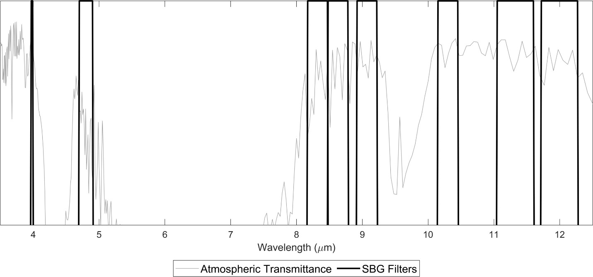{width="6.5in" height="3.047222222222222in"}

[]{#_Toc143613306 .anchor}**Table 2: SBG final band positions and
characteristics.**

<table>
<colgroup>
<col style="width: 6%" />
<col style="width: 12%" />
<col style="width: 10%" />
<col style="width: 10%" />
<col style="width: 9%" />
<col style="width: 10%" />
<col style="width: 10%" />
<col style="width: 8%" />
<col style="width: 9%" />
<col style="width: 11%" />
</colgroup>
<tbody>
<tr class="odd">
<td><strong>Band #</strong></td>
<td><strong>Center Wavelength (µm)</strong></td>
<td>
<strong>Spectral Width (FWHM)</strong>

<strong>(nm)</strong>
</td>
<td>
<strong>Tolerance</strong>

<strong>Center Wavelength (± nm)</strong>
</td>
<td><strong>Tolerance Spectral Width (±nm)</strong></td>
<td><strong>Knowledge Center Wavelength (±nm)</strong></td>
<td><strong>Knowledge Spectral Width (±nm)</strong></td>
<td>
<strong>Accuracy</strong>

<strong>(Kelvin)</strong>
</td>
<td><strong>NEdT (Kelvin)</strong></td>
<td>
<strong>Range</strong>

<strong>(Kelvin)</strong>
</td>
</tr>
<tr class="even">
<td></td>
<td></td>
<td></td>
<td></td>
<td></td>
<td></td>
<td></td>
<td></td>
<td></td>
<td></td>
</tr>
<tr class="odd">
<td></td>
<td></td>
<td></td>
<td></td>
<td></td>
<td></td>
<td></td>
<td></td>
<td></td>
<td></td>
</tr>
<tr class="even">
<td></td>
<td></td>
<td></td>
<td></td>
<td></td>
<td></td>
<td></td>
<td></td>
<td></td>
<td></td>
</tr>
<tr class="odd">
<td></td>
<td></td>
<td></td>
<td></td>
<td></td>
<td></td>
<td></td>
<td></td>
<td></td>
<td></td>
</tr>
<tr class="even">
<td></td>
<td></td>
<td></td>
<td></td>
<td></td>
<td></td>
<td></td>
<td></td>
<td></td>
<td></td>
</tr>
<tr class="odd">
<td></td>
<td></td>
<td></td>
<td></td>
<td></td>
<td></td>
<td></td>
<td></td>
<td></td>
<td></td>
</tr>
<tr class="even">
<td></td>
<td></td>
<td></td>
<td></td>
<td></td>
<td></td>
<td></td>
<td></td>
<td></td>
<td></td>
</tr>
<tr class="odd">
<td></td>
<td></td>
<td></td>
<td></td>
<td></td>
<td></td>
<td></td>
<td></td>
<td></td>
<td></td>
</tr>
</tbody>
</table>

The TIR instrument will operate as a push-whisk mapper very similar to
ECOSTRESS with 256 pixels in the cross-whisk direction for each spectral
channel (Figure 2), which enables a wide swath and high spatial
resolution. As the spacecraft moves forward, the scan mirror sweeps the
focal plane ground projection in the cross-track direction. Each sweep
is 256-pixels wide. The different spectral bands are swept across a
given point on the ground sequentially. From the spacecraft altitude of
665 km, the resulting swath is 935 km wide. The scan mirror rotates at a
constant angular speed and sweeps the focal plane image 68.8° across
nadir, then to two on-board blackbody targets at 300 K and 340 K. Both
blackbodies will be viewed with each cross-track sweep every 1.29
seconds to provide gain and offset calibrations.

## Radiometer

\[Updated info here on radiometer\]

+------------------------+---------------------------------------------+
| **Spectral**           |                                             |
+========================+=============================================+
| Bands (µm)             | 4, 4.8, 8.32, 8.63, 9.07, 10.3, 11.35,      |
|                        | 12.05                                       |
+------------------------+---------------------------------------------+
| Bandwidth (nm)         | 20, 150, 300, 300, 300, 300, 500, 500       |
+------------------------+---------------------------------------------+
| Accuracy at 300 K      | \<0.01 µm                                   |
+------------------------+---------------------------------------------+
| **Radiometric**        |                                             |
+------------------------+---------------------------------------------+
| Range                  | TIR bands (200 - 500 K)                     |
|                        |                                             |
|                        | 4 micron band (700 -1200 K)                 |
|                        |                                             |
|                        | 4.8 micron band (400 - 800 K)               |
+------------------------+---------------------------------------------+
| Resolution             | \< 0.05 K, linear quantization to 14 bits   |
+------------------------+---------------------------------------------+
| Accuracy               | \< 0.5 K 3-sigma at 275 K                   |
+------------------------+---------------------------------------------+
| Precision (NEdT)       | \< 0.2 K                                    |
+------------------------+---------------------------------------------+
| Linearity              | \>99% characterized to 0.1 %                |
+------------------------+---------------------------------------------+
| **Spatial**            |                                             |
+------------------------+---------------------------------------------+
| IFOV                   | 60m                                         |
+------------------------+---------------------------------------------+
| MTF                    | \>0.65 at FNy                               |
+------------------------+---------------------------------------------+
| Scan Type              | Push-Whisk                                  |
+------------------------+---------------------------------------------+
| Swath Width at 665-km  | 935 km (+/- 34.4°)                          |
| altitude               |                                             |
+------------------------+---------------------------------------------+
| Cross Track Samples    | 10,000 (check)                              |
+------------------------+---------------------------------------------+
| Swath Length           |                                             |
+------------------------+---------------------------------------------+
| Down Track Samples     | 256                                         |
+------------------------+---------------------------------------------+
| Band to Band           | 0.2 pixels (12 m)                           |
| Co-Registration        |                                             |
+------------------------+---------------------------------------------+
| Pointing Knowledge     | 10 arcsec (0.5 pixels) (approximate value,  |
|                        | currently under evaluation)                 |
+------------------------+---------------------------------------------+
| **Temporal**           |                                             |
+------------------------+---------------------------------------------+
| Orbit Crossing         | Multiple                                    |
+------------------------+---------------------------------------------+
| Global Land Repeat     | Multiple                                    |
+------------------------+---------------------------------------------+
| **On Orbit             |                                             |
| Calibration**          |                                             |
+------------------------+---------------------------------------------+
| Lunar views            | 1 per month {radiometric}                   |
+------------------------+---------------------------------------------+
| Blackbody views        | 1 per scan {radiometric}                    |
+------------------------+---------------------------------------------+
| Deep Space views       | 1 per scan {radiometric}                    |
+------------------------+---------------------------------------------+
| Surface Cal            | 2 (day/night) every 5 days {radiometric}    |
| Experiments            |                                             |
+------------------------+---------------------------------------------+
| Spectral Surface Cal   | 1 per year                                  |
| Experiments            |                                             |
+------------------------+---------------------------------------------+
| **Data Collection**    |                                             |
+------------------------+---------------------------------------------+
| Time Coverage          | Day and Night                               |
+------------------------+---------------------------------------------+
| Land Coverage          | Land surface above sea level                |
+------------------------+---------------------------------------------+
| Water Coverage         | n/a                                         |
+------------------------+---------------------------------------------+
| Open Ocean             | n/a                                         |
+------------------------+---------------------------------------------+
| Compression            | 2:1 lossless                                |
+------------------------+---------------------------------------------+

: []{#_Toc143613307 .anchor}Table 3: SBG TIR Instrument and Measurement
Characteristics

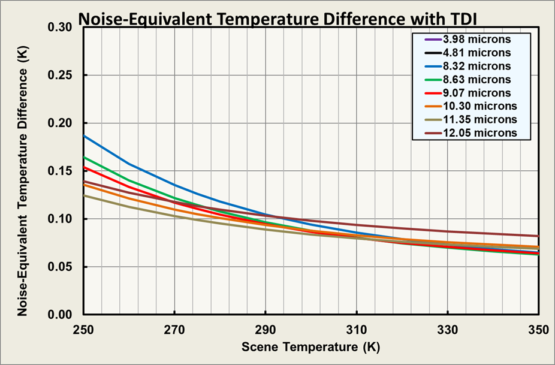{width="6.5in" height="4.274305555555555in"}

[]{#_Toc143613155 .anchor}**Figure 2: Modeled SBG NEdT versus scene
temperature for the two MIR and six TIR bands with time delay
integration (TDI).**

# Theory and Methodology

## Midwave and Thermal Infrared Remote Sensing Background

The at-sensor measured radiance in the infrared region (4--15 µm, MIR:
3-5 µm, TIR: 8-15 µm) consists of a combination of different terms from
surface emission, solar reflection, and atmospheric emission and
attenuation. The Earth-emitted radiance is a function of temperature and
emissivity and gets attenuated by the atmosphere on its path to the
satellite. The emissivity of an isothermal, homogeneous emitter is
defined as the ratio of the actual emitted radiance to the radiance
emitted from a black body at the same thermodynamic temperature ([Norman
and Becker 1995](#_ENREF_70)), $\epsilon_{\lambda}$=
$R_{\lambda}$/$B_{\lambda}$. The emissivity is an intrinsic property of
the Earth's surface and is an independent measurement of the surface
temperature, which varies with irradiance and local atmospheric
conditions. The emissivity of most natural Earth surfaces for the TIR
wavelength ranges between 8 and 12 μm and, for a sensor with spatial
scales \<100 m, varies from \~0.7 to close to 1.0. Narrowband
emissivities less than 0.85 are typical for most desert and semi-arid
areas due to the strong quartz absorption feature (reststrahlen band)
between the 8- and 9.5-μm range, whereas the emissivity of vegetation,
water, and ice cover are generally greater than 0.95 and spectrally flat
in the 3--15-μm range except for dry and senesced vegetation that can
have emissivities range from 0.9-0.95 in the longer wavelengths above 10
μm.

The atmosphere also emits radiation, of which some reaches the sensor
directly as \"path radiance,\" while some gets radiated to the surface
(irradiance) and reflected back to the sensor, commonly known as the
reflected downwelling sky irradiance. One effect of the sky irradiance
is the reduction of the spectral contrast of the emitted radiance, due
to Kirchhoff\'s law. Assuming the spectral variation in emissivity is
small (Lambertian assumption), and using Kirchhoff\'s law to express the
hemispherical-directional reflectance as directional emissivity
($\rho_{\lambda} = 1 - \epsilon_{\lambda}),$ The at-sensor measured
radiance in the infrared spectral region (3--15 µm) is a combination of
three primary terms: the Earth-emitted radiance, reflected downwelling
radiance (thermal + solar components), and total atmospheric path
radiance (thermal + solar components).

  -----------------------------------------------------------------------------------------------------------------------------------------------------------------------------------------------------------------------------------------------------------------------------------------------------------------------
  $L_{obs}(\lambda,\theta) = \tau_{\lambda}(\theta)\left\lbrack \epsilon_{\lambda}B\left( \lambda,T_{s} \right) + \ \rho_{\lambda}\left( L_{s}^{\downarrow}(\lambda,\theta) + L_{t}^{\downarrow}(\lambda,\theta) \right) \right\rbrack + L_{t}^{\uparrow}(\lambda,\theta) + + L_{s}^{\uparrow}(\lambda,\theta)\ \ \ \ $
  (1)
  -----------------------------------------------------------------------------------------------------------------------------------------------------------------------------------------------------------------------------------------------------------------------------------------------------------------------

  -----------------------------------------------------------------------------------------------------------------------------------------------------------------------------------------------------------------------------------------------------------------------------------------------------------------------

  : []{#_Toc143613156 .anchor}Figure 3: Simulated top-of-atmosphere
  radiance at sensor for solar (red) and infrared (blue) radiance
  components in the 3--13 µm region including the total atmospheric
  transmittance (black). The left image shows an example for desert sand
  (quartz) while right image is a simulation for a forest (redwood
  conifer) both at 300 K surface temperature and using a US standard
  atmosphere.

where: $L(\lambda,\theta)$ = at-sensor radiance, $\lambda$ is
wavelength, $\theta$ is the satellite viewing angle,
$\epsilon_{\lambda}$ is the surface emissivity, $\rho_{\lambda}$ is
surface reflectance, $B\left( \lambda,T_{s} \right)$ is the Planck
function describing radiance emitted at surface temperature, $T_{s}$,
$L_{s}^{\downarrow}$ is the total (diffuse and direct) downwelling solar
radiance, $L_{t}^{\downarrow}$ is the downwelling thermal irradiance,
$\tau_{\lambda}(\theta)$ is the atmospheric transmittance,
$L_{s}^{\uparrow}(\lambda,\ \theta)$ is the upward path solar radiance,
and $L_{t}^{\uparrow}(\lambda,\ \theta)$ is the upward thermal path
radiance reaching the sensor.

Reflected solar radiation in the midwave infrared (MIR, 3-5 µm) region
is non-negligible for highly reflective surfaces and needs to be taken
into account in the atmospheric correction. For example, Figure 3 shows
that the solar contribution to at-sensor radiance is almost the same
magnitude as the thermal component between 3-4 µm for highly reflective
quartz sands (\~1 W/m2), while the solar component is negligible for a
simulated vegetative surface (e.g. conifer). Typically the diffuse and
direct solar beam terms are estimated and treated separately since the
solar zenith angle has different effects on these terms. For example,
with high solar zenith angles the solar beam at the surface decreases,
but the solar diffuse irradiance term may increase. For most terrestrial
surfaces the emissivity varies between 0.6 and 1 in the MIR, but values
less than 0.85 are mostly restricted to deserts. Even though there are
significant spectral variations in this region, their BRDF anisotropic
factor is small and on the order of 2%. As a result we can assume a
single BRDF factor and Lambertian surface with isotropic reflection i.e.
$\rho_{\lambda} = \frac{\rho_{\lambda}}{\pi}$.

The reflected thermal infrared (TIR, 8-15 µm) radiance term is generally
smaller in magnitude (\~10%) than the surface-emitted radiance but needs
to be taken into account particularly over highly reflective surfaces
and on humid days when atmospheric water vapor content is high. Because
of the smaller sky irradiance contribution and generally low
reflectances in the TIR region over most vegetated surfaces, we can also
assume a Lambertian surface and use Kirchhoff\'s law to express the
hemispherical-directional reflectance as directional emissivity i.e.
$\rho_{\lambda} = \frac{{1 - \epsilon}_{\lambda}}{\pi}$. Equation (1)
gives the at-sensor radiance for a single wavelength, $\lambda$, while
the measurement from a sensor is typically measured over a range of
wavelengths, or band. The at-sensor radiance for a discrete band, $i$,
is obtained by weighting and normalizing the at-sensor spectral radiance
calculated by equation (1) with the sensor\'s spectral response function
for each band, ${Sr}_{\lambda}$, as follows:

+---------------------------------------------------------+------------+
| $$L_{i}(\theta) = \frac{\int_                           | > \(2\)    |
| {}^{}{{Sr}_{\lambda}(i) \bullet L_{\lambda}(\theta) \bu |            |
| llet d\lambda\ }}{{Sr}_{\lambda}(i) \bullet d\lambda}$$ |            |
+=========================================================+============+
+---------------------------------------------------------+------------+

: []{#_Toc291161845 .anchor}Figure 4: Simulated at sensor radiance
components described in equation (1) in the MIR range (3-4.2 micron) for
desert sand (left) and redwood conifer (right) for a surface at 300 K
and US standard atmosphere. Note the large solar reflected component for
desert sand, while for vegetation this component is negligible due to
higher emissivity (low reflectance). For both surfaces, the downwelling
thermal radiance and solar path radiances are the smallest components
and account for less than 2% of total radiance.

Based on these assumptions we can express the total at-sensor radiance
measured by a sensor for band *i* as:

$L_{i}(\theta) = \tau_{i}(\theta)\left\lbrack \epsilon_{i}B\left( i,T_{s} \right) + \ \frac{{1 - \epsilon}_{i}}{\pi}\left( L_{s}^{\downarrow}(i,\theta) + L_{t}^{\downarrow}(i,\theta) \right) \right\rbrack + L_{t}^{\uparrow}(i,\theta) + + L_{s}^{\uparrow}(i,\theta)$
(3)

The atmospheric and solar terms ($L_{s}^{\downarrow}$,
$L_{t}^{\downarrow}{,\ \tau}_{\lambda}$, $L_{s}^{\uparrow}$,
$L_{t}^{\uparrow}$) can be estimated with a suitable radiative transfer
model such as MODTRAN ([Berk et al. 2005](#_ENREF_10); [Kneizys et al.
1996](#_ENREF_55)) or RTTOV, using input atmospheric fields of air
temperature, relative humidity, and geopotential height from either
remote sounding data (e.g. IASI, AIRS), or from Numerical Weather Model
(NWP) data (e.g. ECMWF, MERRA2, NCEP). For the atmospheric correction of
MODIS and VIIRS Infared data, both temperature/emissivity separation
algorithms used to produce the LST&E products (MOD21, VNP21) use the
[RTTOV](https://nwp-saf.eumetsat.int/site/software/rttov/) model, which
was found to be an order of magnitude faster in compute time than
MODTRAN. The RTTOV model was developed by the European Center for Medium
range Weather Forecasting (ECMWF) ([Matricardi et al. 2004](#_ENREF_62))
and uses FORTRAN 90 code with a spectral range in the visible/infrared
from 0.4 -- 50 µm. More detailed information on RTTOV is available in
Matricardi ([2004](#_ENREF_62)) and Bauer ([2006](#_ENREF_8)).

  ----------------------------------------------------------------------------------------------------------
  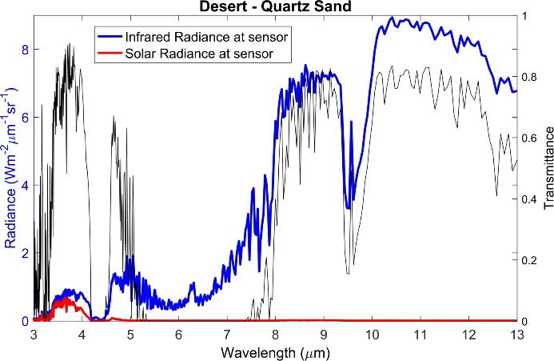{width="3.1272583114610675in"   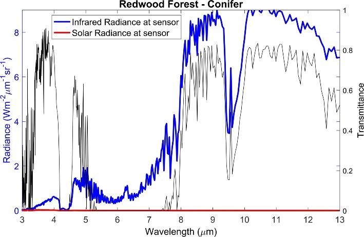{width="3.201388888888889in"
  height="2.0347222222222223in"}                        height="2.0829538495188102in"}
  ----------------------------------------------------- ----------------------------------------------------

  ----------------------------------------------------------------------------------------------------------

  : []{#_Toc143613158 .anchor}Figure 5: Example profiles of Relative
  Humidity (RH) and Air Temperature from the NCEP GDAS product.

To further speed up computational time a Look Up Table (LUT) approach
can be implemented to estimate the solar components
($L_{s}^{\downarrow}$, $L_{s}^{\uparrow}$) based on input day of year,
satellite zenith angle, and solar zenith angle. For the MOD21 and VNP21
TES algorithms, these LUT's were calculated using MODTRAN runs with a
step for satellite and solar zenith angles of 10 degrees for angles
smaller than 30, and 5 degrees for angles larger, and up to 65 degrees
for satellite and 75 for solar angles. A step of one day per month for a
year was used for the day of year constraint (i.e. solar constant
changes).

The approach for computing surface radiance is essentially a two-step
process. First, the atmospheric state is characterized by obtaining
atmospheric profiles of air temperature, water vapor, geopotential
height, and ozone at the observation time and location of the
measurement. Ideally the profiles should be obtained from a validated,
mature product with sufficient spatial resolution and close enough in
time with the ECOSTRESS observation to avoid interpolation errors. This
is particularly important for the temperature and water profiles to
ensure good accuracy. Absorption from other gas species such as CH~4~,
CO, and N~2~O will not be significant

  ----------------------------------------------------------------------------------------------------------
  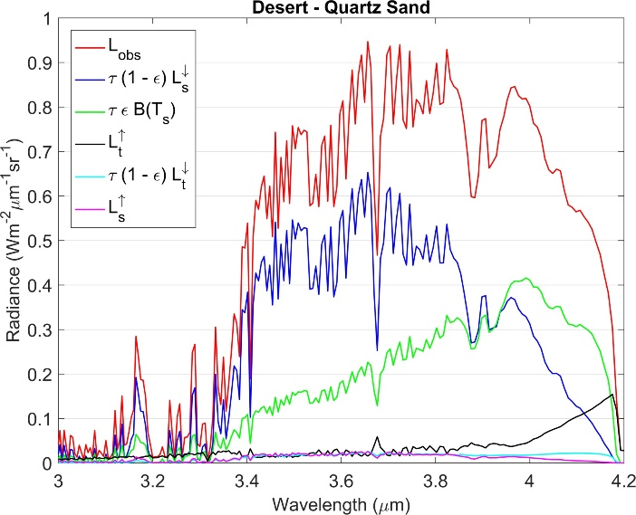{width="3.1785192475940507in"   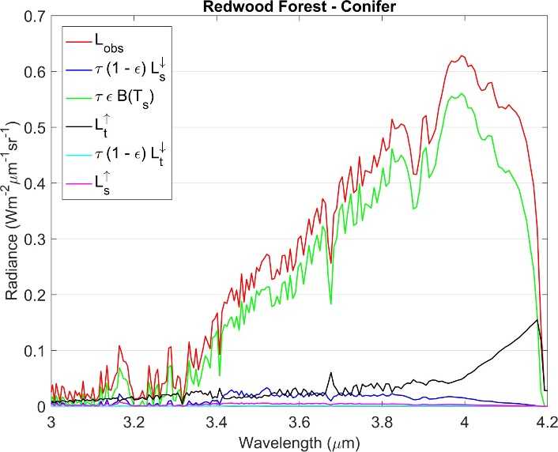{width="3.199419291338583in"
  height="2.578472222222222in"}                         height="2.591666666666667in"}
  ----------------------------------------------------- ----------------------------------------------------

  ----------------------------------------------------------------------------------------------------------

  : []{#_Toc143613308 .anchor}Table 4: Geophysical data available in the
  GEOS5-FP analyses product. Columns under Mandatory specify if the
  variables is needed for determining atmospheric correction parameters.

for the placement of the ECOSTRESS TIR bands. The second step is to
input the atmospheric profiles to a radiative transfer model to estimate
the atmospheric parameters defined previously. This method will be used
on clear-sky pixels only, which will be classified using a cloud mask
specifically tailored for ECOSTRESS data. Clouds result in strong
attenuation of the thermal infrared signal reaching the sensor, and an
attempt to correct for this attenuation will not be made.

##  Radiative Transfer Model

### RTTOV

The Radiative Transfer for TOVS
([RTTOV](https://nwp-saf.eumetsat.int/site/software/rttov/)) is a very
fast radiative transfer model for nadir-viewing passive visible,
infrared and microwave satellite radiometers, spectrometers and
interferometers ([Saunders et al. 1999](#_ENREF_75)). RTOV is a
FORTRAN-90 code for simulating satellite radiances, designed to be
incorporated within users\' applications.  RTTOV was originally
developed at ECMWF in the early 90\'s for TOVS ([Eyre and Woolf
1988](#_ENREF_24)). Subsequently the original code has gone through
several developments ([Matricardi et al. 2001](#_ENREF_63); [Saunders et
al. 1999](#_ENREF_75)), more recently within the EUMETSAT NWP Satellite
Application Facility (SAF), of which RTTOV v11 is the latest version. It
is actively developed by ECMWF and UKMET.

A number of satellite sensors are supported from various platforms
(<https://nwpsaf.eu/deliverables/rtm/rttov_description.html>). RTTOV has
been sufficiently tested and validated and is conveniently fast for full
scale retrievals ([Matricardi 2009](#_ENREF_61)). Given an atmospheric
profile of temperature, water vapor and optionally other trace gases
(for example ozone and carbon dioxide) together with satellite and solar
zenith angles and surface temperature, pressure and optionally surface
emissivity and reflectance, RTTOV will compute the top of atmosphere
radiances in each of the channels of the sensor being simulated. Users
can also specify the selected channels to be simulated.

Mathematically, in vector notation, given a state vector, x, which
describes the atmospheric/surface state as a profile and surface
variables the radiance vector, y, for all the channels required to be
simulated is given by ([Saunders et al. 1999](#_ENREF_75)):

+---------+------------------------------------------------+----------+
|         | **y** = *H*(**x**)                             | > \(4\)  |
+=========+================================================+==========+
+---------+------------------------------------------------+----------+

: []{#_Toc143613159 .anchor}Figure 6: An example showing temporal
interpolation of air temperature (left panels) and relative humidity
(right panels) data from the NCEP GDAS product over Los Angeles, CA at
different atmospheric levels from surface to the stratosphere. A linear
and a constrained quadratic fit is used for data at 0, 6, 12, 18 UTC and
0 UTC on the following day. The results indicate that a quadratic fit is
optimal for fitting air temperature data in the boundary layer and
mid-troposphere, but that a linear fit is more representative at higher
levels. This is also true for the relative humidity.

where *H* is the radiative transfer model, i.e. RTTOV (also referred to
as the observation operator in data assimilation parlance). This is
known as the \'direct\' or \'forward\' model.

An important feature of the RTTOV model is that it not only performs the
fast computation of the forward (or direct) clear-sky radiances but also
the fast computation of the gradient of the radiances with respect to
the state vector variables for the input state vector values. The
Jacobian matrix **H** which gives the change in radiance **δy** for a
change in any element of the state vector **δx** assuming a linear
relationship about a given atmospheric state **x~0~**:

+---------+------------------------------------------------+----------+
|         | **δy** = **H**(**x~0~**)**δx**                 | > \(5\)  |
+=========+================================================+==========+
+---------+------------------------------------------------+----------+

: []{#_Toc143613160 .anchor}Figure 7: a) Illustration of interpolation
in elevation. The black circles represent elevations at which the NWP
profiles are defined. b) Illustration of spatial interpolation. The grid
represents the layout of the pixels and the black circles the NWP points
(not to scale). The radiative transfer parameters values at the four
pertinent NWP points are interpolated to the location of the current
pixel, represented by the gray circle.

The elements of **H** contain the partial
derivatives $\frac{\partial y_{i}}{\partial x_{j}}\left( \frac{dy_{i}}{dx_{j}} \right)$ where
the subscript* **i*** refers to channel number and ***j*** to position
in state vector. The Jacobian gives the top of atmosphere radiance
change for each channel from each level in the profile given a unit
perturbation at any level of the profile vectors or in any of the
surface/cloud parameters. It shows clearly, for a given profile, which
levels in the atmosphere are most sensitive to changes in temperature
and variable gas concentrations for each channel.

In RTTOV the transmittances of the atmospheric gases are expressed as a
function of profile dependent predictors. This parameterization of the
transmittances makes the model computationally efficient. The RTTOV fast
transmittance scheme uses regression coefficients derived from accurate
Line by Line computations to express the optical depths as a linear
combination of profile dependent predictors that are functions of
temperature, absorber amount, pressure and viewing angle ([Matricardi
and Saunders 1999](#_ENREF_64)). The regression coefficients are
computed using a training set of diverse atmospheric profiles chosen to
represent the range of variations in temperature and absorber amount
found in the atmosphere ([Chevallier 2000](#_ENREF_14); [Matricardi
2008](#_ENREF_60), [2009](#_ENREF_61); [Matricardi and Saunders
1999](#_ENREF_64)). The selection of the predictors is made according to
the coefficients file supplied to the program.

## Atmospheric Profile Data

The general methodology for atmospherically correcting TIR data is based
on the methods that were developed for the ASTER ([Palluconi et al.
1999](#_ENREF_72)) and MODIS approaches ([Hulley et al.
2012a](#_ENREF_39)). However, adjustments will be made by taking
advantage of improved interpolation techniques and higher resolution
Numerical Weather Prediction (NWP) model data.

Currently two options for atmospheric profile sources are available: 1)
interpolation of data assimilated from NWP models, and 2) retrieved
atmospheric geophysical profiles from remote-sensing data. The NWP
models use current weather conditions, observed from various sources
(e.g., radiosondes, surface observations, and weather satellites) as
input to dynamic mathematical models of the atmosphere to predict the
weather. Data are typically output in 6-hour increments, e.g., 00, 06,
12, and 18 UTC. Examples include the Global Data Assimilation System
(GDAS) product provided by the National Centers for Environmental
Prediction (NCEP)

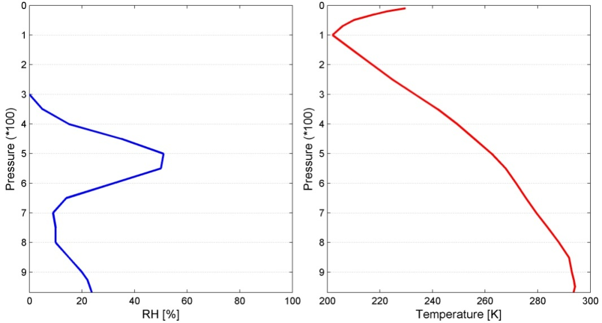{width="4.119944225721785in"
height="2.2150251531058616in"}

([Kalnay et al. 1990](#_ENREF_52)), the Modern Era
Retrospective-analysis for Research and Applications (MERRA-2) product
provided by the Goddard Earth Observing System Data Assimilation System
Version 5.2.0 (GEOS-5.2.0) ([Bosilovich et al. 2008](#_ENREF_12)),
GEOS-5 Forward Processing (FP) Atmospheric Data Assimilation System
(GEOS-5 ADAS), and the European Center for Medium-Range Weather
Forecasting (ECMWF), which is supported by more than 32 European states.
Remote-sensing data, on the other hand, are available real-time,
typically twice-daily and for clear-sky conditions. The principles of
inverse theory are used to estimate a geophysical state (e.g.,
atmospheric temperature) by measuring the spectral emission and
absorption of some known chemical species such as carbon dioxide in the
thermal infrared region of the electromagnetic spectrum (i.e. the
observation). Examples of current remote sensing data include the
Atmospheric Infrared Sounder (AIRS) ([Susskind et al. 2003](#_ENREF_79))
and Moderate Resolution Imaging Spectroradiometer (MODIS) ([Justice and
Townshend 2002](#_ENREF_51)), both on NASA\'s Aqua satellite launched in
2002.

SBG will have a unique 12:30 am/pm overpass that does not overlap with
current and likely future sounders (e.g. AIRS, CrIS, IASI) that usually
have early afternoon overpass time (1:30 am/pm) and so the only feasible
way to atmospherically correct the data at a given observation hour is
to interpolate in space and time from NWP data. NWP data options
available for SBG include the MERRA-2 and GEOS5 reanalyses products
produced by the NASA Global Modeling and Assimilation Office (GMAO) and
NOAA provided NWP data, e.g. NFS and NCEP. The likely choice for SBG
will be the GEOS5-FP data that will provide consistency from ECOSTRESS.
GEOS5-FP data provide the highest spatial (1/4 degree) and temporal (3
hourly) resolution and is provided in near real-time for end users.
MERRA-2 data has a one month latency which would have complicated the
processing system dynamics at the JPL science data system. The GEOS-5 FP
Atmospheric Data Assimilation System (GEOS-5 ADAS) uses an analysis
developed jointly with NOAA's National Centers for Environmental
Prediction (NCEP), which allows the Global Modeling and Assimilation
Office (GMAO) to take advantage of the developments at NCEP and the
Joint Center for Satellite Data Assimilation (JCSDA) ([Lucchesi
2017](#_ENREF_57)).

The atmospheric profiles are first interpolated in time to the SBG
observation using the \[00 03 06 09 12 15 18 21\] analysis observation
hours using a constrained quadratic function as

discussed in the following section. The GEOS5 data is then gridded to
the SBG swath resolution using a bicubic interpolation approach. The
SRTM Digital Elevation Model (DEM) available in

+-----+----------------------+-----------+-----------+----------------+
| *   |                      |           |           |                |
| *GE |                      |           |           |                |
| OS5 |                      |           |           |                |
| -FP |                      |           |           |                |
| An  |                      |           |           |                |
| aly |                      |           |           |                |
| ses |                      |           |           |                |
| D   |                      |           |           |                |
| ata |                      |           |           |                |
| (   |                      |           |           |                |
| ins |                      |           |           |                |
| t3_ |                      |           |           |                |
| 3d_ |                      |           |           |                |
| asm |                      |           |           |                |
| _Np |                      |           |           |                |
| )** |                      |           |           |                |
+=====+======================+===========+===========+================+
| *   |                      | **        | **        | **Remarks**    |
| *Ge |                      | Mandatory | Available |                |
| oph |                      | for       | in        |                |
| ysi |                      | RTTOV?**  | GEOS5?**  |                |
| cal |                      |           |           |                |
| fi  |                      |           |           |                |
| eld |                      |           |           |                |
| s** |                      |           |           |                |
+-----+----------------------+-----------+-----------+----------------+
| t   | Time                 | Yes       | Yes       |                |
| ime |                      |           |           |                |
+-----+----------------------+-----------+-----------+----------------+
| lat | Latitude             | Yes       | Yes       |                |
+-----+----------------------+-----------+-----------+----------------+
| lon | Longitude            | Yes       | Yes       |                |
+-----+----------------------+-----------+-----------+----------------+
| lev | Pressure             | Yes       | Yes       |                |
+-----+----------------------+-----------+-----------+----------------+
| T   | Air Temperature      | Yes       | Yes       |                |
+-----+----------------------+-----------+-----------+----------------+
| QV  | Specific Humidity    | Yes       | Yes       | Specific       |
|     |                      |           |           | humidity is    |
|     |                      |           |           | converted into |
|     |                      |           |           | ppmv for input |
|     |                      |           |           | to RTTOV       |
+-----+----------------------+-----------+-----------+----------------+
| PS  | Surface Pressure     | Yes       | Yes       |                |
+-----+----------------------+-----------+-----------+----------------+
| skt | Skin Temperature     | Yes       | No        | T value at the |
|     |                      |           |           | first valid    |
|     |                      |           |           | level above    |
|     |                      |           |           | surface is     |
|     |                      |           |           | used           |
+-----+----------------------+-----------+-----------+----------------+
| t2  | Temperature at 2 m   | Yes       | No        | T value at the |
|     |                      |           |           | first valid    |
|     |                      |           |           | level above    |
|     |                      |           |           | surface is     |
|     |                      |           |           | used           |
+-----+----------------------+-----------+-----------+----------------+
| q2  | Specific Humidity at | Yes       | No        | Q value at the |
|     | 2 m                  |           |           | first valid    |
|     |                      |           |           | level above    |
|     |                      |           |           | surface is     |
|     |                      |           |           | used           |
+-----+----------------------+-----------+-----------+----------------+
| lsm | Land Sea Mask        | Yes       | No        | Auxiliary      |
|     |                      |           |           | database       |
|     |                      |           |           |                |
|     |                      |           |           | SBG L1A GEO    |
|     |                      |           |           | Data           |
+-----+----------------------+-----------+-----------+----------------+
| el  | Elevation            | Yes       | No        | Auxiliary      |
|     |                      |           |           | database       |
|     |                      |           |           |                |
|     |                      |           |           | SBG L1A GEO    |
|     |                      |           |           | Data           |
+-----+----------------------+-----------+-----------+----------------+
| tcw | Total Column Water   | No        | No        | But calculated |
|     |                      |           |           | internally     |
|     |                      |           |           | from QV        |
|     |                      |           |           | levels, and    |
|     |                      |           |           | used for L2    |
|     |                      |           |           | uncertainty    |
|     |                      |           |           | estimation.    |
+-----+----------------------+-----------+-----------+----------------+
| **  |                      |           |           |                |
| Res |                      |           |           |                |
| olu |                      |           |           |                |
| tio |                      |           |           |                |
| n** |                      |           |           |                |
+-----+----------------------+-----------+-----------+----------------+
| F   |                      |           |           |                |
| req |                      |           |           |                |
| uen |                      |           |           |                |
| cy: |                      |           |           |                |
| 3   |                      |           |           |                |
| hr  |                      |           |           |                |
| an  |                      |           |           |                |
| aly |                      |           |           |                |
| sis |                      |           |           |                |
| f   |                      |           |           |                |
| rom |                      |           |           |                |
| 00  |                      |           |           |                |
| :00 |                      |           |           |                |
| UTC |                      |           |           |                |
+-----+----------------------+-----------+-----------+----------------+
| Sp  |                      |           |           |                |
| ati |                      |           |           |                |
| al: |                      |           |           |                |
| 3D  |                      |           |           |                |
| Gr  |                      |           |           |                |
| id, |                      |           |           |                |
| 1/4 |                      |           |           |                |
| deg |                      |           |           |                |
| ree |                      |           |           |                |
| in  |                      |           |           |                |
| la  |                      |           |           |                |
| tit |                      |           |           |                |
| ude |                      |           |           |                |
| ×   |                      |           |           |                |
| 5   |                      |           |           |                |
| /16 |                      |           |           |                |
| deg |                      |           |           |                |
| ree |                      |           |           |                |
| in  |                      |           |           |                |
| lon |                      |           |           |                |
| git |                      |           |           |                |
| ude |                      |           |           |                |
+-----+----------------------+-----------+-----------+----------------+
| Di  |                      |           |           |                |
| men |                      |           |           |                |
| sio |                      |           |           |                |
| ns: |                      |           |           |                |
| 1   |                      |           |           |                |
| 152 |                      |           |           |                |
| (l  |                      |           |           |                |
| ong |                      |           |           |                |
| itu |                      |           |           |                |
| de) |                      |           |           |                |
| x   |                      |           |           |                |
| 721 |                      |           |           |                |
| (l  |                      |           |           |                |
| ati |                      |           |           |                |
| tud |                      |           |           |                |
| e), |                      |           |           |                |
| 42  |                      |           |           |                |
| pr  |                      |           |           |                |
| ess |                      |           |           |                |
| ure |                      |           |           |                |
| lev |                      |           |           |                |
| els |                      |           |           |                |
+-----+----------------------+-----------+-----------+----------------+
| G   |                      |           |           |                |
| ran |                      |           |           |                |
| ule |                      |           |           |                |
| si  |                      |           |           |                |
| ze: |                      |           |           |                |
| 558 |                      |           |           |                |
| MB  |                      |           |           |                |
+-----+----------------------+-----------+-----------+----------------+

: []{#_Toc143613161 .anchor}Figure 8. Flow diagram showing all steps in
the retrieval process in generating the SBG land surface temperature and
emissivity product starting with thermal infrared (TIR) at-sensor
radiances and progressing through atmospheric correction, cloud
detection, and the temperature emissivity separation (TES) algorithm.

the L1B product will be used to crop the profiles at the appropriate
levels for each SBG pixel at native resolution.

### Profile Temporal Interpolation

The diurnal cycle of near surface air temperature oscillates almost
sinusoidally between a minimum at sunrise and a maximum in the
afternoon. This occurs primarily because the atmosphere is relatively
transparent to the shortwave radiation from the sun and relatively
opaque to the thermal radiation from the Earth and as a result the
surface is warmed by a positive daytime net radiation, and cooled by a
negative nighttime radiation balance (radiative cooling). The net
radiation determines whether the temperature rises, falls, or remains
constant. The peak in daily temperature generally occurs in the
afternoon as the air continues to warm due to a positive net radiation
that persists for a few hours after noon (temperature lag). Similarly,
minimum daily temperatures generally occur substantially after midnight,
and sometimes during early morning hours around dawn, since heat is lost
all night long. This effect can be seen in Figure 5 which shows air
temperature (left panels) and relative humidity (right panels) data from
the NCEP GDAS product over Los Angeles, CA for the 0, 6, 12, 18 UTC and
0 UTC on the following day. The air temperature diurnal cycle near the
surface (1000 mb) shows a maximum temperature around 5 pm local time (12
pm UTC) during the summertime (1 August 2004), and a minimum at 4 am
local (12 am UTC). A quadratic fit (red line) to the 5 data points
captures the sinusoidal diurnal pattern quite well with maximum
difference of \~1 K from the linear fit (black line). The maximum
diurnal variation at 1000 mb for this particular day was \~ 7 K,
decreasing to \~1 K above the boundary layer (850 mb), and on the order
of a few degrees in the troposphere (250 mb). This indicates that a
linear fit might be good enough above the boundary layer.

This is particularly evident for the relative humidity (RH) diurnal
cycle, where large differences can be seen between the linear and
quadratic fits at 250 mb due to a double inflection point. RH is the
amount of moisture in the air compared to what the air can \"hold\" at
that temperature and is generally calculated in relation to saturated
water vapor density. When the air can\'t \"hold\" all the moisture, then
it condenses as dew. Because of this the diurnal variation in RH is
approximately inverse to that of temperature. At about sunrise the RH is
typically at a maximum and reaches a minimum in the afternoon hours. The
annual variation of RH is largely depends upon the locality. At regions
where the rainy season is in summer and winter is dry, the maximum RH
occurs in summer and minimum in winter and at other regions maximum RH
occurs in winter. Over oceans the RH reaches a maximum during the
summertime**.**

  ---------------------------------------------------------------------------------------------------------------------------------------------------------------------------------------------
  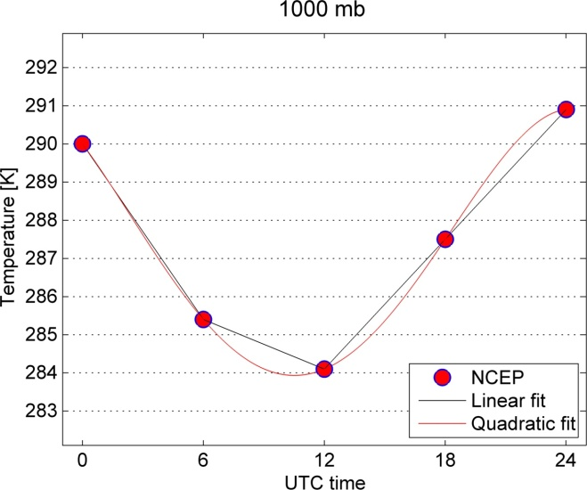{width="2.9971128608923885in"   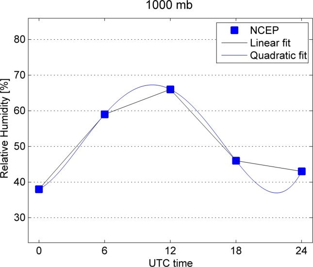{width="2.9314238845144356in"
  height="2.5in"}                                                                                 height="2.5in"}
  ----------------------------------------------------------------------------------------------- ---------------------------------------------------------------------------------------------
  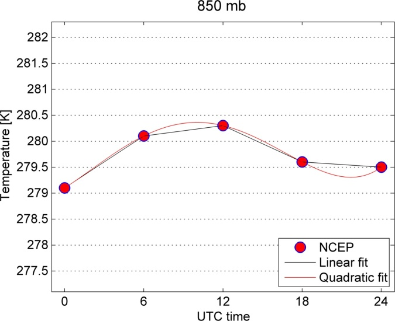{width="3.0695636482939634in"   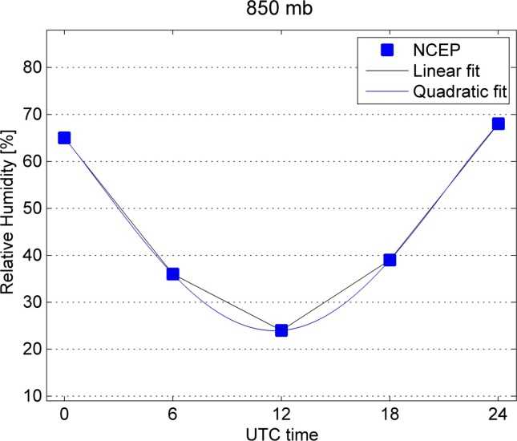{width="2.931182195975503in"
  height="2.5in"}                                                                                 height="2.5in"}

  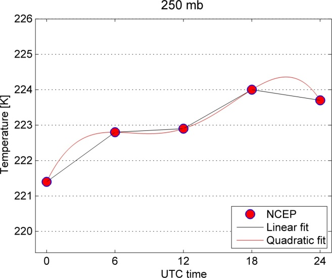{width="2.98625656167979in"    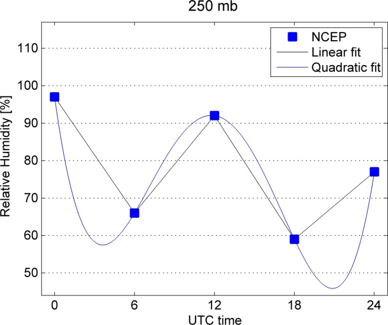{width="2.98625656167979in"
  height="2.5in"}                                                                                 height="2.5in"}
  ---------------------------------------------------------------------------------------------------------------------------------------------------------------------------------------------

  : []{#_Toc143613162 .anchor}Figure 9. Flow diagram of the temperature
  emissivity separation (TES) algorithm in its entirety, including the
  NEM, RATIO and MMD modules. Details are included in the text,
  including information about the refinement of
  $\mathbf{\epsilon}_{\mathbf{\max}}$.

### Profile Vertical and Horizontal Interpolation

A study has been conducted to develop and test different interpolation
schemes using NWP data and evaluate their impact on the retrieved LST
([Cook 2014](#_ENREF_19)). The methodologies have been developed and
tested using only the NCEP North American Regional Reanalysis (NARR)
data set defined over North America only ([Mesinger et al.
2006](#_ENREF_67)). These methodologies will be adapted and used for
interpolation of GEOS5 data required by SBG. The approach generates the
radiative transfer parameters,
$\tau_{\lambda},\ \ L_{\lambda}^{\downarrow}\ ,\ and\ L_{\lambda}^{\uparrow}$
(Eq. 1) at each elevation for each model grid point for the scene.
Generating the radiative transfer parameters at a set of elevations at
each grid point results in a three- dimensional (spatial and height)
cube of data encompassing the entire scene. The radiative transfer
parameters are linearly interpolated to the appropriate elevation at
each of the model grid points, illustrated in Figure 7a, and these
resulting parameters are interpolated to the appropriate pixel locations
using Shepard's inverse distance interpolation method, illustrated in
Figure 7b.

+----------------------------------------+-----------------------------+
| \(a\)                                  | \(b\)                       |
|                                        |                             |
| {width="3.6320002187226597in" | a                           |
| height="1.7120002187226597in"}         | m.png](media/image17.png){w |
|                                        | idth="2.2031528871391077in" |
|                                        | he                          |
|                                        | ight="1.738043525809274in"} |
+========================================+=============================+
+----------------------------------------+-----------------------------+

: []{#_Toc143613163 .anchor}Figure 10. SBG simulated LST generated from
a MASTER scene on 30 January 2018 over Mauna Loa and Kilauea volcanoes
in Hawaii.

## Radiative Transfer Sensitivity Analysis

The accuracy of the atmospheric correction technique proposed relies on
the accuracy of the input variables to the model, such as air
temperature, relative humidity, and ozone. The combined uncertainties of
these input variables need to be known if an estimate of the radiative
transfer accuracy is to be estimated. These errors can be band
dependent, since different channels have different absorbing features
and they are also dependent on absolute accuracy of the input profile
data at different levels. The final uncertainty introduced is the
accuracy of the radiative transfer model itself; however, this is
expected to be small.

To perform the analysis, four primary input geophysical parameters were
input to MODTRAN 5.2, and each parameter was changed sequentially in
order to estimate the corresponding percent change in radiance
([Palluconi et al. 1999](#_ENREF_72)). These geophysical parameters were
air temperature, relative humidity, and ozone. Two different atmospheres
were chosen, a standard tropical atmosphere and a mid-latitude summer
atmosphere. These two simulated atmospheres should capture realistic
errors we expect to see in humid conditions.

Typical values for current NWP accuracies (e.g., GEOS5, ECMWF) of air
temperature and relative humidity retrievals in the boundary layer were
used for the perturbations: 1) air temperature of 2 K, 2) relative
humidity of 20%, 3) ozone was doubled. Table 4 shows the percent changes
in simulated SBG brightness temperatures for bands MIR-1 (4.0 µm) and
TIR 1 (8.32 µm), 3 (9.07 µm), and 5 (10.3 µm) for changes in input
geophysical parameters. SBG TIR band 1 falls closest to the strong water
vapor absorption region below about 8 µm and is therefore most sensitive
to perturbations in relative humidity. The temperature perturbations
have similar effects for all bands with brightness temperature increases
of 1-2 K for a +2K perturbation in tropospheric air temperature, but are
lowest for TIR band 1 as a result of the higher water vapor sensitivity.
Doubling the ozone results in a much larger sensitivity for TIR band 3,
since its band position around 9 microns falls within the ozone
symmetrical normal vibration mode at 1103 cm-1 (\~9 micron) in addition
to the primary mode which is a large asymmetric stretch at 1042 cm-1
(9.6 micron) that can easily be seen as a large absorption feature (e.g.
see Figure 1). Changing the aerosol visibility from rural to urban had a
small effect on each band but was largest for band 5. Generally the
radiance in the thermal infrared region is insensitive to aerosols in
the troposphere so, for the most part, a climatology-based estimate of
aerosols would be sufficient. However, when stratospheric aerosol
amounts increase substantially due to volcanic eruptions, for example,
then aerosols amounts from future NASA remote-sensing missions such as
ACE and GEO-CAPE would need to be taken into account.

It should also be noted, as discussed in Palluconi et al.
([1999](#_ENREF_72)), that in reality these types of errors may have
different signs, change with altitude, and/or have cross-cancelation
between the parameters. As a result, it is difficult to quantify the
exact error budget for the radiative transfer calculation; however, what
we do know is that the challenging cases will involve warm and humid
atmospheres where distributions of atmospheric water vapor are the most
uncertain. []{#_Toc291161853 .anchor}

Table 5: Percent changes in simulated SBG brightness temperatures for
bands MIR-1 (4.0 µm) and TIR 1 (8.32 µm), 3 (9.07 µm), and 5 (10.3 µm)
for changes in input geophysical parameters.

<table>
<caption>
Figure 11.
SBG simulated emissivity for band TIR-3 (9 micron) from a MASTER scene
on 30 January 2018 over Mauna Loa and Kilauea volcanoes in
Hawaii.
</caption>
<colgroup>
<col style="width: 13%" />
<col style="width: 11%" />
<col style="width: 10%" />
<col style="width: 9%" />
<col style="width: 8%" />
<col style="width: 8%" />
<col style="width: 8%" />
<col style="width: 8%" />
<col style="width: 9%" />
<col style="width: 10%" />
</colgroup>
<thead>
<tr class="header">
<th><strong>Geophysical Parameter</strong></th>
<th><strong>Parameter change</strong></th>
<th colspan="4">
<strong>% Change in Brightness Temperature
(K)</strong>

<strong>(Mid-lat Summer Atmosphere)</strong>
</th>
<th colspan="4">
<strong>% Change in Brightness Temperature
(K)</strong>

<strong>(Tropical)</strong>
</th>
</tr>
</thead>
<tbody>
<tr class="odd">
<td></td>
<td></td>
<td>MIR-1</td>
<td>TIR-1</td>
<td>TIR-3</td>
<td>TIR- 5</td>
<td>MIR-1</td>
<td>TIR-1</td>
<td>TIR-3</td>
<td>TIR-5</td>
</tr>
<tr class="even">
<td>Air Temperature</td>
<td>+2 K</td>
<td>1.99</td>
<td>1.20</td>
<td>1.59</td>
<td>1.41</td>
<td>1.98</td>
<td>1.03</td>
<td>1.41</td>
<td>1.18</td>
</tr>
<tr class="odd">
<td>Relative Humidity</td>
<td>+20%</td>
<td>-0.09</td>
<td>-1.41</td>
<td>-1.04</td>
<td>-1.30</td>
<td>-0.11</td>
<td>-1.74</td>
<td>-1.43</td>
<td>-1.79</td>
</tr>
<tr class="even">
<td>Ozone</td>
<td>+100%</td>
<td>-0.00</td>
<td>-0.05</td>
<td>-1.05</td>
<td>-0.25</td>
<td>-0.00</td>
<td>-0.05</td>
<td>-1.12</td>
<td>-0.23</td>
</tr>
</tbody>
</table>

: []{#_Toc143613164 .anchor}Figure 11. SBG simulated emissivity for band
TIR-3 (9 micron) from a MASTER scene on 30 January 2018 over Mauna Loa
and Kilauea volcanoes in Hawaii.

## Temperature and Emissivity Separation Approaches

The radiance in the TIR atmospheric window (8--13 µm) is dependent on
the temperature and emissivity of the surface being observed. Even if
the atmospheric properties (water vapor and air temperature) are well
known and can be removed from equation (1), the problem of retrieving
surface temperature and emissivity from multispectral measurements is
still a non-deterministic process. This is because the total number of
measurements available (N bands) is always less than the number of
variables to be solved for (emissivity in N bands and one surface
temperature). Therefore, no retrieval will ever do a perfect job of
separation, with the consequence that errors in temperature and
emissivity may co-vary. If the surface can be approximated as Lambertian
(isotropic) and the emissivity is assigned *a priori* from a land cover
classification, then the problem becomes deterministic with only the
surface temperature being the unknown variable. Examples of such cases
would be over ocean, ice, or densely vegetated scenes where the
emissivity is known and spectrally flat in all bands. Another
deterministic approach is the single-band inversion approach. If the
atmospheric parameters are known in equation (1), then the temperature
can also be solved for using a single band, usually in the clearest
region of the window (\~11 µm). Deterministic approaches are usually
employed with sensors that have two or three bands in the TIR region,
while non-deterministic approaches are applied to multispectral sensors
so that spectral variations in the retrieved emissivity can be related
to surface composition and cover, in addition to retrieving the surface
temperature. For ECOSTRESS, a non-deterministic approach will be used,
as spectral emissivity will need to be determined physically, along with
temperature, in order to help answer the science questions outlined
previously in section 3.

### Deterministic Approaches

#### Split-window Algorithms

The most common deterministic approach can be employed without having to
explicitly solve the radiative transfer equation. Two or more bands are
employed in the window region (typically 10.5--12 µm), and atmospheric
effects are compensated for by the differential absorption
characteristics from the two bands. This approach is used with much
success over oceans to compute the SST ([Brown and Minnett
1999](#_ENREF_13)), as the emissivity of water is well known ([Masuda et
al. 1988](#_ENREF_59)). Variations of this method over land include the
split-window (SW) approach ([Coll and Caselles 1997](#_ENREF_15); [Prata
1994](#_ENREF_73); [Price 1984](#_ENREF_74); [Wan and Dozier
1996](#_ENREF_87); [Yu et al. 2008](#_ENREF_92)), the multichannel
algorithm ([Deschamps and Phulpin 1980](#_ENREF_23)), and the dual-angle
algorithm ([Barton et al. 1989](#_ENREF_7)). Over land, the assumption
is that emissivities in the split-window bands being used are stable and
well known and can be assigned using a land cover classification map
([Snyder et al. 1998](#_ENREF_77)). However, this assumption introduces
large errors over barren surfaces where much larger variations in
emissivity are found due to the presence of large amounts of exposed
rock or soil often with abundant silicates ([Hulley and Hook
2009a](#_ENREF_41)). Land cover classification maps typically use VNIR
data for assignment of various classes. This method may work for most
vegetation types and over water surfaces but, because VNIR reflectances
correspond predominately to Fe oxides and OH^-^ and not to the Si-O bond
over barren areas, there is little or no correlation with silicate
mineralogy features in thermal infrared data. This is why, in most
classification maps, only one bare land class is specified (barren).
This type of approach will not be used for the SBG standard algorithm
over land, but may be employed over coastal oceans and deep oceans, for
the following reasons:

1.  The emissivity of the land surface is in general heterogeneous and
    is dependent on many factors including surface soil moisture,
    vegetation cover changes, and surface compositional changes, which
    are not characterized by classification maps.

2.  Split-window algorithms are inherently very sensitive to measurement
    noise between bands.

3.  Classification leads to sharp discontinuities and contours in the
    data between different class types. This violates one of the goals
    of SBG in producing seamless images.

4.  Temperature inaccuracies are difficult to quantify over geologic
    surfaces where constant emissivities are assigned.

#### Single-band Inversion

If the atmosphere is known, along with an estimate of the emissivity,
then equation (1) can be inverted to retrieve the surface temperature
using one band. Theoretically, any band used should retrieve the same
temperature, but uncertainties in the atmospheric correction will result
in subtle differences as different bands have stronger atmospheric
absorption features than others which may be imperfectly corrected for
atmospheric absorption. For example, a band near 8 µm will have larger
dependence on water vapor, while the 9--10-µm region will be more
susceptible to ozone absorption. Jimenez-Munoz and Sobrino
([2010](#_ENREF_49)) applied this method to ASTER data by using
atmospheric functions (AFs) to account for atmospheric effects. The AFs
can be computed by the radiative transfer equation or empirically given
the total water vapor content. The clearest ASTER band (13 or 14) was
used to retrieve the temperature, with the emissivity determined using
an NDVI fractional vegetation cover approach. A similar procedure has
been proposed to retrieve temperatures from the Landsat TIR band 6 on
ETM+ and TM sensors ([Li et al. 2004](#_ENREF_56)). The single-band
inversion method will not be used for SBG for the following reasons:

1.  One of the goals of SBG science will be to retrieve the spectral
    emissivity of geologic surfaces for compositional analysis. This
    will not be possible with the single-band approach, which assigns
    emissivity based on land cover type and vegetation fraction.

2.  Estimating emissivity from NDVI-derived vegetation cover fraction
    over arid and semi-arid regions will introduce errors in the LST
    because NDVI is responsive only to chlorophyll active vegetation,
    and does not correlate well with senescent vegetation (e.g.,
    shrublands).

3.  Only one-band emissivity is solved for the single-band inversion
    approach. SBG will be a multispectral retrieval approach.

### Non-deterministic Approaches

In non-deterministic approaches, the temperature and emissivity is
solved using an additional constraint or extra degree of freedom that is
independent of the data source. These types of solutions are also rarely
perfect because the additional constraint will always introduce an
additional level of uncertainty, however, they work well over all
surfaces (including arid and semi arid) and can automatically account
for changes in the surface e.g. due to fire or moisture. First, we
introduce two well-known approaches, the day/night and TISI algorithms,
followed by an examination of the algorithms and methods that led up to
establishment of the TES algorithm.

#### Day/Night Algorithm

The constraint in the day/night algorithm capitalizes on the fact that
the emissivity is an intrinsic property of the surface and should not
change from day- to nighttime observations. The day/night algorithm is
currently used to retrieve temperature/emissivity from MODIS data in the
MOD11B1 product ([Wan and Li 1997](#_ENREF_88)). The method relies on
two measurements (day and night), and the theory is as follows: Two
observations in N bands produces 2N observations, with the unknown
variables being N-band emissivities, a day- and nighttime surface
temperature, four atmospheric variables (day and night air temperature
and water vapor), and an anisotropic factor, giving N + 7 variables. In
order to make the problem deterministic, the following conditions must
be met: 2N$\geq$N+7, or N$\geq$`<!-- -->`{=html}7. For the MODIS
algorithm, this can be satisfied by using bands 20, 22, 23, 29, 31--33.
Although this method is theoretically sound, the retrieval is
complicated by the fact that two clear, independent observations are
needed (preferably close in time) and the pixels from day and night
should be perfectly co-registered. Errors may be introduced when the
emissivity changes from day to night observation (e.g., due to
condensation or dew), and from undetected nighttime cloud. In addition,
the method relies on very precise co-registration between the day- and
nighttime pixel.

#### Temperature Emissivity Separation Approaches

During research activities leading up to the ASTER mission, the ASTER
Temperature Emissivity Working Group (TEWG) was established in order to
examine the performance of existing non-deterministic algorithms and
select one suitable for retrieving the most accurate temperature and/or
emissivity over the entire range of terrestrial surfaces. This lead to
development of the TES algorithm, which ended up being a hybrid
algorithm that capitalized on the strengths of previous algorithms. In
Gillespie et al. ([1999](#_ENREF_28)), ten inversion algorithms were
outlined and tested, leading up to development of TES. For all ten
algorithms, an independent atmospheric correction was necessary. The ten
algorithms were as follows:

1.  Alpha-derived emissivity (ADE) method

2.  Classification method

3.  Day-Night measurement

4.  Emissivity bounds method

5.  Graybody emissivity method

6.  Mean-MMD method (MMD)

7.  Model emissivity method

8.  Normalized emissivity method (NEM)

9.  Ratio Algorithm

10. Split-window algorithm

In this document, we will briefly discuss a few of the algorithms but
will not expand upon any of them in great detail. The day-night
measurement (3), classification (2), and split-window (10) algorithms
have already been discussed in section 4.2.1. A detailed description of
all ten algorithms is available in Gillespie et al.
([1999](#_ENREF_28)). The various constraints proposed in these
algorithms either determine spectral shape but not temperature, use
multiple observations (day and night), assume a value for emissivity and
calculate temperature, assume a spectral shape, or assume a relationship
between spectral shape and minimum emissivity.

The normalized emissivity method (NEM) removes the downwelling sky
irradiance component by assuming an $\epsilon_{\max}$ of 0.99.
Temperature is then estimated by inverting the Planck function and a new
emissivity found. This process is repeated until successive changes in
the estimated surface radiances are small. This method in itself was not
found to be suitable for ASTER because temperature inaccuracies tended
to be high (\>3 K) and the emissivities had incorrect spectral shapes.
Other approaches have used a model to estimate emissivity at one
wavelength ([Lyon 1965](#_ENREF_58)) or required that the emissivity be
the same at two wavelengths ([Barducci and Pippi 1996](#_ENREF_5)). This
introduces problems for multispectral data with more than 5 bands.

The ADE method ([Hook et al. 1992](#_ENREF_36); [Kealy et al.
1990](#_ENREF_53); [Kealy and Hook 1993](#_ENREF_54)) is based on the
alpha residual method that preserves emissivity spectral shape but not
amplitude or temperature. The constraint introduced uses an empirical
relationship between spectral contrast and average emissivity to restore
the amplitude of the alpha-residual spectrum and to compute temperature.
The average emissivity was used in the relationship to minimize
band-to-band calibration errors. The TEWG used this key feature of the
ADE method in TES, although the minimum emissivity instead of average
emissivity was used in the empirical relationship ([Matsunaga
1994](#_ENREF_65)). The ADE itself was not fully employed for two
primary reasons as discussed in Gillespie et al.
([1999](#_ENREF_28)): 1) ADE uses Wien\'s approximation, exp(x) - 1 =
exp(x), which introduces a noticeable \"tilt\" in the residual spectra
that gets transferred to the final emissivity spectra; and 2) This issue
was easily fixed in the hybrid version of TES.

Lastly, the temperature-independent spectral indices (TISI) approach
([Becker and Li 1990](#_ENREF_9)) computes relative emissivities from
power-scaled brightness temperatures. TISI, however, is band-dependent
and only recovers spectral shape; furthermore, the values are non
unique. To retrieve actual emissivities, additional information or
assumptions are needed. Other algorithms, which only retrieve spectral
shape, are the thermal log and alpha residual approach ([Hook et al.
1992](#_ENREF_36)) and spectral emissivity ratios ([Watson
1992](#_ENREF_90); [Watson et al. 1990](#_ENREF_91)). Neither of these
were considered because they do not recover temperature or actual
emissivity values.

# Temperature Emissivity Separation (TES) Algorithm

The final TES algorithm proposed by the ASTER TEWG combined some core
features from previous algorithms and, at the same time, improved on
them. TES combines the NEM, the ratio, and the minimum-maximum
difference (MMD) algorithm to retrieve temperature and a full emissivity
spectrum. The NEM algorithm is used to estimate temperature and
iteratively remove the sky irradiance, from which an emissivity spectrum
is calculated, and then ratioed to their mean value in the ratio
algorithm. At this point, only the shape of the emissivity spectrum is
preserved, but not the amplitude. In order to compute an accurate
temperature, the correct amplitude is then found by relating the minimum
emissivity to the spectral contrast (MMD). Once the correct emissivities
are found, a final temperature can be calculated with the maximum
emissivity value. Additional improvements involve a refinement of
$\epsilon_{\max}$ in the NEM module and refining the correction for sky
irradiance using the $\varepsilon_{\min}$-MMD final emissivity and
temperature values. Finally, a quality assurance (QA) data image is
produced that partly depends on outputs from TES such as convergence,
final $\epsilon_{\max}$, atmospheric humidity, and proximity to clouds.
More detailed discussion of QA is included later in this document.

Numerical modeling studies performed by the ASTER TEWG showed that TES
can recover temperatures to within 1.5 K and emissivities to within
0.015 over most scenes, assuming well calibrated, accurate radiometric
measurements ([Gillespie et al. 1998](#_ENREF_29)).

## Data Inputs

Inputs to the TES algorithm are the surface radiance, $L_{s,i}$, given
by equation (4) (at-sensor radiance corrected for transmittance and path
radiance), and downwelling sky irradiance
term,$\ L_{\lambda}^{\downarrow}$ , which is computed from the
atmospheric correction algorithm using a radiative

transfer model such as MODTRAN. Both the surface radiance and sky
irradiance will be output as a separate product. The surface radiance is
primarily used as a diagnostic tool for monitoring changes in Earth\'s
surface composition. Before the surface radiance is estimated using
equation (4), the accuracy of the atmospheric parameters,
$L_{\lambda}^{\downarrow}$, $\tau_{\lambda}(\theta)$,
$L_{\lambda}^{\uparrow}(\theta)$, is improved upon using a water vapor
scaling (WVS) method ([Tonooka 2005](#_ENREF_82)) on a band-by-band
basis for each observation using an extended multi-channel/water vapor
dependent (EMC/WVD) algorithm (for more details, see SBG Surface
Radiance ATBD).

## TES Limitations

As with any retrieval algorithm, limitations exist that depend on
measurement accuracy, model errors, and incomplete characterization of
atmospheric effects. The largest source of inaccuracy currently for
ASTER data is the residual effect of incomplete atmospheric correction.
Measurement accuracy and precision contribute to less of a degree. This
problem is compounded for graybodies, which have low spectral contrast
and are therefore more prone to errors in \"apparent\" MMD, which is
overestimated due to residual sensor noise and incomplete atmospheric
correction. A threshold classifier was introduced by the TEWG to partly
solve this problem over graybody surfaces. Instead of using the
calibration curve to estimate $\varepsilon_{\min}$ from MMD, a value of
$\varepsilon_{\min}$= 0.983 was automatically assigned when the spectral
contrast or MMD in emissivity was smaller than 0.03 for graybody
surfaces (e.g., water, vegetation). However, this caused artificial step
discontinuities in emissivity between vegetated and arid areas.

At the request of users, two parameter changes were made to the ASTER
TES algorithm on August 1, 2007, first described in Gustafson et al.
([2006](#_ENREF_33)). Firstly, the threshold classifier was removed as
it caused contours and artificial boundaries in the images that users
could not tolerate in their analysis. The consequence of removing the
threshold classifier was a smoother appearance for all images but at the
cost of TES underestimating the emissivity of graybody scenes, such as
water by up to 3% and vegetation by up to 2% ([Hulley et al.
2008](#_ENREF_45)). The second parameter change removed the iterative
correction for reflected downwelling radiation, which also frequently
failed due to inaccurate atmospheric corrections ([Gustafson et al.
2006](#_ENREF_33)). Using only the first iteration resulted in improved
spectral shape and performance of TES.

## TES Processing Flow

Figure 8 shows the processing flow diagram for the generation of the
cloud masks, land-leaving radiance, VNIR reflectances, and TES
temperature and emissivity, while Figure 9 shows a more detailed
processing flow of the TES algorithm itself. Each of the steps will be
presented in sufficient detail in the following section, allowing users
to regenerate the code. TES uses input image data of surface radiance,
$L_{s,i}$, and sky irradiance, $L_{\lambda}^{\downarrow}$, to solve the
TIR radiative transfer equation. The output images will consists of
seven emissivity images ($\epsilon_{i}$) corresponding to SBG MIR band 1
and TIR bands 1-6, and one surface temperature image (T). Emissivity
will not be retrieved for MIR band 2 (4.8 micron) due to its strong CO2
absorption features.

{width="5.9in" height="5.211033464566929in"}

$\epsilon_{\max}$= 0.99

Surface Radiance: $L_{s,i}$

Sky Irradiance: $L_{\lambda}^{\downarrow}$

no

Refine $\epsilon_{\max}$$\epsilon_{\max}$

no

$\epsilon_{\max}$ reset**?**

yes

$\upsilon{> V}_{1}?$$\nu > V_{1}$?
\'$\nu$ **\>**$\mathbf{V}_{\mathbf{1}}$**?**

c=1

$\nu = var(\epsilon^{'})$$\epsilon^{'})$

N=12

[Convergence]{.underline}

[Divergence]{.underline}

$\left| \mathrm{\Delta}^{2}R^{'}/\mathrm{\Delta}c^{2} \right|$\> t1

yes

no

**NEM MODULE**

$$\epsilon_{\max} = \epsilon^{'}$$

no

**Dvg?**

yes

$R_{i} - R_{i}^{'}$ \< t2

for all $i$

**Cvg?**

no

yes

**c\>N?**

c=c+1

$T_{NEM} = max(B_{i}^{- 1}\left( R_{i}^{'} \right))$,
$\epsilon^{'} = R_{i}^{'}/B_{i}(T_{NEM})$

Estimate ground-

emitted radiance

$$R_{i}^{'} = L_{s,i}^{'} - (1 - \epsilon_{\max})\ L_{\lambda}^{\downarrow}$$

QA Data Plane

**RATIO MODULE**

yes

$$\beta_{i} = \epsilon_{i}b\left\lbrack \sum_{i = 1}^{b}\epsilon_{i} \right\rbrack^{- 1}$$

**MMD MODULE**

$\epsilon_{\max}$$\epsilon_{\max} = 0.96$

$V_{1}$$V_{1} = ?$

$MMD = \max\left( \beta_{i} \right) - \ min(\beta_{i})$$MMD = \max\left( \beta_{i} \right) - \ min(\beta_{i})$

$\epsilon_{\min} = \alpha_{1} - \alpha_{2} \bullet {MMD}^{\alpha_{3}}$$\epsilon_{\min} = \alpha_{1} - \alpha_{2} \bullet {MMD}^{\alpha_{3}}$

$\epsilon_{i}^{TES} = \beta_{i}\left( \frac{\epsilon_{\min}}{min(\beta_{i})} \right)$$\epsilon_{i}^{TES} = \beta_{i}\left( \frac{\epsilon_{\min}}{min(\beta_{i})} \right)$

$\epsilon_{\max}^{TES} = max(\epsilon_{i}^{TES})$

${\mathbf{T}^{\mathbf{TES}} = \ B}_{i}^{- 1}\left( R_{i}^{'},\ \epsilon_{\max}^{TES}\ \  \right)$

## NEM Module

The normalized emissivity method (NEM) builds upon the model emissivity
algorithm ([Lyon 1965](#_ENREF_58)) by allowing the initial
$\epsilon_{\max}$ value to be consistent for all wavelengths. The role
of NEM is to compute the surface kinetic temperature, T, and a correct
shape for the emissivity spectrum. An initial value of 0.99 is set for
$\epsilon_{\max}$, which is typical for most vegetated surfaces, snow,
and water. For geologic materials such as rocks and sand,
$\epsilon_{\max}$ values are set lower than this, typically 0.96, and
this value remains fixed. For all other surface types, a modification to
the original NEM allows for optimization of $\epsilon_{\max}$ using an
empirically based process. For the majority of materials in the
ECOSTRESS spectral library, a typical range for $\epsilon_{\max}$ is
0.94\<$\epsilon_{\max}$\<1.0. Therefore, for a material at 300 K, the
maximum errors that NEM temperatures should have are \~±1.5 K, assuming
the reflected sky irradiance has been estimated correctly.

## Removing Downwelling Sky Irradiance

Generally the effects of sky irradiance are small with typical
corrections of \<1 K ([Gillespie et al. 1998](#_ENREF_29)). However, the
contribution becomes larger for pixels with low emissivity (high
reflectance) or in humid conditions when the sky is warmer than the
surface. Over graybody surfaces (water and vegetation), the effects are
small because of their low reflectivity in all bands. The first step of
the NEM module is to estimate ground-emitted radiance, which is found by
subtracting the reflected sky irradiance from the surface radiance term:

+---------+-------------------------------------------------+---------+
|         | $$R_{i} = L_{s,i}^{'} - (1                      | > \(6\) |
|         |  - \epsilon_{\max})\ L_{\lambda}^{\downarrow}$$ |         |
+=========+=================================================+=========+
+---------+-------------------------------------------------+---------+

: []{#_Toc143613165 .anchor}Figure 12. SBG calibration curve of minimum
emissivity vs. min-max difference (MMD). The lab data (crosses) are
computed from 150 spectra consisting of a broad range of terrestrial
materials (rocks, sand, soil, water, vegetation, and ice).

The NEM temperature, which we call $T_{NEM}$, is then estimated by
inverting the Planck function for each band using $\epsilon_{\max}$ and
the ground-emitted radiance and then taking the maximum of those
temperatures. The maximum temperature will most likely be closest to the
actual surface temperature in the presence of uncompensated atmospheric
effects.

+---------+-------------------------------------------------+---------+
|         | $$T_{i} = \frac{c_{2}}{\lambda_{i}}\lef         | > \(7\) |
|         | t( \ln\left( \frac{c_{1}\epsilon_{\max}}{\pi R_ |         |
|         | {i}\lambda_{i}^{5}} + 1 \right) \right)^{- 1}$$ |         |
+=========+=================================================+=========+
+---------+-------------------------------------------------+---------+

: []{#_Toc143613166 .anchor}Figure 13. Schematic of the Temperature
Emissivity Uncertainty Simulator (TEUSim) forward (left) and inverse
(right) models describing the inputs, outputs and general flow for
generating the LST error budget.

  -----------------------------------------------------------------------
             $$T_{NEM} = max(T_{i})$$                          \(8\)
  ---------- ------------------------------------------------- ----------

  -----------------------------------------------------------------------

  : []{#_Toc143613167 .anchor}Figure 14. Locations of the 15,704 day and
  nighttime atmospheric soundings of temperature, moisture, and ozone of
  from the SeeBor V5.0 radiosounding database.

The NEM emissivity spectrum is then calculated as the ratio of emitted
radiance to that of a blackbody with a temperature estimated by
$T_{NEM}$:

  ---------------------------------------------------------------------------
             $$\epsilon_{i}^{'} = \frac{R_{i}}{B_{i}(T_{NEM})}$$   \(9\)
  ---------- ----------------------------------------------------- ----------

  ---------------------------------------------------------------------------

  : Figure 15. Histograms displaying the LST accuracy results of a
  6-band TES approach with SBG TIR band locations for standard
  atmosphere (left) and tropical atmosphere (right), and for three
  different error sources including model (TES retrieval), instrument
  noise (NEdT = 0.2 K) and atmospheric (10% relative humidity error, and
  1 K temperature error). 10,000 Monte Carlo simulations were run using
  MODTRAN and input ECOlib spectra of rocks, sands, soils, and
  vegetation. The errorbar represents the standard deviation (precision)
  of the simulation run for all errors combined.

The new emissivity spectrum is then used to re-calculate
$R_{i}^{'} = L_{s,i}^{'} - (1 - \epsilon_{i}^{'})\ L_{\lambda}^{\downarrow}$,
and the process is repeated until convergence, which is determined if
the change in $R_{i}$ between steps is less than a set threshold,
$t_{2}$, which is set as the radiance equivalent to NEΔT of the sensor.
The process is stopped if the number of iterations exceeds a limit N,
set to 12. Execution of the NEM module is also aborted if the slope of
$R_{i}$ versus iteration, $c$, increases such that
$\left| \mathrm{\Delta}^{2}R^{'}/\mathrm{\Delta}c^{2} \right|$ \>
$t_{1}$, where $t_{1}$ is also set to radiance equivalent of NEΔT for
the sensor (still to be determined for SBG). In this case, correction is
not possible, TES is aborted, and NEM values of $\epsilon_{i}$ and
$T_{NEM}$ are reported in the QA data plane, along with an error flag.
TES is also aborted and an error flag recorded if, for any iteration,
the values of $\epsilon_{i}$ fall out of reasonable limits, set to
$0.5 < \epsilon_{i} < 1.0$. See Figure 11 for a detailed description of
these steps.

## Refinement of $\mathbf{\epsilon}_{\mathbf{\max}}$

Most pixels at SBG resolution (60 m) will contain a mixed cover type
consisting of vegetation and soil, rock and water. The effective maximum
emissivity for such pixels will therefore vary across the scene and
depend on the fractional contribution of each cover type. For these
cases, the initial $\epsilon_{\max}$ = 0.99 may be set to high and
refinement of $\epsilon_{\max}$ is necessary to improve accuracy of
$T_{NEM}$. The optimal value for $\epsilon_{\max}$ minimizes the
variance, $\nu$, of the NEM calculated emissivities, $\epsilon_{i}$. The
optimization of $\epsilon_{\max}$ is only useful for pixels with low
emissivity contrast (near graybody surfaces) and therefore is only
executed if the variance for $\epsilon_{\max}$= 0.99 is less than an
empirically determined threshold (e.g., $V_{1} = 1.7 \times 10^{- 4}$
for ASTER ) (Gillespie et al. 1998). If the variance is greater than
$V_{1}$, then the pixel is assumed to predominately consist of either
rock or soil. For this case, $\epsilon_{\max}$ is reset to 0.96, which
is a good first guess for most rocks and soils in the ECOSTRESS spectral
library, which typically fall between the 0.94 and 0.99 range. If the
first condition is met, and the pixel is a near-graybody, then values
for $\epsilon_{\max}$ of 0.92, 0.95, 0.97, and 0.99 are used to compute
the variance for each corresponding NEM emissivity spectrum. A plot of
variance $\nu$ versus each $\epsilon_{\max}$ value results in an
upward-facing parabola with the optimal $\epsilon_{\max}$ value
determined by the minimum of the parabola curve in the range
$0.9 < \epsilon_{\max} < 1.0$. This minimum is set to a new
$\epsilon_{\max}$value, and the NEM module is executed again to compute
a new $T_{NEM}$. Further tests are used to see if a reliable solution
can be found for the refined $\epsilon_{\max}$. If the parabola is too
flat, or too steep, then refinement is aborted and the original
$\epsilon_{\max}$ value is used. The steepness condition is met if the
first derivative (slope of $\nu$ vs. $\epsilon_{\max}$) is greater than
a set threshold (e.g., $V_{2} = 1.0 \times 10^{- 3}$ for ASTER) and the
flatness conditions is met if the second derivative is less than a set
threshold (e.g., $V_{3} = 1.0 \times 10^{- 3}$ for ASTER). Finally, if
the minimum $\epsilon_{\max}$ corresponds to a very low $\nu$, then the
spectrum is essentially flat (graybody) and the original
$\epsilon_{\max}$ = 0.99 is used. This condition is met if
$\nu_{\min} < V_{4}$ (e.g. $V_{2} = 1.0 \times 10^{- 4}$ for ASTER).
These thresholds will need to be refined for the SBG bands and
determined empirically.

## Ratio Module

In the ratio module, the NEM emissivities are ratioed to their average
value to calculate a $\beta_{i}$ spectrum as follows:

+---------+-------------------------------------------------+----------+
|         | $$\beta_{                                       | > \(10\) |
|         | i} = \frac{\epsilon_{i}}{\overline{\epsilon}}$$ |          |
+=========+=================================================+==========+
+---------+-------------------------------------------------+----------+

: []{#_Toc143613310 .anchor}Table 6. LST total uncertainty expressed as
the root mean square error (RMSE) using a 3-band and 5-band TES
algorithm for 4 different surface classes with surface emissivity
spectra from ECOlib (111 total samples), MODTRAN simulations, and SeeBor
global radiosonde profiles. The LST uncertainty includes random errors
in simulated air temperature (1 K), relative humidity profile (10%), and
instrument noise (0.2 K) as discussed in the text.

Typical ranges for the $\beta_{i}$ emissivities are
$0.75 < \beta_{i} < 1.32$, given that typical emissivities range from
0.7 to 1.0. Errors in the $\beta_{i}$ spectrum due to incorrect NEM
temperatures are generally systematic.

## MMD Module

In the minimum-maximum difference (MMD) module, the $\beta_{i}$
emissivities are scaled to an actual emissivity spectrum using
information from the spectral contrast or MMD of the $\beta_{i}$
spectrum. The MMD can then be related to the minimum emissivity,
$\epsilon_{\min}$, in the spectrum using an empirical relationship
determined from lab measurements of a variety of different spectra,
including rocks, soils, vegetation, water, and snow/ice. From
$\epsilon_{\min}$, the actual emissivity spectrum can be found by
re-scaling the $\beta_{i}$ spectrum. First, the MMD of the $\beta_{i}$
spectrum is found by:

+---------+-------------------------------------------------+----------+
|         | $$MMD =                                         | > \(11\) |
|         | \max\left( \beta_{i} \right) - min(\beta_{i})$$ |          |
+=========+=================================================+==========+
+---------+-------------------------------------------------+----------+

: []{#_Toc143613169
.anchor}{width="5.80799978127734in"
height="4.304496937882765in"}

Then MMD can be related to $\epsilon_{\min}$ using a power-law
relationship:

+---------+-------------------------------------------------+----------+
|         | $\epsilon_{\min                                 | > \(12\) |
|         | } = \alpha_{1} - \alpha_{2}{MMD}^{\alpha_{3}}$, |          |
+=========+=================================================+==========+
+---------+-------------------------------------------------+----------+

: Figure 16. Example LST error for a VIIRS scene on 19 July 2023 over
the western US using eq. 24. LST errors range from 0-2 and increase with
higher PWV content and sensor view angle.

where $\alpha_{j}$ are coefficients that are obtained by regression
using lab measurements. For the six SBG TIR bands between 8 and 12 µm
(shown in Figure 1), the values for the coefficients were calculated as
$\alpha_{1}$= 0.9929, $\alpha_{2} = 0.7453$, and $\alpha_{3} = 0.8149$.
The TES emissivities are then calculated by re-scaling the $\beta_{i}$
emissivities:

+---------+-------------------------------------------------+----------+
|         | $$\epsilon_{i}^{TES} = \beta_{i}\left( \        | > \(13\) |
|         | frac{\epsilon_{\min}}{min(\beta_{i})} \right)$$ |          |
+=========+=================================================+==========+
+---------+-------------------------------------------------+----------+

: []{#_Toc143613170 .anchor}Figure 17 (left) MMD curves as obtained by
fitting equation 26 to directional emissivity data derived with the
multi-sensor method, for seven of the VZA bins; (right) Coefficient
$\mathbf{a'}_{\mathbf{3}}$ of the MMD equation (eq. 26; blue) as
function of the VZA and respective fitted curve (eq. 27; red).

For pixels with low spectral contrast (e.g., graybody surfaces), the
accuracy of MMD calculated from TES is compromised and approaches a
value that depends on measurement error and residual errors from
incomplete atmospheric correction. For ASTER, which has a NEΔT of 0.3 K
at 300 K, measurement error contributes to the apparent contrast, and a
method was explored to correct the apparent MMD using Monte Carlo
simulations. For SBG (NEΔT of \~0.1-0.2 K per band), we expect
measurement errors to be minimal and atmospheric effects to be the
largest contribution to MMD errors. A further problem for graybody
surfaces is a loss of precision for low MMD values. This is due to the
shape of the power-law curve of $\epsilon_{\min}$ vs. MMD at low MMD
values, where small changes in MMD can lead to large changes in
$\epsilon_{\min}$. To address these issues, the ASTER TEWG initially
proposed a threshold classifier for graybody surfaces. If MMD\<0.03, the
value of $\epsilon_{\min}$ in equation (13) was set to 0.983, a value
typical for water and most vegetated surfaces. However, this
classification was later abandoned as it introduced large step
discontinuities in most images (e.g., from vegetation to mixed-cover
types).

The consequence of removing the threshold classifier was that over
graybody surfaces errors in emissivity could range from 0.01 to 0.05
(0.5 K to 3 K) due to measurement error and residuals errors from
atmospheric correction ([Gustafson et al. 2006](#_ENREF_33); [Hulley and
Hook 2009b](#_ENREF_42)). For SBG, we expect to use original TES without
classification and use the WVS method to correct the atmospheric
parameters on a pixel-by-pixel basis.

For bare surfaces (rocks, soils, and sand), the error in NEM calculated
T may be as much as 2--3 K, assuming a surface at 340 K due to the fixed
assumption of $\epsilon_{\max}$ = 0.96. This error can be corrected by
recalculating T using the TES retrieved maximum emissivity,
$\epsilon_{\max}^{TES}$, and the

atmospherically corrected radiances, $R_{i}$. The maximum emissivity
used as correction for reflected $L_{\lambda}^{\downarrow}$ will be
minimal.

+---------+-------------------------------------------------+----------+
|         | $$T^{T                                          | > \(14\) |
|         | ES} = \frac{c_{2}}{\lambda_{\max}}\left( \ln\le |          |
|         | ft( \frac{c_{1}\epsilon_{\max}^{TES}}{\pi R_{i} |          |
|         | \lambda_{\max}^{5}} + 1 \right) \right)^{- 1}$$ |          |
+=========+=================================================+==========+
+---------+-------------------------------------------------+----------+

: []{#_Toc143613311 .anchor}Table 7. Bit flags defined in the QC SDS for
the 5-band ECOSTRESS algorithm.

An example LST and emissivity simulated SBG scene are shown in Figures
10 and 11 respectively. The SBG scenes was simulated from MASTER data
acquired on 30 January 2018 over Kilauea, Hawaii. TES was first applied
to similar MASTER bands as SBG to retrieve the LST and emissivity, and
then a regression based technique was used to adjust the MASTER
emissivity bands for the equivalent SBG bands shown in Figure 1. Bare
areas of rock and soil and the Kilauea lava flow on the southeast side
have emissivities \<0.85 in the 9 micron band, while graybody surfaces
such as dense vegetation or water have higher emissivities \>0.95.
Figure 11 shows a simulated SBG emissivity scene for the same MASTER
line for band TIR-3 (9 micron).

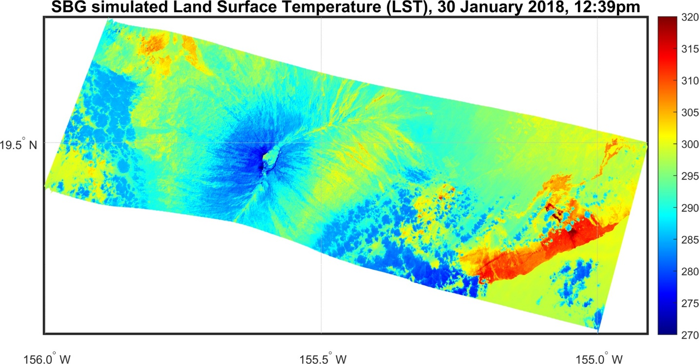{width="6.5in" height="3.390277777777778in"}

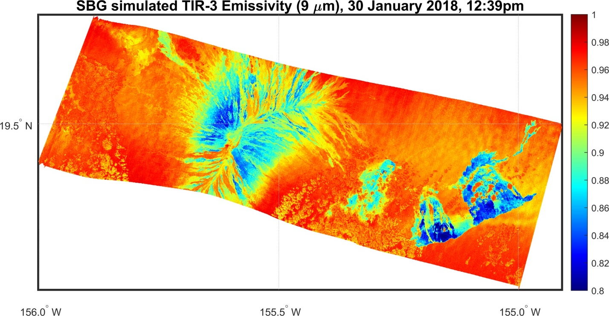{width="6.5in" height="3.377083333333333in"}

In the original ASTER algorithm, a final correction is made for sky
irradiance using the TES temperature and emissivities; however, this was
later removed, as correction was minimal and influenced by atmospheric
correction errors. This additional correction will not be used for SBG.

## MMD vs. $\mathbf{\epsilon}_{\mathbf{\min}}$ Regression

The relationship between MMD and $\epsilon_{\min}$ is physically
reasonable and is determined using a set of laboratory spectra in the
ECOSTRESS spectral library v2.0 ([Meerdink et al. 2019](#_ENREF_66)) and
referred to as the calibration curve. The original ASTER regression
coefficients were determined from a set of 86 laboratory reflectance
spectra of rocks, soils, water, vegetation, and snow supplied by J.W.
Salisbury from Johns Hopkins University. One question that needed to be
answered was whether using a smaller or larger subset of this original
set of spectra changed the results in any manner. Establishing a
reliable MMD vs. $\epsilon_{\min}$ relationship with a subset of
spectral representing all types of surfaces is a critical assumption for
the calibration curve. This assumption was tested using various
combinations and numbers of different spectra (e.g., Australian rocks,
airborne data, and a subset of 31 spectra from Salisbury), and all
yielded very similar results to the original 86 spectra.

For SBG, the original 86 spectra were updated to include additional sand
spectra used to validate the North American ASTER Land Surface
Emissivity Database (NAALSED) ([Hulley and Hook 2009b](#_ENREF_42)) and
additional spectra for vegetation from the MODIS spectral library and
ASTER spectral library v2.0, giving a total of 150 spectra. The data
were convolved to the nominal SBG bands and $\epsilon_{\min}$ and
$\beta_{i}$ spectra calculated for each sample. The MMD for each spectra
was then calculated from the $\beta_{i}$ spectra and regressed to the
$\epsilon_{\min}$ values. The relationship follows a simple power law
given by equation (7), with regression coefficients $\alpha_{1}$=
0.9929, $\alpha_{2} = 0.7453$, and $\alpha_{3} = 0.8149$, and
$R^{2} = 0.989$. Figure 12 shows the power-law relationship between MMD
and $\epsilon_{\min}$ using the 150 lab spectra.

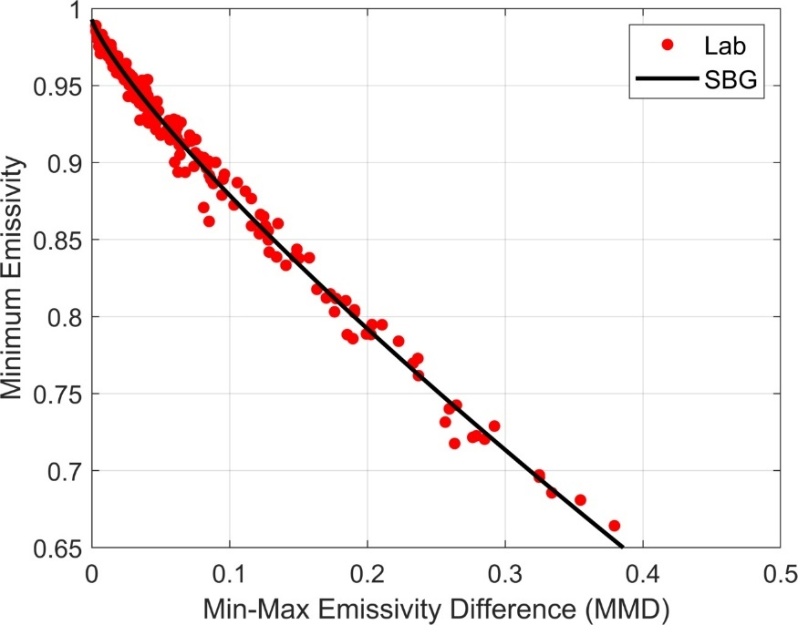{width="3.970600393700787in"
height="3.1120002187226596in"}

# Uncertainty Analysis

NASA has identified a major need to develop long-term, consistent
products valid across multiple missions, with well-defined uncertainty
statistics addressing specific Earth-science questions. These products
are termed Earth System Data Records (ESDRs), and LST&E has been
identified as an important ESDR. Currently a lack of understanding of
LST&E uncertainties limits their usefulness in land surface and climate
models. In this section we present results from the Temperature
Emissivity Uncertainty Simulator (TEUSim) that has been developed to
quantify and model uncertainties for a variety of TIR sensors and LST
algorithms ([Hulley et al. 2012b](#_ENREF_48)). Using the simulator,
uncertainties were estimated for the L2 products of SBG using a 6-band
TES approach. These uncertainties will be parameterized according to
view angle and estimated total column water vapor for eventual
application to real-time SBG L2 data on a pixel by pixel basis.

1.  **The Temperature and Emissivity Uncertainty Simulator (TEUSim)**

The TEUSim was developed for simulating LST&E uncertainties from various
sources of error for the TES and SW algorithms in a rigorous manner for
any appropriate TIR sensor (see Figure 13). These include random errors
(e.g. instrument noise), systematic errors (e.g. calibration), and
spatio-temporally correlated errors (e.g. atmospheric correction). The
MODTRAN v6 radiative transfer model is used for the simulations with a
global set of radiosonde profiles and surface emissivity spectra
representing a broad range of atmospheric conditions and a wide variety
of surface types. This approach allows the retrieval algorithm to be
easily evaluated under realistic but challenging combinations of
surface/atmospheric conditions. The TEUSim is designed to separately
quantify error contributions from the following potential sources:

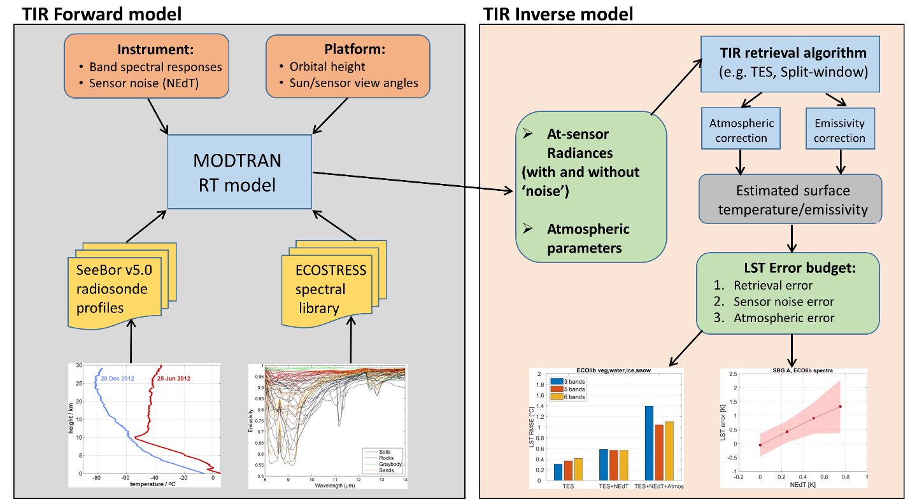{width="6.5in" height="3.6006944444444446in"}

1.  Instrument noise (NEdT)

2.  Algorithm (Model)

3.  Atmospheric correction

4.  Undetected cloud

5.  Calibration

The results presented in this study will focus on the first three of
these error sources: instrument noise, algorithm, and atmospheric
correction. The effects of cloud and calibration issues will be
quantified in orbit once enough data is acquired.

1.  **Atmospheric Profiles**

The TEUSim uses a global simulation model with input atmospheric data
from the SeeBor V5.0 radiosounding database ([Borbas et al.
2005](#_ENREF_11)). The SeeBor data consist of 15,704 profiles of
uniformly distributed global atmospheric soundings temperature,
moisture, and ozone at 101 pressure levels for clear sky conditions,
acquired both day and night in order to capture the full-scale natural
atmospheric variability (Figure 14).

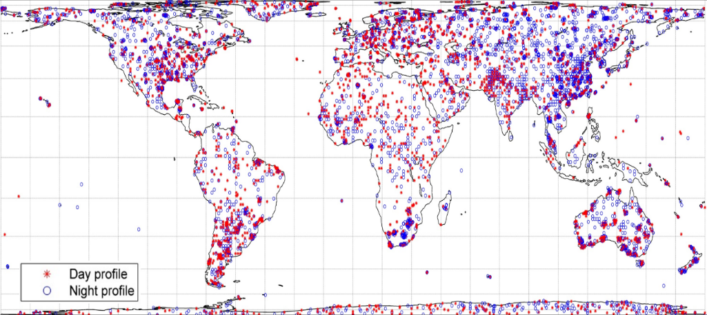{width="5.095999562554681in" height="2.4in"}

2.  **Radiative Transfer Model**

In TEUSim the latest version of MODTRAN (v6) was used for the radiative
transfer calculations. MODTRAN 6 uses an improved molecular band model,
termed the Spectrally Enhanced Resolution MODTRAN (SERTRAN), which has a
much finer spectroscopy (0.1 cm^-1^) than previous versions (1--2
cm^-1^). This results in higher accuracy in modeling of band absorption
features in the longwave TIR window regions, and comparisons with
line-by-line models has shown good accuracy ([Berk et al.
2005](#_ENREF_10)).

3.  **Surface End-Member Selection**

A selection of emissivity spectra from the ECOSTRESS Spectral Library
(ECOlib) ([Meerdink et al. 2019](#_ENREF_66)) were used to define the
surface spectral emission term in MODTRAN. A total of 59 spectra were
chosen based on certain criteria and grouped into four surface
classifications: rocks (20), soils (26), sands (9), and graybodies (4).
Spectra were chosen to represent the most realistic effective
emissivities observed at the remote sensing scales.

For rocks, certain spectra were removed prior to processing based on two
considerations. First, samples that rarely exist as kilometer-scale,
sub-aerial end-member exposures on the Earth's surface such as
pyroxenite or serpentinite were eliminated. Second, and in parallel,
spectrally similar samples were eliminated. Spectral similarity was
defined by the location, shape, and magnitude of spectral features
between 7 and 13 µm. All eliminated samples are represented in the final
selection through spectrally-similar end-member types. The final rock
set included 20 spectra.

ECOlib includes 49 soil spectra classified according to their taxonomy,
such as Alfisol (9), Aridisol (14), Entisol (10), Inceptisol (7) and
Mollisol (9). Filtering in this case was based solely on spectral
similarity between each taxonomy type. The final soils set included 26
soil spectra.

A set of nine emissivity spectra collected in separate field campaigns
during 2008 over large homogeneous sand dune sites in the southwestern
United States in support of validation for the NAALSED v2.0 ([Hulley et
al. 2009a](#_ENREF_46)) were used for sands. The sand samples consist of
a wide variety of different minerals including quartz, magnetite,
feldspars, gypsum, and basalt mixed in various amounts, and represent a
broad range of emissivities in the TIR as detailed in Hulley et al.
([2009a](#_ENREF_46)).

To represent graybody surfaces, spectra of distilled water, ice, snow,
and conifer were chosen from ASTlib. Four spectra were sufficient to
represent this class since graybody surfaces exhibit low contrast and
high emissivities. It should be noted that certain types of man-made
materials were not included, such as aluminum roofs that do not occur at
the spatial resolution of these sensors, but should be included for
higher-spatial-resolution data sets such as those provided by airborne
instruments.

4.  **Radiative Transfer Simulations**

In the TEUSim, each radiosonde profile for each set of end-member
spectra can be used as an input to MODTRAN, or a subset of particular
types of atmospheric data and surface spectra may be used. A seasonal
rural aerosol is typically assumed with standard profiles for fixed
gases within MODTRAN. Gaussian viewing angles of 0°, 11.6°, 26.1° and
40.3° were used to represent the viewing geometry of SBG that will not
exceed 35°. The downward sky irradiance, $L_{\lambda}$($\theta$), can be
modeled using the path radiance, transmittance, and view angle. To
simulate the downward sky irradiance in MODTRAN, the sensor target is
placed a few meters above the surface, with surface emission set to
zero, and view angle set at the prescribed angles above. In this
configuration, the reflected downwelling sky irradiance is estimated for
a given view angle. The total sky irradiance contribution for band *i*
is then calculated by summing the contribution of all view angles over
the entire hemisphere:

+--------+-----------------------------------------------+-------------+
|        | $$L_{i}^{\downarrow                           | > \(15\)    |
|        | } = \int_{0}^{2\pi}{\int_{0}^{\pi/2}{L_{i}^{\ |             |
|        | downarrow}(\theta) \bullet sin\theta \bullet  |             |
|        | cos\theta \bullet d\theta \bullet d\delta}}$$ |             |
+========+===============================================+=============+
+--------+-----------------------------------------------+-------------+

: []{#_Toc143613312 .anchor}Table 8. The Scientific Data Sets (SDSs) for
the ECOSTRESS L2 product.

where $\theta$ is the view angle and $\delta$ is the azimuth angle. To
minimize computational time, the downward sky irradiance is first
modeled as a non-linear function of path radiance at nadir view using
(17) ([Tonooka 2001](#_ENREF_81)):

+--------+-----------------------------------------------+-------------+
|        | $$L_{i}^{\downarrow}(\gamma)                  | > \(16\)    |
|        | = a_{i} + b_{i} \bullet L_{i}^{\uparrow}(0,\g |             |
|        | amma) + c_{i}L_{i}^{\uparrow}(0,\gamma)^{2}$$ |             |
+========+===============================================+=============+
+--------+-----------------------------------------------+-------------+

: []{#_Toc383677546 .anchor}Figure 18. Difference between the MODIS
(MOD11_L2) and ASTER (AST08) LST products and in-situ measurements at
Lake Tahoe. The MODIS product is accurate to ±0.2 K, while the ASTER
product has a bias of 1 K due to residual atmospheric correction effects
since the standard product does not use a Water Vapor Scaling (WVS)
optimization model.

where $a_{i}$, $b_{i}$, and $c_{i}$ are regression coefficients, and
$L_{i}^{\uparrow}(0,\gamma)$ is computed by:

+---------+-------------------------------------------------+---------+
|         | $$L_{i}                                         | >       |
|         | ^{\uparrow}(0,\gamma) = L_{i}^{\uparrow}(\theta |  \(17\) |
|         | ,\gamma) \bullet \frac{1 - \tau_{i}(\theta,\gam |         |
|         | ma)^{cos\theta}}{1 - \tau_{i}(\theta,\gamma)}$$ |         |
+=========+=================================================+=========+
+---------+-------------------------------------------------+---------+

: []{#_Toc143613172 .anchor}Figure 19. Laboratory-measured emissivity
spectra of sand samples collected at ten pseudo-invariant sand dune
validation sites in the southwestern United States. The sites cover a
wide range of emissivities in the TIR region.

Equations (17) and (18) were used to estimate the downwelling sky
irradiance in the TEUSim results using pre-calculated regression
coefficients for SBG bands. The reflected sky irradiance term is
generally smaller in magnitude than the surface-emitted radiance, but
needs to be taken into account, particularly on humid days when the
total atmospheric water vapor content is high. The simulated LST is
based on the surface air temperature of each radiosonde profile:

+---------+-------------------------------------------------+---------+
|         | $${LST}_{sim} = T_{air} + \delta T$$            | >       |
|         |                                                 |  \(18\) |
+=========+=================================================+=========+
+---------+-------------------------------------------------+---------+

: []{#_Toc383677548 .anchor}Figure 20. ASTER false-color visible images
(top) and emissivity spectra comparisons between ASTER TES and lab
results for Algodones Dunes, California; White Sands, New Mexico; and
Great Sands, Colorado (bottom). Squares with blue dots indicate the
sampling areas. ASTER error bars show temporal and spatial variation,
whereas lab spectra show spatial variation.

where ${LST}_{sim}$ and $T_{air}$ are the simulated LST and surface air
temperature. Galve et al. ([2008](#_ENREF_27)) found a mean $\delta T$
of +3 K and standard deviation of 9 K from a global study of surface-air
temperature differences over land in the MODIS MOD08 and MOD11 products.
We therefore defined $\delta T$ as a random distribution with a mean of
3 K and a standard deviation of 9 K for each profile input to MODTRAN.

The TES algorithm uses surface radiance as input, which can be derived
from the atmospheric transmittance $\tau_{\lambda}$($\theta$), TOA
radiance $L_{\lambda}$($\theta$), path radiance
$L_{\lambda}^{\uparrow}$($\theta$), and downward sky irradiance
$L_{\lambda}^{\downarrow}$($\theta$). To calculate the various sources
of error in LST&E retrievals from TES, these variables were simulated
for the following conditions:

1.  Perfect atmosphere (i.e., exact inputs): $L_{\lambda}$($\theta$) and
    atmospheric parameters $\tau_{\lambda}$($\theta$),
    $L_{\lambda}^{\uparrow}$($\theta$), and
    $L_{\lambda}^{\downarrow}$($\theta$) calculated using a given
    profile, surface type and viewing angle;

2.  Imperfect atmosphere (i.e., inputs with errors):
    $L_{\lambda}^{'}(\theta),\tau_{\lambda}^{'}$ ($\theta$),
    $L_{\lambda}^{' \uparrow}$($\theta$), and
    $L_{\lambda}^{' \downarrow}$($\theta$) calculated using perturbed
    temperature and humidity profiles to simulate real 'imperfect' input
    data (see next section for assumed errors used on the atmospheric
    profiles).

To further simulate the effects of instrument noise, the above two
conditions were run by further adding random noise to the radiances
based on a noise model that describes the sensor's noise equivalent
delta temperature (NEdT).

## Error Propagation

The total LST uncertainty for the TES algorithm based on model,
atmospheric and measurement noise contributions can be written as:

+--------+-----------------------------------------------+-------------+
|        | ${\delta LST}_{TES} =$                        | > \(19\)    |
|        | $\left\lbrack {\delta LST}_{M} + {\delta LST  |             |
|        | }_{A} + {\delta LST}_{N} \right\rbrack^{1/2}$ |             |
+========+===============================================+=============+
+--------+-----------------------------------------------+-------------+

: []{#_Toc383677549 .anchor}Figure 21. An example of the R-based
validation method applied to the MODIS Aqua MOD11 and MOD21 LST products
over six pseudo-invariant sand dune sites using all data during 2005.
AIRS profiles and lab-measured emissivities from samples collected at
the sites were used for the R-based calculations.

where ${\delta LST}_{M}$ is the model error due to assumptions made in
the TES calibration curve, ${\delta LST}_{A}$ is the atmospheric error,
and ${\delta LST}_{N}$ is the error associated with measurement noise.
These errors are assumed to be independent.

To calculate the separate contributions from each of these errors let us
first denote the simulated atmospheric parameters as x
$= \lbrack\tau_{\lambda}(\theta),$ $L_{\lambda}^{\uparrow}(\theta)$,
$L_{\lambda}^{\downarrow}(\theta)$\] and simulated observed radiance
parameter as $y = L_{\lambda}(\theta)$. Both $x$ and $y$ are required to
estimate the surface radiance that is input to the TES algorithm. In
reality, however, the input parameters $x$ are not known explicitly, but
are associated with some error, $\delta x$, which we write as
$\widehat{x} = x + \delta x$. Similarly, the observed radiances have an
associated noise based on the NE∆T of the specific sensor, which we will

denote by $\widehat{y}$.

To characterize the retrieval (or model) error, we express the TES
algorithm as a function based on perfect input parameters $x$ and $y$
such that ${LST}_{TES} = f(x,\ y$). The model error, $\delta{LST}_{M}$,
i.e.,

+---------+-------------------------------------------------+---------+
|         | ${\delta LST}_{M} =$                            | >       |
|         | $E\left\lbrack \left( f(x,\ y) - {LS            |  \(20\) |
|         | T}_{sim} \right)^{2}\ |x,y \right\rbrack^{1/2}$ |         |
+=========+=================================================+=========+
+---------+-------------------------------------------------+---------+

: []{#_Toc143613314 .anchor}Table 10. Uncertainty analysis results
showing how perturbations in emissivity, air temperature and relative
humidity affect the relative accuracy of the R-based LST derivation.

where ${LST}_{sim}$ is the simulated LST used in the MODTRAN
simulations, and $E\left\lbrack \bullet |x,y \right\rbrack$ denotes the
mean-square error between the retrieved and simulated LST for inputs $x$
and $y$.

In order to simulate an atmospheric error, the input atmospheric
profiles were adjusted to simulate real data by applying random errors
in the water vapor retrievals of between 10--20% that is typical for NWP
models and retrieved water vapor estimates ([Seemann et al.
2006](#_ENREF_76)). Accordingly, the relative humidity profiles were
adjusted by scaling factors ranging from 0.8 to 1.2 (20%) in MODTRAN
using a uniformly distributed random number generator. The atmospheric
error can then be written as the difference between TES using perfect
atmospheric inputs, $x$ and imperfect inputs, $\widehat{x}$:

+---------+-------------------------------------------------+---------+
|         | ${\delta LST}_{A} =$                            | >       |
|         | $E\left\l                                       |  \(21\) |
|         | brack \left( f\left( \widehat{x},\ y \right) -  |         |
|         | f(x,\ y) \right)^{2}\ |x,y \right\rbrack^{1/2}$ |         |
+=========+=================================================+=========+
+---------+-------------------------------------------------+---------+

: []{#_Toc143613315 .anchor}Table **11**. R-based LST validation
statistics from six pseudo-invariant sand dune sites using all MOD11 and
MOD21 LST retrievals during 2005.

And lastly the error due to measurement noise can be written as the
difference between TES with perfect simulated TOA radiances, $y$ and TES
with noisy radiances, $\widehat{y}$, assuming perfect atmospheric
inputs, $x$:

  -------------------------------------------------------------------------------------------------------------------------------
             ${\delta LST}_{N} =$                                                                                      \(22\)
             $E\left\lbrack \left( f\left( x,\ \widehat{y} \right) - f(x,\ y) \right)^{2}\ |x,y \right\rbrack^{1/2}$   
  ---------- --------------------------------------------------------------------------------------------------------- ----------

  -------------------------------------------------------------------------------------------------------------------------------

  : []{#_Toc383677559 .anchor}

Since the TES algorithm simultaneously retrieves the LST and spectral
emissivity, the above equations also apply to the corresponding
emissivity retrieval for each band.

To demonstrate the various error sources described above, Figure 15
shows results from a TEUSim run to quantify the relative contributions
for three error sources including model (TES retrieval), instrument
noise (NEdT = 0.2 K) and atmospheric (10% relative humidity error, and 1
K temperature error). A U.S. standard and a tropical atmospheric profile
was used with the MODTRAN model. Results in Figure 15 show histograms of
the total accuracy and precision

  ------------------------------------------------------------------------------------------------------------
  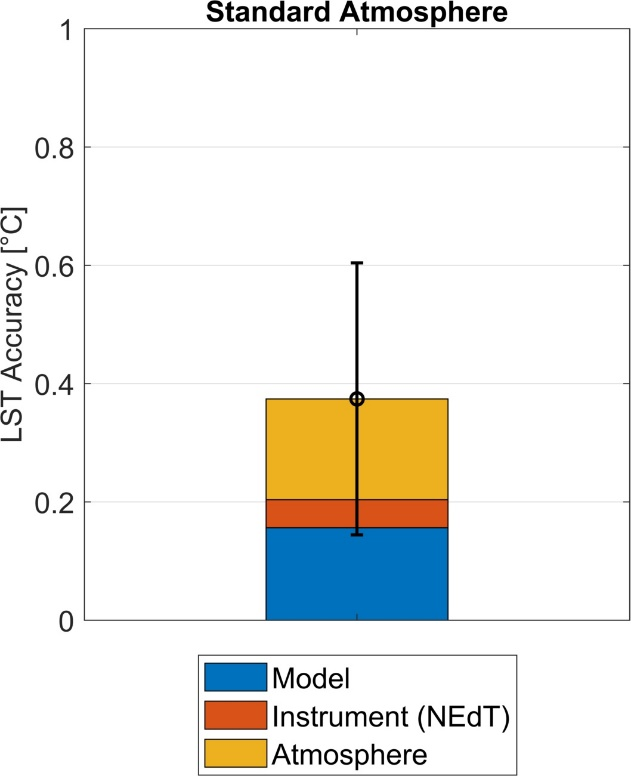{width="2.862484689413823in"   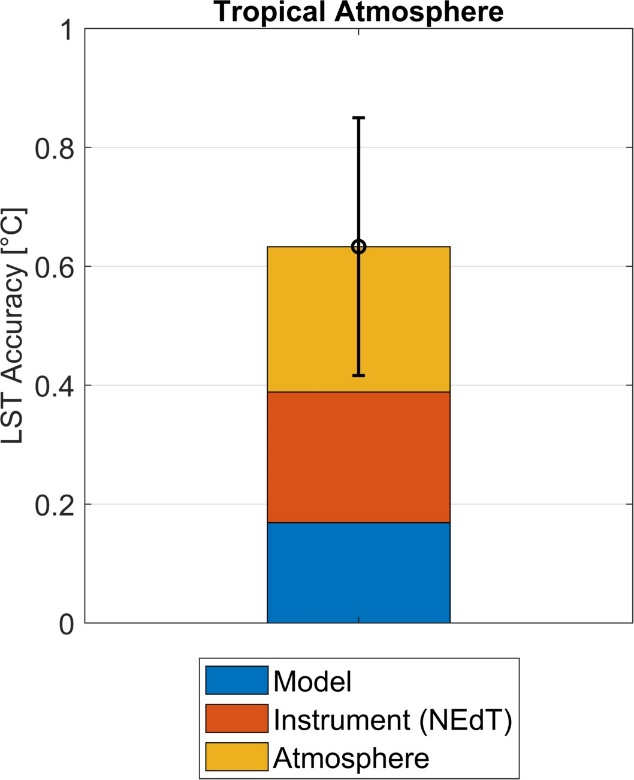{width="2.8618055555555557in"
  height="3.52in"}                                      height="3.51916447944007in"}
  ----------------------------------------------------- ------------------------------------------------------

  ------------------------------------------------------------------------------------------------------------

(errobar) for the standard (nominal) and tropical (difficult case)
atmospheres using 10,000 Monte Carlo simulations and input ECOlib
spectra of rocks, sands, soils, and vegetation. The results show that
for the standard atmosphere that the atmospheric correction error
results in the largest error of 0.17 K, followed by the model error of
0.15 K and instrument noise had the smallest error of 0.05 K. For the
tropical case, errors increase to 0.24 K for the atmospheric correction
and to 0.22 K for the instrument noise, but the model error stays
relatively stable with only slight increase to 0.17 K. This demonstrates
that increasing the water vapor content has a large effect on both the
atmospheric correction and instrument noise influence on the TES
algorithm. The results are demonstrate that for SBG, the total accuracy
of the L2 LST product is expected to be less than 1 K assuming that
instrument noise is ≤0.2 K and input atmospheric profiles are accurate
to within 10% in relative humidity and 1 K in air temperature. These are
typical error estimates of NWP models based on in situ validation
results.

Table 6 shows uncertainty results using the SeeBor radiosounding
database and four different surface classes including graybodies
(vegetation, water, ice, snow), rocks, soils and sands all extracted
from ECOlib. Random errors were simulated at each level using a
uniformly distributed random number generator for the profiles (1 K
temperature, 10% humidity, instrument noise of 0.2 K) and surface
temperature estimated using equation 18. Two different versions of TES
were used for the retrievals, a 3-band TES algorithm (SBG TIR bands 2,
5, 6) and a 5-band TES algorithm (SBG TIR bands 1, 2, 3, 5, 6).
Simulations were all run at nadir view angle. The results show that rock
samples had the greatest uncertainty in retrieved LST but was larger for
the 3-band TES (1.45 K) when compared to the 5-band approach (1.2 K).
This is due to larger scatter and uncertainty in the calibration curve
when less bands are used for the regression, combined with the fact that
rocks typically have larger spectral contrast and more difficult to
retrieve spectral shapes. The total uncertainty for the 3-band approach
was 1.15 K, while the 5-band approach had a total uncertainty below the
1 K level.

  ---------------------------------------------------------------------------
                                         **LST Total      
                                         Uncertainty      
                                         \[K\]**          
  -------------- --------- ------------- ---------------- -------------------
  Surface Type   Samples   Simulations   TES 3-band       TES 5-band

  Vegetation,    8         660,096       1.19             0.93
  water, ice,                                             
  snow                                                    

  Rocks          48        3,960,686     1.45             1.16

  Soils          45        3,713,040     0.90             0.81

  Sands          10        825,120       0.99             0.92

  Total          111       9,158,832     1.15             0.96
  ---------------------------------------------------------------------------

  : Table 12. Emissivity comparisons between lab, MOD11, and MOD21 at
  six pseudo-invariant sand sites.

1.  **Parameterization of Uncertainties**

A key requirement for generating a LST&E dataset is accurate knowledge
of all contributing uncertainties. Uncertainties for each input product
must be rigorously estimated for a variety of different conditions on a
pixel-by-pixel basis before they can be merged and incorporated into a
time series of measurements of sufficient length, consistency, and
continuity to adequately meet the science requirements. The next logical
step is to apply the uncertainty statistics produced from the TEUSim and
apply them to estimate uncertainties from real data. To achieve this we
use a simple empirical model where the total uncertainty, taken as the
RMSE of the differences between simulated (truth) and retrieved LST&E,
is regressed to the simulation inputs that showed the highest dependence
error. These were the sensor view angle, total water vapor column
amount, and land surface type. We then fit the total uncertainty with
these independent variables using a least-squares method fit to a
quadratic function. Three surface types were classified: graybody,
transitional, and bare. The transitional surface represents a mixed
cover type, and was calculated by varying the vegetation fraction cover
percentage, $f_{v}$, by 25, 50, and 75% for the set of bare surface
spectra (rocks, soils, sand) as follows:

+--------+-----------------------------------------------+-------------+
|        | $$\vareps                                     | > \(23\)    |
|        | ilon_{trans} = \varepsilon_{gray} \bullet f_{ |             |
|        | v} + \varepsilon_{bare} \bullet (1 - f_{v})$$ |             |
+========+===============================================+=============+
+--------+-----------------------------------------------+-------------+

: []{#_Toc143613175 .anchor}Figure 22. An example of the T-based
validation results showing ECOSTRESS LST versus in situ LST measurements
for all T-based sites at Lake Constance, Gobabeb, Lake Tahoe, Salton Sea
and Russell ranch.

where $\varepsilon_{trans}$ is the transition emissivity,
$\varepsilon_{gray}$ is a graybody emissivity spectrum (e.g., conifer),
and $\varepsilon_{bare}$ are the lab emissivities for bare surfaces.

The total uncertainty includes both a sensor view angle (SVA) and TCW
dependence.

+---+-------------------------------------------------------+-------------+
|   | $$\d                                                  | > \(24\)    |
|   | elta{LST}_{SBG} = a_{o} + a_{1}TCW + a_{2}SVA + a_{3} |             |
|   | TCW \bullet SVA\  + a_{4}{TCW}^{2} + a_{5}{SVA}^{2}$$ |             |
+===+=======================================================+=============+
+---+-------------------------------------------------------+-------------+

Similarly, the band-dependent emissivity uncertainties can be expressed
as:

+---+-------------------------------------------------------------+-------+
|   | $$\delta\v                                                  | > \   |
|   | arepsilon_{i,SBG} = a_{i,o} + a_{i,1}TCW + a_{i,2}SVA + a_{ | (25\) |
|   | i,3}TCW \bullet SVA + a_{i,4}{TCW}^{2} + a_{i,5}{SVA}^{2}$$ |       |
+===+=============================================================+=======+
+---+-------------------------------------------------------------+-------+

where $\delta LST$ is the LST uncertainty (K) calculated as the
difference between the simulated and retrieved LST,
$\delta\varepsilon_{i}$ is the band-dependent emissivity uncertainty for
band *i*, calculated as the difference between the input lab emissivity
and retrieved emissivity, and $a_{i}$ and $a_{i,j}$ are the LST and
emissivity regression coefficients and depend on surface type (graybody,
transition, bare).

A sensitivity study showed that the parameterizations given by equations
19--20 provided the best fit to the simulation results in terms of RMSE,
with fits of \~0.1 K. Once the coefficients are established they can be
applied on a pixel-by-pixel basis across any scene given estimates of
TCW (usually extracted from the NWP data, e.g. GEOS5), and the *SVA*
from the product metadata. A simple emissivity threshold using a band
with large spectral variation can be used to

discriminate between graybody, transition, and bare types in any given
scene for application of the relevant coefficients. This uncertainty
model will be applied to SBG LST&E retrievals and included in the
Scientific Data Set (SDS). The uncertainties will be calculated on a
pixel-by-pixel basis for LST and emissivity for all 5 bands.

# Emissivity anisotropy correction

LST data retrieved from TIR remote sensing can have strong directional
dependencies due to the intrinsic heterogeneity of the land surface
resulting in anisotropic emission. The directional behavior of the LST
has been identified and quantified in numerous studies and is a major
source of artificial variability/biases in LST data records (Duffour et
al., 2016; Ermida et al., 2014; Guillevic et al., 2013; Rasmussen et
al., 2011). Some of the LST variability with viewing angle can be
attributed to emissivity, since most natural surfaces such as desert
sands and forests are anisotropic emitters (Cao et al., 2019; Cuenca and
Sobrino, 2004; García-Santos et al., 2012; Labed and Stoll, 1991;
Lagouarde et al., 1995; Sobrino and Cuenca, 1999). The anisotropy of
soil emissivity is related to geometrical effects of grain size,
roughness and porosity (Labed and Stoll, 1991). A number of physical
models (e.g. (Hapke, 1981; Moersch and Christensen, 1995; Pitman et al.,
2005; Wald and Salisbury, 1995) and empirical models (e.g.
(García-Santos et al., 2012; Nerry et al., 1991) have been used to
address the angular dependence, however, since a sensor's field of view
(FOV) may encompass a wide range of materials, it is difficult to
translate laboratory or modeled emissivity anisotropy to the satellite
pixel scale of tens of meters or more (Ermida et al. 2023). Therefore,
Ermida et al. 2023 proposed a view angle dependent emissivity correction
directly from the satellite pixel scale retrievals and applied to the
TES algorithm.

The inputs to the TES algorithm (surface radiance, downwelling radiance)
assume a Lambertian surface (isotropic), and the calibration curve uses
a set of library emissivity spectra that have been measured in the lab
with no angular dependence. As a result, Ermida et al. 2023 proposed a
new methodology to derive the MMD calibration curve based on
multi-sensor observations from a combination of Spinning Enhanced
Visible and Infrared Imager (SEVIRI) on-board Meteosat Second Generation
(MSG) satellites and the Visible Infrared Imaging Radiometer Suite
(VIIRS) on-board the joint NASA/NOAA Suomi National Polar-orbiting
Partnership (NPP). Taking advantage of the multi-angle view provided by
the different sensors, Ermida et al. 2020 was able to characterize
emissivity dependency of view zenith angle over a selection of sites
over homogeneous desert regions. The correction was limited to bare
areas since studies suggest that surface roughness introduced by
vegetation tends to attenuate the anisotropy of emissivity (Sobrino et
al., 2005).

## MMD calibration curve with view angle dependence

Although the TES algorithm provides direct estimates of emissivity based
on TOA satellite radiance measurements, (Ermida et al., 2020) showed
that the TES can only accurately estimate angular effects of the channel
IR8.7, since the MMD constrains the spectral variations of the
emissivity with angle for the other channels. The work by Ermida et al.
(2020) suggests that different MMD curves for different view angles
might be necessary to account for emissivity anisotropy and proposed a
reformulation of the MMD curve in order allow angular variations of the
emissivity:

  -----------------------------------------------------------------------
  $$\varepsilon_{\min} = a_{1} - a_{2}{MMD}^{{a'}_{3}}$$          
  --------------------------------------------------------------- -------

  -----------------------------------------------------------------------

with

  -----------------------------------------------------------------------
  $${a'}_{3} = a_{3} + a_{4}{VZA}^{a_{5}}$$                       
  --------------------------------------------------------------- -------

  -----------------------------------------------------------------------

with the VZA with units of degrees. The calibration of the new MMD
coefficients $a_{4}$ and $a_{5}$ cannot be obtained from spectral
library data since these generally correspond to a nadir configuration.
In order to obtain the needed data for the calibration, a multi-sensor
retrieval approach was used at the selected sites. Because the spectral
library is likely to provide coefficients with better accuracy, and the
sites' retrievals are limited to desert bare ground conditions, only the
$a_{4}$ and $a_{5}$ coefficients are fitted to the new data. To achieve
that, equation (26) is first fitted to multi-sensor retrievals for
different view zenith angle (VZA) classes, fixing $a_{1}$ and $a_{2}$ to
the spectral library values, i.e. only coefficient ${a'}_{3}$ is fitted.
Then, equation (27) is fitted to the previously obtained ${a'}_{3}$
values for each VZA class. Here, $a_{3}$ is also prescribed using the
spectral library-based estimate and ultimately only $a_{4}$ and $a_{5}$
are fitted, yielding the values $a_{4} = - {5.6290 \times 10}^{- 7}$ and
$a_{5} = 2.7106$. Since the coefficients in equation (27) were derived
from VIIRS TIR bands, they are valid for other sensors with a similar
spectral range in TIR bands since the fit is based on the emin vs MMD
curve. For this reason we will use the same coefficients derived from
equation (27) for ECOSTRESS LST retrievals, which will have a very
similar band configuration as SBG, and test the new SVA dependent
calibration curve over selected sites with validation data (e.g.
Gobabeb, Namibia). Since the maximum viewing angle with ECOSTRESS is 30
degrees (SBG will be 35 degrees) we expect the impact on LST&E
retrievals to be relatively small, but non-negligible, especially over
arid surfaces.

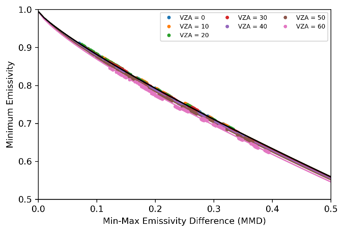{width="3.0694597550306213in"
height="2.0718853893263343in"}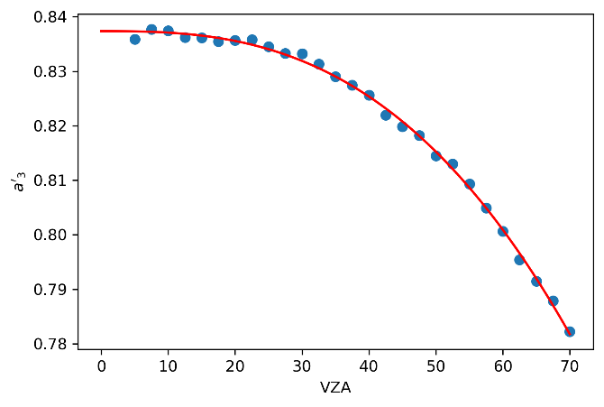{width="3.042785433070866in"
height="2.047133639545057in"}

#  {#section-1 .unnumbered}

# Quality Control and Diagnostics

The T and $\epsilon$ products will need to be assessed using a set of
quality control (QC) flags. These QC flags will involve automatic tests
processed internally for each pixel and will depend on various retrieval
conditions such as whether the pixel is over land or ocean surface, the
atmospheric water vapor content (dry, moist, very humid, etc.), and
cloud cover. The data quality attributes will be set automatically
according to parameters set on data conditions during algorithm
processing and will be assigned as either \"bad,\" \"suspect,\" or
\"good.\" Estimates of the accuracy and precision of the T and
$\epsilon$ product will be reported in a separate data plane. At each
step in the TES algorithm, various performance information will be
output, which will give the user a summary of algorithm statistics in a
spatial context. This type of information will be useful for determining
surface type, atmospheric conditions, and overall performance of TES.

The architecture of the SBG data plane will be very similar to the
ECOSTRESS T and $\epsilon$ QA data plane and the MOD21 product ([Hulley
et al. 2012a](#_ENREF_39)). It will consist of header information
followed by an 8-bit QA data plane. The structure of the QA data plane
will consist of ten primary fields, which are detailed in Table 7:

1.  Mandatory QA flags: Overall description of status of pixel, produced
    with good quality, unreliable quality, not produced due to cloud, or
    other reasons than cloud.

2.  Data Quality Field: good data, missing pixel, fairly and poorly
    calibrated are assigned to specific bit patterns.

3.  Cloud Mask Field: Outputs from cloud mask statistics, e.g.,
    optically thick or thin cloud, cirrus or contrails, clear, or
    snow/ice determined from NDSI threshold.

4.  Cloud Adjacency: Clear pixels defined in the cloud mask will be
    assigned an adjacency category dependent on distance to the nearest
    cloud defined quantitatively by the number of pixels (e.g., very
    close, close, far, very far).

5.  The final value of $\epsilon_{\max}$ used in the NEM module after
    optimization (if necessary).

6.  Number of iterations needed to remove reflected downwelling sky
    irradiance.

7.  Atmospheric opacity test for humid scenes, using
    $L_{\lambda}^{\downarrow}/L^{'}$ test.

8.  MMD regime: MMD\<0.3 (near-graybody) or MMD\>0.3 (likely bare).

9.  Emissivity accuracy (poor, marginal, good excellent).

10. LST accuracy (poor, marginal, good excellent).

The emissivity and LST accuracies described in bits 12-15 will be
estimated from the uncertainty parameterization model. Classifying the
performance level is based on typical validation results from using the
TES algorithm from various instruments including ASTER and MODIS
([Hulley and Hook 2011](#_ENREF_43)).

Pixels with \'unreliable quality\' are typically either affected by
nearby cloud, or have a large water vapor loading making the retrieval
more uncertain. These pixels are flagged if they are within \~500 m of a
detected nearby cloud, if the emissivity for the 12 micron is less than
0.95, or if the transmissivity for that pixel is low (\<0.3) due to a
nearly opaque atmosphere (high water vapor). Emissivities for the 12
micron band usually invariant with respect to surface type and are high
with values \>0.96, unless the surface consists of rare mafic materials
such as some basalts which are found in volcanic regions and have an
unusually low emissivity in the longwave bands. If a pixel is affected
by cloud, or there is incomplete atmospheric correction due to water
vapor effects, band 5 emissivities will typically fall below 0.95.

+--------+------------------+-----------------------------------------+
| **     | **Long Name**    | **Description**                         |
| Bits** |                  |                                         |
+========+==================+=========================================+
| 1&0    | Mandatory QA     | 00 = Pixel produced, best quality       |
|        | flags            |                                         |
|        |                  | 01 = Pixel produced, nominal quality.   |
|        |                  | Either one or more of the following     |
|        |                  | conditions are met:                     |
|        |                  |                                         |
|        |                  | 1.  emissivity in both 11 and 12 micron |
|        |                  |     bands \< 0.95, i.e. possible cloud  |
|        |                  |     contamination                       |
|        |                  |                                         |
|        |                  | 2.  low transmissivity due to high      |
|        |                  |     water vapor loading (\<0.4), check  |
|        |                  |     PWV values and error estimates      |
|        |                  |                                         |
|        |                  | 10 = Pixel produced, but cloud detected |
|        |                  |                                         |
|        |                  | 11 = Pixel not produced due to          |
|        |                  | missing/bad data, user should check     |
|        |                  | Data quality flag bits                  |
+--------+------------------+-----------------------------------------+
| 3 & 2  | Data quality     | 00 = Good quality L1B data              |
|        | flag             |                                         |
|        |                  | 01 = not set                            |
|        |                  |                                         |
|        |                  | 10 = not set                            |
|        |                  |                                         |
|        |                  | 11 = Missing/bad L1B data               |
+--------+------------------+-----------------------------------------+
| 5 & 4  | Cloud/Ocean Flag | tbd                                     |
+--------+------------------+-----------------------------------------+
| 7 & 6  | Iterations       | 00 = Slow convergence                   |
|        |                  |                                         |
|        |                  | 01 = Nominal                            |
|        |                  |                                         |
|        |                  | 10 = Nominal                            |
|        |                  |                                         |
|        |                  | 11 = Fast                               |
+--------+------------------+-----------------------------------------+
| 9 & 8  | Atmospheric      | 00 = \>=3 (Warm, humid air; or cold     |
|        | Opacity          | land)                                   |
|        |                  |                                         |
|        |                  | 01 = 0.2 - 0.3 (Nominal value)          |
|        |                  |                                         |
|        |                  | 10 = 0.1 - 0.2 (Nominal value)          |
|        |                  |                                         |
|        |                  | 11 = \<0.1 (Dry, or high altitude       |
|        |                  | pixel)                                  |
+--------+------------------+-----------------------------------------+
| 11 &   | MMD              | 00 = \> 0.15 (Most silicate rocks)      |
| 10     |                  |                                         |
|        |                  | 01 = 0.1 - 0.15 (Rocks, sand, some      |
|        |                  | soils)                                  |
|        |                  |                                         |
|        |                  | 10 = 0.03 - 0.1 (Mostly soils, mixed    |
|        |                  | pixel)                                  |
|        |                  |                                         |
|        |                  | 11 = \<0.03 (Vegetation, snow, water,   |
|        |                  | ice)                                    |
+--------+------------------+-----------------------------------------+
| 13 &   | Emissivity       | 00 = \>0.02 (Poor performance)          |
| 12     | accuracy         |                                         |
|        |                  | 01 = 0.015 - 0.02 (Marginal             |
|        |                  | performance)                            |
|        |                  |                                         |
|        |                  | 10 = 0.01 - 0.015 (Good performance)    |
|        |                  |                                         |
|        |                  | 11 = \<0.01 (Excellent performance)     |
+--------+------------------+-----------------------------------------+
| 15 &   | LST accuracy     | 00 = \>2 K (Poor performance)           |
| 14     |                  |                                         |
|        |                  | 01 = 1.5 - 2 K (Marginal performance)   |
|        |                  |                                         |
|        |                  | 10 = 1 - 1.5 K (Good performance)       |
|        |                  |                                         |
|        |                  | 11 = \<1 K (Excellent performance)      |
+--------+------------------+-----------------------------------------+

# Scientific Data Set (SDS) Variables

The SBG LST&E products will be archived in Hierarchical Data Format 5 -
Earth Observing System (HDF5-EOS) format files. HDF is the standard
archive format for NASA EOS Data Information System (EOSDIS) products.
The LST&E product files will contain global attributes described in the
metadata, and scientific data sets (SDSs) with local

attributes. Unique in HDF-EOS data files is the use of HDF features to
create point, swath, and grid structures to support geolocation of data.
These structures (Vgroups and Vdata) provide geolocation relationships
between data in an SDS and geographic coordinates (latitude and
longitude or map projections) to support mapping the data. Attributes
(metadata), global and local, provide various information about the
data. Users unfamiliar with HDF and HDF-EOS formats may wish to consult
Web sites listed in the Related Web Sites section for more information.

The scientific variable arrays that will be output in the SBG L2 product
are highlighted in Table 8, including descriptions of data type, units,
valid range, fill value, scale factor and offset. The sequence begins as
a swath (scene) at a nominal pixel spatial resolution of 60x60 meters at
nadir and a nominal swath width of 935 km. The data types and scaling
factors have been optimized to minimize the amount of memory required to
store the data.

+---------+--------------+------+------+-------+------+-----+------+
| **SDS** | **Long       | **   | *    | **    | **   | *   | **   |
|         | Name**       | Data | *Uni | Valid | Fill | *Sc | Offs |
|         |              | ty   | ts** | Ra    | Val  | ale | et** |
|         |              | pe** |      | nge** | ue** | Fa  |      |
|         |              |      |      |       |      | cto |      |
|         |              |      |      |       |      | r** |      |
+=========+==============+======+======+=======+======+=====+======+
| **      | **SDS (per   |      |      |       |      |     |      |
| Group** | pixel, 5400  |      |      |       |      |     |      |
|         | \* 5632)**   |      |      |       |      |     |      |
+---------+--------------+------+------+-------+------+-----+------+
| LST     | Land Surface | ui   | K    | 7500- | 0    | 0   | 0.0  |
|         | Temperature  | nt16 |      | 65535 |      | .02 |      |
+---------+--------------+------+------+-------+------+-----+------+
| QC      | Quality      | ui   | n/a  | 0-    | n/a  | n/a | n/a  |
|         | control for  | nt16 |      | 65535 |      |     |      |
|         | LST and      |      |      |       |      |     |      |
|         | emissivity   |      |      |       |      |     |      |
+---------+--------------+------+------+-------+------+-----+------+
| Emis1   | Band 1       | u    | n/a  | 1-255 | 0    | 0.  | 0.49 |
|         | emissivity   | int8 |      |       |      | 002 |      |
+---------+--------------+------+------+-------+------+-----+------+
| Emis2   | Band 2       | u    | n/a  | 1-255 | 0    | 0.  | 0.49 |
|         | emissivity   | int8 |      |       |      | 002 |      |
+---------+--------------+------+------+-------+------+-----+------+
| Emis3   | Band 3       | u    | n/a  | 1-255 | 0    | 0.  | 0.49 |
|         | emissivity   | int8 |      |       |      | 002 |      |
+---------+--------------+------+------+-------+------+-----+------+
| Emis4   | Band 4       | u    | n/a  | 1-255 | 0    | 0.  | 0.49 |
|         | emissivity   | int8 |      |       |      | 002 |      |
+---------+--------------+------+------+-------+------+-----+------+
| Emis5   | Band 5       | u    | n/a  | 1-255 | 0    | 0.  | 0.49 |
|         | emissivity   | int8 |      |       |      | 002 |      |
+---------+--------------+------+------+-------+------+-----+------+
| Emis6   | Band 6       | u    | n/a  | 1-255 | 0    | 0.  | 0.49 |
|         | emissivity   | int8 |      |       |      | 002 |      |
+---------+--------------+------+------+-------+------+-----+------+
| Emis7   | Band 7       | u    | n/a  | 1-255 | 0    | 0.  | 0.49 |
|         | emissivity   | int8 |      |       |      | 002 |      |
+---------+--------------+------+------+-------+------+-----+------+
| Emis8   | Band 8       | u    | n/a  | 1-255 | 0    | 0.  | 0.49 |
|         | emissivity   | int8 |      |       |      | 002 |      |
+---------+--------------+------+------+-------+------+-----+------+
| LST_Err | Land Surface | u    | K    | 1-255 | 0    | 0   | 0.0  |
|         | Temperature  | int8 |      |       |      | .04 |      |
|         | error        |      |      |       |      |     |      |
+---------+--------------+------+------+-------+------+-----+------+
| Em      | Band 1       | ui   | n/a  | 0-    | 0    | 0.0 | 0.0  |
| is1_Err | emissivity   | nt16 |      | 65535 |      | 001 |      |
|         | error        |      |      |       |      |     |      |
+---------+--------------+------+------+-------+------+-----+------+
| Em      | Band 2       | ui   | n/a  | 0-    | 0    | 0.0 | 0.0  |
| is2_Err | emissivity   | nt16 |      | 65535 |      | 001 |      |
|         | error        |      |      |       |      |     |      |
+---------+--------------+------+------+-------+------+-----+------+
| Em      | Band 3       | ui   | n/a  | 0-    | 0    | 0.0 | 0.0  |
| is3_Err | emissivity   | nt16 |      | 65535 |      | 001 |      |
|         | error        |      |      |       |      |     |      |
+---------+--------------+------+------+-------+------+-----+------+
| Em      | Band 4       | ui   | n/a  | 0-    | 0    | 0.0 | 0.0  |
| is4_Err | emissivity   | nt16 |      | 65535 |      | 001 |      |
|         | error        |      |      |       |      |     |      |
+---------+--------------+------+------+-------+------+-----+------+
| Em      | Band 5       | ui   | n/a  | 0-    | 0    | 0.0 | 0.0  |
| is5_Err | emissivity   | nt16 |      | 65535 |      | 001 |      |
|         | error        |      |      |       |      |     |      |
+---------+--------------+------+------+-------+------+-----+------+
| Em      | Band 6       | ui   | n/a  | 0-    | 0    | 0.0 | 0.0  |
| is6_Err | emissivity   | nt16 |      | 65535 |      | 001 |      |
|         | error        |      |      |       |      |     |      |
+---------+--------------+------+------+-------+------+-----+------+
| Em      | Band 7       | ui   | n/a  | 0-    | 0    | 0.0 | 0.0  |
| is7_Err | emissivity   | nt16 |      | 65535 |      | 001 |      |
|         | error        |      |      |       |      |     |      |
+---------+--------------+------+------+-------+------+-----+------+
| Em      | Band 8       | ui   | n/a  | 0-    | 0    | 0.0 | 0.0  |
| is8_Err | emissivity   | nt16 |      | 65535 |      | 001 |      |
|         | error        |      |      |       |      |     |      |
+---------+--------------+------+------+-------+------+-----+------+
| EmisWB  | Wideband     | u    | n/a  | 1-255 | 0    | 0.  | 0.49 |
|         | emissivity   | int8 |      |       |      | 002 |      |
+---------+--------------+------+------+-------+------+-----+------+
| PWV     | Precipitable | ui   | cm   | 0-    | n/a  | 0.  | 0.0  |
|         | Water Vapor  | nt16 |      | 65535 |      | 001 |      |
+---------+--------------+------+------+-------+------+-----+------+
| wat     | Land/water   | u    | 1=w  | 0-1   | 255  | 1   | 0    |
| er_mask | mask         | int8 | ater |       |      |     |      |
|         |              |      |      |       |      |     |      |
|         |              |      | 0=   |       |      |     |      |
|         |              |      | land |       |      |     |      |
+---------+--------------+------+------+-------+------+-----+------+
| clo     | Land/water   | u    | 1=c  | 0-1   | 255  | 1   | 0    |
| ud_mask | mask         | int8 | loud |       |      |     |      |
|         |              |      |      |       |      |     |      |
|         |              |      | 0=c  |       |      |     |      |
|         |              |      | lear |       |      |     |      |
+---------+--------------+------+------+-------+------+-----+------+
| height  | Ground       | i    | me   | -     | -3   | 1   | 0    |
|         | elevation    | nt16 | ters | 1000- | 2768 |     |      |
|         |              |      |      | 10000 |      |     |      |
+---------+--------------+------+------+-------+------+-----+------+
| Range   | Satellite to | i    | me   | 0-    | -3   | 100 | 80   |
|         | pixel range  | nt16 | ters | 32767 | 2768 |     | 0000 |
+---------+--------------+------+------+-------+------+-----+------+
| view    | Sensor       | i    | deg  | 0-    | -3   | 0   | 0.0  |
| _zenith | zenith angle | nt16 | rees | 18000 | 2768 | .01 |      |
+---------+--------------+------+------+-------+------+-----+------+

# Calibration/Validation Plans

The SBG payload will have two blackbodies operating at approximately 300
K and 340 K. Both blackbodies will be viewed with each cross-track sweep
every 1.29 seconds to provide gain and offset calibrations. During
pre-flight ground calibration, a large high-emissivity cavity blackbody
target will be measured to provide radiometric calibration. Data from
the ground calibration will be used to correct the expected small errors
intrinsic to compact flight blackbodies, and any radiometer
nonlinearity. All flight and ground calibration blackbodies will utilize
redundant NIST-traceable temperature sensors. The calibrated TIR data
will have a 300 K radiometric accuracy of 0.5 K and a radiometric
precision of 0.1 K in 6 spectral bands.

In addition to calibration with blackbodies, SBG will perform vicarious
calibration using a well characterized set of ground
calibration/validation sites shown in Table 10. Calibration/Validation
sites will include well established water, vegetation, and barren
targets ([Hook et al. 2004](#_ENREF_34); [Hulley et al.
2009a](#_ENREF_46)). Many of these sites are currently being used to
validate the TIR measurements of ASTER, MODIS and ECOSTRESS LST data
([Hook et al. 2007](#_ENREF_38); [Hulley et al. 2022](#_ENREF_40);
[Hulley et al. 2009a](#_ENREF_46)). This work will be conducted as part
of the SDS activities and will ensure that the ECOSTRESS data and
products meet the required accuracy, precision and uncertainty.

Two methods have been established for validating LST data: a
conventional T-based method and an R-based method ([Wan and Li
2008](#_ENREF_85)). The T-based method requires ground measurements over
thermally homogenous sites concurrent with the satellite overpass, while
the R-based method relies on a radiative closure simulation in a clear
atmospheric window region to

  --------------------------------- ------------- ------- ---------- -------- -------------
  Site                              Biome Type            Latitude            Longitude

  Climate Hotspot Regions                                                     

  Boreal North America              ENF           47.0               -87.0    

  Boreal Eurasia                    ENF           47.0               45.0     

  Tropical/Dry Transition 1         EBF           -12.0              -67.0    

  Tropical/Dry Transition 2         EBF/WSA       -16.0              -50.0    

  Tropical/Dry Transition 3         EBF/WSA       20.0               -103.0   

  Tropical/Dry Transition 4         WSA/SAV       9.0                4.0      

  Tropical/Dry Transition 5         WSA/SAV       -23.0              22.0     

  Agricultural Regions                                                        

  Agricultural North America 1      CRO           35.7               -121.0   

  Agricultural North America 2      CRO           41.5               -98.7    

  Agricultural Eurasia 1            CRO           44.2               18.0     

  Agricultural Eurasia 2            CRO           25.0               78.0     

  Agricultural Eurasia 3            CRO           47.0               0.0      

  ET and LST Validation Sites                                                 

  Campbell River, Canada            ENF           49.9               -125.3   

  Hartheim, Germany                 ENF           47.9               7.6      

  Howland Forest, ME, USA           ENF           45.2               -68.7    

  Metolius, OR, USA                 ENF           44.5               -121.6   

  Quebec Boreal, Canada             ENF           49.7               -74.3    

  Tatra, Slovak Republic            ENF           49.1               20.2     

  Wind River Crane, WA, USA         ENF           45.8               -122.0   

  Guyaflux, French Guyana           EBF           5.3                -52.9    

  La Selva, Costa Rica              EBF           10.4               -84.0    

  Manaus K34, Brazil                EBF           -2.6               -60.2    

  Santarem KM67, Brazil             EBF           -2.9               -55.0    

  Santarem KM83, Brazil             EBF           -3.0               -55.0    

  Chamela, Mexico                   DBF           19.5               -105.0   

  Duke Forest, NC, USA              DBF           36.0               -79.1    

  Hainich, Germany                  DBF, Cal/Val  51.1               10.5     

  Harvard Forest, MA, USA           DBF           42.5               -72.2    

  Hesse Forest, France              DBF           48.7               7.1      

  Tonzi Ranch, CA, USA              DBF/WSA       38.4               -121.1   

  ARM S. Great Plains, OK, USA      CRO           36.6               -97.5    

  Aurade, France                    CRO           43.5               1.1      

  Bondville, IL, USA                CRO, Cal/Val  40.0               -88.3    

  El Saler-Sueca, Spain             CRO           39.3               -0.3     

  Mead 1, 2, 3 NE, USA              CRO           41.2               -96.5    

  Salton Sea, CA                    Cal/Val       33.3               -115.7   

  Lake Tahoe, CA                    Cal/Val       39.15              -120     

  Gobabeb, Namibia                  Cal/Val       23.55              15.05    

  Algodones Dunes, CA               Cal/Val       33.0               -115.1   
  --------------------------------- ------------- ------- ---------- -------- -------------

estimate the LST from top of atmosphere (TOA) observed brightness
temperatures, assuming the emissivity is known from ground measurements.
The T-based method is the preferred method, but it requires accurate
in-situ measurements that are only available from a small number of
thermally homogeneous sites concurrently with the satellite overpass.
The R-based method is not a true validation in the classical sense, but
it is useful for exposing biases in LST products and doesn\'t require
simultaneous in-situ measurements and is therefore easier to implement
both day and night over a larger number of global sites; however, it is
susceptible to errors in the atmospheric correction and emissivity
uncertainties.

Emissivity samples have been collected at the Algodones and Gobabeb
Cal/Val sites and their emissivity determined in the laboratory using a
Nicolet 520 FT-IR spectrometer ([Gottsche and Hulley
2012b](#_ENREF_31)). Validation of emissivity data from space ideally
requires a site that is homogeneous in emissivity at the scale of the
imagery, allowing several image pixels to be validated over the target
site. A validation study at the Land Surface Analysis--Satellite
Application Facility (LSA-SAF) Gobabeb validation site in Namibia showed
that MODIS emissivities derived from a 3-band TES approach (MOD21
product) matched closely with in-situ emissivity data (\~1%), while
emissivities based on land cover classification products (e.g., SEVIRI,
MOD11) overestimated emissivities over the sand dunes by as much as 3.5%
([Gottsche and Hulley 2012a](#_ENREF_30)). Similar studies will be
performed with ECOSTRESS to determine if the spectral shapes of the
emissivity retrievals are consistent with in situ measurements.

We plan to use the Lake Tahoe and Salton Sea automated validation sites
for cal/val over water bodies. At these sites measurements of skin
temperature have been made every two minutes since 1999 (Tahoe) and 2006
(Salton Sea) and are used to validate the mid and thermal infrared data
and products from ASTER and MODIS ([Hook et al. 2007](#_ENREF_38)).
Water targets are ideal for cal/val activities because they are
thermally homogeneous and the emissivity is generally well known. A
further advantage of Tahoe is that the lake is located at high altitude,
which minimizes atmospheric correction errors, and is large enough to
validate sensors from pixel ranges of tens of meters to several
kilometers. Figure 18 shows an example of differences between the
standard MODIS (MOD11_L2) and ASTER (AST08) LST products and in-situ
measurements at Lake Tahoe. The MODIS product is accurate to ±0.2 K,
while the ASTER product has a bias of 1 K due to residual atmospheric
correction effects. The typical range of temperatures at Tahoe is from
5°C to 25°C. More recently in 2008, an additional cal/val site at the
Salton Sea was established. Salton Sea is a low-altitude site with
significantly warmer temperatures than Lake Tahoe (up to 35°C), and
together they provide a wide range of different conditions.

{width="5.8764162292213475in"
height="2.9114971566054244in"}

For vegetated surface types we will use a combination of data from the
Surface Radiation Budget Network (SURFRAD) and FLUXNET sites. For
SURFRAD, we will use a set of six sites established in 1993 for the
continuous, long-term measurements of the surface radiation budget over
the United States through the support of NOAA's Office of Global
Programs (http://www.srrb.noaa.gov/surfrad/). The six sites (Bondville,
IL; Boulder, CO; Fort Peck, MT; Goodwin Creek, MS; Penn State, PA; and
Sioux Falls, SD) are situated in large, flat agricultural areas
consisting of crops and grasslands and have previously been used to
assess the MODIS and ASTER LST&E products with some success ([Augustine
et al. 2000](#_ENREF_2); [Wang and Liang 2009](#_ENREF_89)). From
FLUXNET and the Carbon Europe Integrated Project
(http://www.carboeurope.org/), we will include an additional four sites
to cover the broadleaf and needleleaf forest biomes (e.g., Hainich and
Hartheim, Germany; Hesse Forest and Aurade, France; El Saler-Sueca,
Spain), using data from the FLUXNET as well as data from the EOS Land
Validation Core sites (http://landval.gsfc.nasa.gov/coresite_gen.html).
We will further use data from the Atmospheric Radiation Measurement
(ARM) cal/val site in Oklahoma, USA for validation of LST. The Southern
Great Plains (SGP) site was the first field measurement site established
by DOE\'s ARM Program. The SGP site consists of in situ and
remote-sensing instrument clusters arrayed across approximately 55,000
square miles (143,000 square kilometers) in north-central Oklahoma.

For LST validation over arid regions, we will use two pseudo-invariant,
homogeneous sand dune sites located in southwestern USA (Algodones
dunes) and in Namibia (Gobabeb). These sites have already been used for
validating ASTER, MODIS, and AIRS LST products, ([Hulley et al.
2009b](#_ENREF_47)). The emissivity and mineralogy of samples collected
at these sites have been well characterized and are described by Hulley
et al. ([2009a](#_ENREF_46)).

Pseudo-invariant ground sites such as playas, salt flats, and claypans
have been increasingly recognized as optimal targets for the long-term
validation and calibration of visible, shortwave, and thermal infrared
data ([Bannari et al. 2005](#_ENREF_4); [Cosnefroy et al.
1996](#_ENREF_20); [de Vries et al. 2007](#_ENREF_22); [Teillet et al.
1998](#_ENREF_80)). We have found that large sand dune fields are
particularly useful for the validation of TIR emissivity data ([Hulley
and Hook 2009a](#_ENREF_41)). Sand dunes have consistent and homogeneous
mineralogy and physical properties over long time periods. They do not
collect water for long periods as playas and pans might, and drying of
the surface does not lead to cracks and fissures, typical in any site
with a large clay component, which could raise the emissivity due to
cavity radiation effects ([Mushkin and Gillespie 2005](#_ENREF_69)).
Furthermore, the mineralogy and composition of sand samples collected in
the field can be accurately determined in the laboratory using
reflectance and x-ray diffraction (XRD) measurements. In general, the
dune sites should be spatially uniform and any temporal variability due
to changes in soil moisture and vegetation cover should be minimal.
Ideally, the surface should always be dry, since any water on the
surface can increase the emissivity by up to 0.16 (16%) in the
8.2--9.2-μm range depending on the type of soil ([Mira et al.
2007](#_ENREF_68)).

## Emissivity Validation Methodology

Seasonal changes in vegetation cover, aeolian processes such as wind
erosion, deposition and transport, and daily variations in surface soil
moisture from precipitation, dew, and snowmelt are the primary factors
that could potentially affect the temporal stability and spatial
uniformity of the pseudo-invariant sand dune cal/val sites. The presence
of soil moisture would result in a significant increase in TIR
emissivity at the dune sites, caused by the water film on the sand
particles decreasing its reflectivity ([Mira et al. 2007](#_ENREF_68);
[Ogawa et al. 2006](#_ENREF_71)), particularly for MODIS

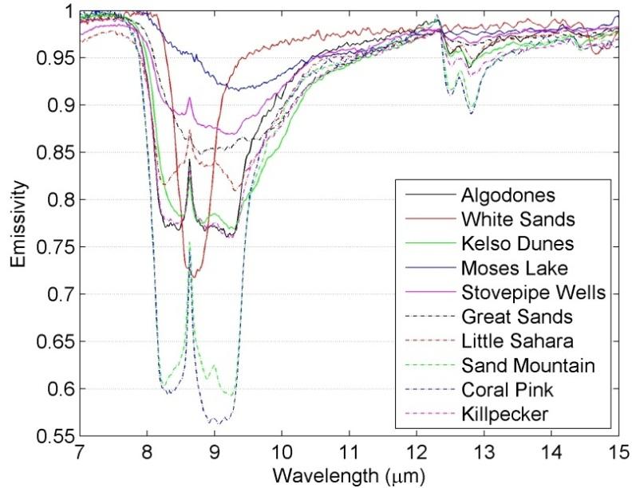{width="5.240530402449694in"
height="4.043992782152231in"}

band 29 in the quartz Reststrahlen band. However, given that the dune
validation sites are aeolian (high winds), at high altitude (low
humidity), and in semi-arid regions (high skin temperatures), the
lifetime of soil moisture in the first few micrometers of the surface
skin layer as measured in the TIR is most likely small due to large
sensible heat fluxes and, therefore, high evaporation rates, in addition
to rapid infiltration. Consequently, we hypothesize that it would most
likely take a very recent precipitation event to have any noticeable
effect on remote-sensing observations of TIR emissivity over these types
of areas.

Figure 19 shows emissivity spectra from sand dune samples collected at
ten sand dune sites in the southwestern United States. The spectra cover
a wide range of emissivities in the TIR region. These sites will be the
core sites used to validate the emissivity and LST products from
ECOSTRESS. Figure 20 shows ASTER false-color visible images of each dune
site and comparisons between the retrieved ASTER emissivity spectra and
lab measurements. The lab spectra in Figure 20 show the mean and
standard deviation (spatial) in emissivity for all sand samples
collected at the site, while the ASTER spectra give the mean emissivity
and combined spatial and temporal standard deviation for all
observations acquired during the summer (July--September) time periods.
The results show that a 5-band TES derived emissivity from ASTER data
captures the spectral shape of all the dune sands very well. The quartz
doublet centered around ASTER band 11 (8.6 µm) is clearly visible for
Algodones Dunes samples, and the characteristic gypsum minimum in ASTER
band 11 (8.6 µm) is evident from the White Sands samples. Similar
results are expected for the 5-band TES algorithm planned for ECOSTRESS

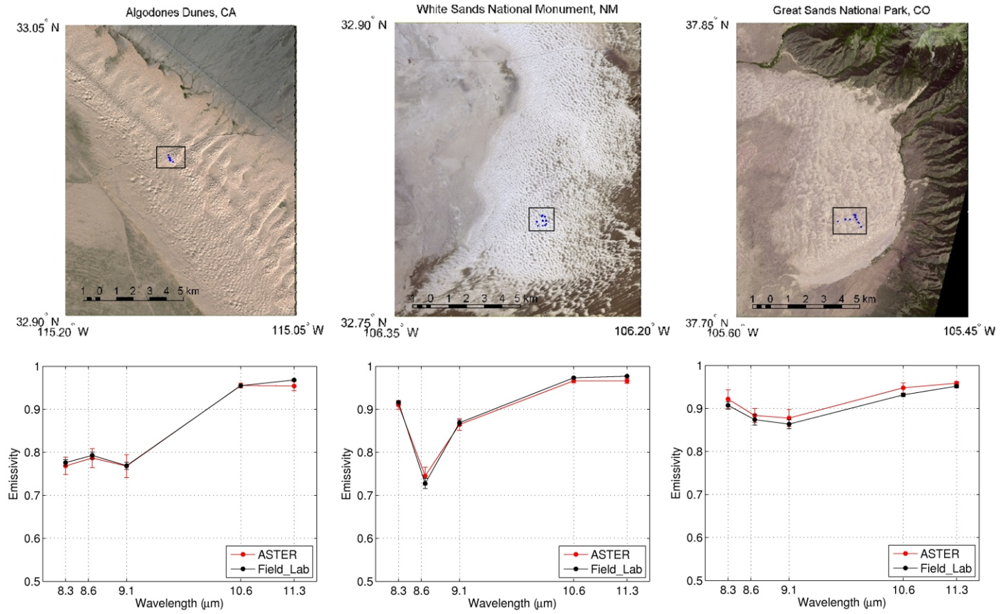{width="6.4588834208223975in"
height="3.970557742782152in"}

## LST Validation Methodology

### Radiance-based Approach

For LST validation over the sand dune sites, we will use a recently
established R-based validation method ([Coll et al. 2009b](#_ENREF_18);
[Wan and Li 2008](#_ENREF_85)). The advantage of this method is that it
does not require in-situ measurements, but instead relies on atmospheric
profiles of temperature and water vapor over the site and an accurate
estimation of the emissivity. The R-based method is based on a
'radiative closure simulation' with input surface emissivity spectra
from either lab or field measurements, atmospheric profiles from an
external source (e.g., model or radiosonde), and the retrieved LST
product as input. A radiative transfer model is used to forward model
these parameters to simulate at-sensor BTs in a clear window region of
the atmosphere (11--12 µm). The input LST product is then adjusted in
2-K steps until two calculated at-sensor BTs bracket the observed BT
value. An estimate of the 'true' temperature (${LST}_{R - based}$) is
then found by interpolation between the two calculated BTs, the observed
BT, and the initial retrieved LST used in the simulation. The LST error,
or uncertainty in the LST retrieval is simply found by taking the
difference between the retrieved LST product and the estimate of
${LST}_{R - based}$. This method has been successfully applied to MODIS
LST products in previous studies ([Coll et al. 2009a](#_ENREF_17); [Wan
and Li 2008](#_ENREF_85); [Wan 2008](#_ENREF_86)). For MODIS data, band
31 (10.78--11.28 µm) is typically used for the simulation since it is
the least sensitive to atmospheric absorption in the longwave region.
The advantage of the R-based method is that it can be applied to a large
number of global sites where the emissivity is known (e.g., from field
measurements) and during night- and daytime observations to define the
diurnal temperature range.

Wan and Li ([2008](#_ENREF_85)) proposed a quality check to assess the
suitability of the atmospheric profiles by looking at differences
between observed and calculated BTs in two nearby window

+-----------------------------------+-----------------------------------+
| A\) Algodones dunes               | B\) Great Sands                   |
|                                   |                                   |
| {width="2.8852416885389327in" | peg){width="2.8852416885389327in" |
| height="2.25in"}                  | height="2.25in"}                  |
+===================================+===================================+
| C\) Kelso                         | D\) Killpecker                    |
|                                   |                                   |
| {width="2.8852416885389327in" | peg){width="2.8852416885389327in" |
| height="2.25in"}                  | height="2.25in"}                  |
+-----------------------------------+-----------------------------------+
| E\) Little Sahara                 | F\) White Sands                   |
|                                   |                                   |
| {width="2.885242782152231in" | jpeg){width="2.885240594925634in" |
| height="2.25in"}                  | height="2.25in"}                  |
+-----------------------------------+-----------------------------------+

regions with different absorption features. For example, the quality
check for MODIS bands 31 and 32 at 11 and 12 µm is:

+---------+-------------------------------------------------+---------+
|         | $$\delta\left( T_{11} - T_{12} \right)          | 1.      |
|         |  = \left( T_{11}^{obs} - T_{12}^{obs} \right) - |         |
|         |  \left( T_{11}^{calc} - T_{12}^{calc} \right)$$ |         |
+=========+=================================================+=========+
+---------+-------------------------------------------------+---------+

where: $T_{11}^{obs}$ and $T_{12}^{obs}$ are the observed brightness
temperatures at 11 and 12 µm respectively, and $T_{11}^{calc}$ and
$T_{12}^{calc}$ are the calculated brightness temperatures from the
R-based simulation at 11 and 12 µm respectively. If
$\delta\left( T_{11} - T_{12} \right)$ is close to zero, then the
assumption is that the atmospheric temperature and water vapor profiles
are accurately representing the true atmospheric conditions at the time
of the observation, granted the emissivity is already well known.
Because water vapor absorption is higher in the 12-µm region, negative
residual values of $\delta\left( T_{11} - T_{12} \right)$ imply the
R-based profiles are overestimating the atmospheric effect, while
positives values imply an underestimation of atmospheric effects. A
simple threshold can be applied to filter out any unsuitable candidate
profiles for validation. Although Wan and Li ([2008](#_ENREF_85))
proposed a threshold of ±0.3 K for MODIS data, we performed a
sensitivity analysis and found that a threshold of ±0.5 K resulted in a
good balance between the numbers of profiles accepted and accuracy of
the final R-based LST. Figure 21 shows an example of the R-based
validation method applied to the MODIS Aqua MOD11 and MOD21 LST products
over six pseudo-invariant sand dune sites using all data during 2005.
AIRS profiles and lab-measured emissivities from samples collected at
the sites were used for the R-based calculations. The results show that
the MOD11 SW LST algorithm underestimates the LST by 3--4 K at all sites
except White Sands, while the MOD21 algorithm has biases of less than
0.5 K. The statistics of the results in including bias and RMSE are
shown in Table 13. MOD11 RMSEs are as high as \~5 K at Great Sands,
while MOD21 RMSEs are mostly at the 1.6 K level. The reason for the
MOD11 cold bias is that the emissivity for barren surfaces is assigned
one value that is fixed (\~0.96 at 11 µm). This causes large LST errors
over bare sites where the mineralogy results in emissivities lower than
that fixed value. The MOD21 algorithm, on the other hand, physically
retrieves the spectral emissivity in MODIS bands 29, 31, and 32, along
with the LST, and this results in more accurate LST results,
particularly over bare regions where emissivity variations can be large,
both spatially and spectrally. Table 14 shows comparisons between the
laboratory-derived emissivities at each site, along with the mean MOD11
and MOD21 emissivities for band 31 (11 µm).

#### Uncertainty Analysis of R-based approach

The uncertainty in the R-based LST estimate (${LST}_{R - based}$) was
calculated by perturbing the atmospheric temperature and water vapor
profiles, and by varying the surface emissivity. Atmospheric effects
were simulated by first increasing the relative humidity at each NCEP
level by 10%, and then by increasing the air temperature by 1 K at each
level. The effect on the accuracy of ${LST}_{R - based}$ was estimated
as the calculated LST difference between the original and the perturbed
profiles for the 11 µm window region. The results are summarized in
Table 11. Using a standard profile with total column water vapor of 2
cm, the absolute LST differences where 0.35 K for the water vapor
variation (10%), and 0.19 K for the air temperature variation (1 K),
resulting in a total atmospheric effect of ±0.39 K. Using an emissivity
perturbation of 0.005 (0.5%), which represents the maximum spatial
variation found from the lab measured spectra and ASTER data at each
site, resulted in an absolute LST difference of 0.23 K. Validation of
the Stand-Alone AIRS Radiative Transfer Algorithm (SARTA) with in situ
data have shown accuracies approaching 0.2 K depending on the wavenumber
region ([Strow et al. 2006](#_ENREF_78)), and this uncertainty was
considered negligible The total combined root mean square error (RMSE)
for the uncertainty in ${LST}_{R - based}$ based on estimated
atmospheric profile, emissivity and radiative transfer model errors was
±0.47 K. This is within the 1 K accuracy requirement for typical in situ
measurements of LST ([Hook et al. 2007](#_ENREF_38)).

Further, since air temperature and water vapor errors (and emissivity)
typically cancel each other out and may have different signs at
different levels, the simulated error of 0.47 K is most likely an
overestimate, i.e. a \'worse-case-scenario\'. Also, using the brightness
temperature profile quality check would most likely filter out the
majority of unsuitable profiles.

  ----------------------------------------------------------------------------------------------
  Parameter               Perturbation                                   R-based LST Change
  ----------------------- ---------------------------------------------- -----------------------
  Emissivity              $$\mathbf{\varepsilon + 0.005}$$               0.23 K

  Air Temperature         $$\mathbf{T}_{\mathbf{air}}\mathbf{+ 1\ K}$$   0.19 K

  Relative Humidity       RH + 10%                                       0.35 K
  ----------------------------------------------------------------------------------------------

+------------------+-----------+-----------+---+-----------+-----------+
|                  | **MOD11   | **MOD11   |   | **MOD21   | **MOD21   |
|                  | Bias**    | RMSE**    |   | Bias**    | RMSE**    |
+==================+===========+===========+===+===========+===========+
| Algodones (197   | −2.65     | 2.78      |   | 0.50      | 1.60      |
| scenes)          |           |           |   |           |           |
+------------------+-----------+-----------+---+-----------+-----------+
| Great Sands      | −4.71     | 4.74      |   | 0.43      | 1.52      |
|                  |           |           |   |           |           |
| (123 Scenes)     |           |           |   |           |           |
+------------------+-----------+-----------+---+-----------+-----------+
| Kelso (210       | −4.52     | 4.58      |   | −0.67     | 1.64      |
| scenes)          |           |           |   |           |           |
+------------------+-----------+-----------+---+-----------+-----------+
| Killpecker (147  | −4.07     | 4.16      |   | −0.09     | 1.68      |
| scenes)          |           |           |   |           |           |
+------------------+-----------+-----------+---+-----------+-----------+
| Little Sahara    | −3.42     | 3.47      |   | 0.52      | 1.63      |
|                  |           |           |   |           |           |
| (159 scenes)     |           |           |   |           |           |
+------------------+-----------+-----------+---+-----------+-----------+
| White Sands      | −0.06     | 0.54      |   | 0.48      | 1.34      |
|                  |           |           |   |           |           |
| (102 scenes)     |           |           |   |           |           |
+------------------+-----------+-----------+---+-----------+-----------+
|                  |           |           |   |           |           |
+------------------+-----------+-----------+---+-----------+-----------+

  -------------------------------------------------------------------------
                         **Lab**          **MOD11**        **MOD21**
  ---------------------- ---------------- ---------------- ----------------
  Algodones (197 scenes) 0.963            0.966            0.954

  Great Sands (123       0.944            0.970            0.949
  Scenes)                                                  

  Kelso (210 scenes)     0.942            0.966            0.949

  Killpecker (147        0.942            0.968            0.946
  scenes)                                                  

  Little Sahara (159     0.953            0.972            0.952
  scenes)                                                  

  White Sands (102       0.976            0.974            0.967
  scenes)                                                  
  -------------------------------------------------------------------------

### Temperature-based (T-based) LST Validation Method

The T-based method provides the best evaluation of the ability for a LST
retrieval algorithm to invert the satellite radiometric measurement and
accurately account for emissivity and atmospheric effects. The
difficulty of this method over land is that several accurate, well
calibrated ground radiometers are required to make rigorous measurements
concurrently with the satellite overpass over a large thermally
homogeneous area ideally representing several pixels at the remote
sensing scale. Field radiometers typically measure the radiometric
temperature of the surface being measured, and this measurement has to
be corrected for the reflected downwelling radiation from the atmosphere
and the emissivity before the surface skin temperature can be obtained.
An example of two state-of-the-art T-based validation sites are
discussed next, Lake Tahoe, CA/NV and Salton Sea, CA.

Lake Tahoe is large clear freshwater lake situated on the
California/Nevada border at 1,996 m elevation making it the largest
Alpine lake in North America, and USA\'s second deepest. The Lake Tahoe
automated calibration/validation site, was established in 1999 with four
buoys, referred to as TB1, TB2, TB3 and TB4, which provide simultaneous
measurements of skin and bulk temperatures in addition to meteorological
data (air temperature, relative humidity, wind speed and direction)
every two minutes ([Hook et al. 2007](#_ENREF_38)). Each buoy includes a
custom-built radiometer developed by JPL that has accuracies below the
0.1 K level. Calibration results have shown good agreement with other
well-calibrated radiometers to within ±0.05 K ([Barton et al.
2004](#_ENREF_6)). The radiometric measurements are converted to skin
temperatures by accounting for the effects of emissivity and reflected
downwelling sky radiation. For emissivity, an emissivity spectrum of
water from the ASTER spectral library is used
(http://speclib.jpl.nasa.gov) ([Baldridge et al. 2009](#_ENREF_3)), and
the reflected downwelling irradiance is computed using radiative
transfer simulations with atmospheric profiles input from NCEP data
([Hook et al. 2003](#_ENREF_37)). Figure 22 shows an example of the
T-based validation results for ECOSTRESS LST versus in situ LST
measurements for all T-based sites at Lake Constance, Gobabeb, Lake
Tahoe, Salton Sea and Russell ranch.

The Salton Sea validation site is situated on a platform located in the
southwest corner of the lake and was established more recently at the
end of 2007. In contrast to Lake Tahoe, the Salton Sea is a large saline
lake situated in southeastern California at an elevation of 75 m below
sea-level. In situ measurements at these two lakes provide the most
comprehensive and largest data record of water skin temperatures
available. The high quality and frequency of the measurements over long
time periods and for a wide range of surface temperatures (\~4 to 35 ºC)
and atmospheric conditions make this an excellent in situ dataset for
validation and calibration of multiple sensors with different overpass
times ([Hook et al. 2004](#_ENREF_34); [Hook et al. 2003](#_ENREF_37);
[Hook et al. 2007](#_ENREF_38); [Tonooka et al. 2005](#_ENREF_83)).

The T-based method becomes increasingly more difficult for sensor\'s
with coarser spatial resolutions (e.g. MODIS 1km) over land where
surface emissivities become spatially and spectrally more variable. For
example, at the ASTER pixel scale (90 m), depending on the homogeneity
of the surface, several radiometer measurements are required over the
land surface being measured to account for LST variability which could
vary by as much as 10 K over a few meters ([Coll et al.
2009a](#_ENREF_17)). Point measurements from flux towers or radiometer
measurements exist but are not fully representative of the surrounding
surface variability at coarse spatial scales. Researchers are
investigating upscaling techniques from in situ to satellite LST
measurements, for example by using the Soil Moisture Monitoring - land
surface model (SETHYS) ([Coudert et al. 2006](#_ENREF_21); [Guillevic et
al. 2012](#_ENREF_32)). However, the fact remains that validating
satellite LST data at \>1km scale with in situ data over land remains a
big challenge due to surface temperature variability that depends on
many factors including season, time of day, surface type and
meteorological conditions.

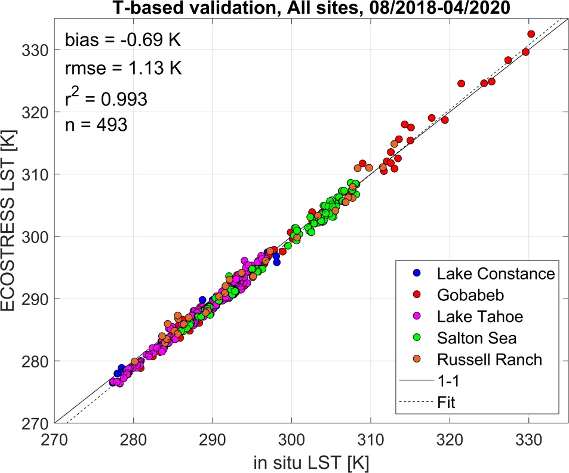{width="4.311301399825022in"
height="3.584000437445319in"}

# Acknowledgements {#acknowledgements .unnumbered}

The research was carried out at the Jet Propulsion Laboratory,
California Institute of Technology, under a contract with the National
Aeronautics and Space Administration.

# References

[]{#_ENREF_1 .anchor}Anderson, M.C., Norman, J.M., Mecikalski, J.R.,
Otkin, J.A., & Kustas, W.P. (2007). A climatological study of
evapotranspiration and moisture stress across the continental United
States based on thermal remote sensing: 2. Surface moisture climatology.
*Journal of Geophysical Research-Atmospheres, 112*

[]{#_ENREF_2 .anchor}Augustine, J.A., DeLuisi, J.J., & Long, C.N.
(2000). SURFRAD - A national surface radiation budget network for
atmospheric research. *Bulletin of the American Meteorological Society,
81*, 2341-2357

[]{#_ENREF_3 .anchor}Baldridge, A.M., Hook, S.J., Grove, C.I., & Rivera,
G. (2009). The ASTER Spectral Library Version 2.0. *Remote Sensing of
Environment, 114*, 711-715

[]{#_ENREF_4 .anchor}Bannari, A., Omari, K., Teillet, R.A., &
Fedosejevs, G. (2005). Potential of getis statistics to characterize the
radiometric uniformity and stability of test sites used for the
calibration of earth observation sensors. *Ieee Transactions on
Geoscience and Remote Sensing, 43*, 2918-2926

[]{#_ENREF_5 .anchor}Barducci, A., & Pippi, I. (1996). Temperature and
emissivity retrieval from remotely sensed images using the \'\'grey body
emissivity\'\' method. *Ieee Transactions on Geoscience and Remote
Sensing, 34*, 681-695

[]{#_ENREF_6 .anchor}Barton, I.J., Minnett, P.J., Maillet, K.A., Donlon,
C.J., Hook, S.J., Jessup, A.T., & Nightingale, T.J. (2004). The
Miami2001 infrared radiometer calibration and intercomparison. part II:
Shipboard results. *Journal of Atmospheric and Oceanic Technology, 21*,
268-283

[]{#_ENREF_7 .anchor}Barton, I.J., Zavody, A.M., Obrien, D.M., Cutten,
D.R., Saunders, R.W., & Llewellyn-Jones, D.T. (1989). Theoretical
Algorithms for Satellite-Derived Sea-Surface Temperatures. *Journal of
Geophysical Research-Atmospheres, 94*, 3365-3375

[]{#_ENREF_8 .anchor}Bauer, P., Moreau, E., Chevallier, F., & O\'Keeffe,
U. (2006). Multiple-scattering microwave radiative transfer for data
assimilation applications. *Quarterly Journal of the Royal
Meteorological Society, 132*, 1259-1281

[]{#_ENREF_9 .anchor}Becker, F., & Li, Z.L. (1990).
Temperature-Independent Spectral Indexes in Thermal Infrared Bands.
*Remote Sensing of Environment, 32*, 17-33

[]{#_ENREF_10 .anchor}Berk, A., Anderson, G.P., Acharya, P.K.,
Bernstein, L.S., Muratov, L., Lee, J., Fox, M., Adler-Golden, S.M.,
Chetwynd, J.H., Hoke, M.L., Lockwood, R.B., Gardner, J.A., Cooley, T.W.,
Borel, C.C., & Lewis, P.E. (2005). MODTRAN^TM^ 5, A Reformulated
Atmospheric Band Model with Auxiliary Species and Practical Multiple
Scattering Options: Update. In S.S. Sylvia, & P.E. Lewis (Eds.), *in
Proc SPIE, Algorithms and Technologies for Multispectral, Hyperspectral,
and Ultraspectral Imagery XI* (pp. 662-667). Bellingham, WA: Proceedings
of SPIE

[]{#_ENREF_11 .anchor}Borbas, E., Seemann, S.W., Huang, H.L., Li, J., &
Menzel, W.P. (2005). Global profile training database for satellite
regression retrievals with estimates of skin temperature and emissivity.
In, *Proc. of the Int. ATOVS Study Conference-XIV*

[]{#_ENREF_12 .anchor}Bosilovich, M.G., Chen, J.Y., Robertson, F.R., &
Adler, R.F. (2008). Evaluation of global precipitation in reanalyses.
*Journal of Applied Meteorology and Climatology, 47*, 2279-2299

[]{#_ENREF_13 .anchor}Brown, O., & Minnett, P. (1999). MODIS infrared
sea surface temperature algorithm. *Algorithm Theoretical Basis Document
Version 2*, Univ. of Miami, Miami, Fla.

[]{#_ENREF_14 .anchor}Chevallier, F. (2000). Sampled database of
60-level atmospheric profiles from the ECMWF analyses. In

[]{#_ENREF_15 .anchor}Coll, C., & Caselles, V. (1997). A split-window
algorithm for land surface temperature from advanced very high
resolution radiometer data: Validation and algorithm comparison.
*Journal of Geophysical Research-Atmospheres, 102*, 16697-16713

[]{#_ENREF_16 .anchor}Coll, C., Caselles, V., Galve, J.M., Valor, E.,
Niclos, R., Sanchez, J.M., & Rivas, R. (2005). Ground measurements for
the validation of land surface temperatures derived from AATSR and MODIS
data. *Remote Sensing of Environment, 97*, 288-300

[]{#_ENREF_17 .anchor}Coll, C., Wan, Z.M., & Galve, J.M. (2009a).
Temperature-based and radiance-based validations of the V5 MODIS land
surface temperature product. *Journal of Geophysical
Research-Atmospheres, 114*, D20102, doi:20110.21029/22009JD012038

[]{#_ENREF_18 .anchor}Coll, C., Wan, Z.M., & Galve, J.M. (2009b).
Temperature-based and radiance-based validations of the V5 MODIS land
surface temperature product. *Journal of Geophysical
Research-Atmospheres, 114*, -

[]{#_ENREF_19 .anchor}Cook, M. (2014). Atmospheric Compensation for a
Landsat Land Surface Temperature Product. In, *Chester F. Carlson Center
for Imaging Science*. Rochester: Rochester Institute of Technology

[]{#_ENREF_20 .anchor}Cosnefroy, H.N., Leroy, M., & Briottet, X. (1996).
Selection and characterization of Saharan and Arabian desert sites for
the calibration of optical satellite sensors. *Remote Sensing of
Environment, 58*, 101-114

[]{#_ENREF_21 .anchor}Coudert, B., Ottle, C., Boudevillain, B., Demarty,
J., & Guillevic, P. (2006). Contribution of thermal infrared remote
sensing data in multiobjective calibration of a dual-source SVAT model.
*Journal of Hydrometeorology, 7*, 404-420

[]{#_ENREF_22 .anchor}de Vries, C., Danaher, T., Denham, R., Scarth, P.,
& Phinn, S. (2007). An operational radiometric calibration procedure for
the Landsat sensors based on pseudo-invariant target sites. *Remote
Sensing of Environment, 107*, 414-429

[]{#_ENREF_23 .anchor}Deschamps, P.Y., & Phulpin, T. (1980). Atmospheric
Correction of Infrared Measurements of Sea-Surface Temperature Using
Channels at 3.7, 11 and 12 Mu-M. *Boundary-Layer Meteorology, 18*,
131-143

[]{#_ENREF_24 .anchor}Eyre, J.R., & Woolf, H.M. (1988). Transmittance of
Atmospheric Gases in the Microwave Region - a Fast Model. *Applied
Optics, 27*, 3244-3249

[]{#_ENREF_25 .anchor}French, A.N., Jacob, F., Anderson, M.C., Kustas,
W.P., Timmermans, W., Gieske, A., Su, Z., Su, H., McCabe, M.F., Li, F.,
Prueger, J., & Brunsell, N. (2005). Surface energy fluxes with the
Advanced Spaceborne Thermal Emission and Reflection radiometer (ASTER)
at the Iowa 2002 SMACEX site (USA) (vol 99, pg 55, 2005). *Remote
Sensing of Environment, 99*, 471-471

[]{#_ENREF_26 .anchor}French, A.N., Schmugge, T.J., Ritchie, J.C., Hsu,
A., Jacob, F., & Ogawa, K. (2008). Detecting land cover change at the
Jornada Experimental Range, New Mexico with ASTER emissivities. *Remote
Sensing of Environment, 112*, 1730-1748

[]{#_ENREF_27 .anchor}Galve, J.A., Coll, C., Caselles, V., & Valor, E.
(2008). An atmospheric radiosounding database for generating land
surface temperature algorithms. *IEEE Transactions on Geoscience and
Remote Sensing, 46*, 1547-1557

[]{#_ENREF_28 .anchor}Gillespie, A., Rokugawa, S., Hook, S., Matsunaga,
T., & Kahle, A.B. (1999). Temperature/Emissivity Separation Algorithm
Theoretical Basis Document, Version 2.4, ASTER TES ATBD, NASA Contract
NAS5-31372, 31322 March, 31999

[]{#_ENREF_29 .anchor}Gillespie, A., Rokugawa, S., Matsunaga, T.,
Cothern, J.S., Hook, S., & Kahle, A.B. (1998). A temperature and
emissivity separation algorithm for Advanced Spaceborne Thermal Emission
and Reflection Radiometer (ASTER) images. *Ieee Transactions on
Geoscience and Remote Sensing, 36*, 1113-1126

[]{#_ENREF_30 .anchor}Gottsche, F.M., & Hulley, G.C. (2012a). Validation
of six satellite-retrieved land surface emissivity products over two
land cover types in a hyper-arid region. *Remote Sensing of Environment,
124*, 149-158

[]{#_ENREF_31 .anchor}Gottsche, F.M., & Hulley, G.C. (2012b). Validation
of six satellite-retrieved land surface emissivity products over two
land cover types in a hyper-arid region. *Remote Sensing of Environment,
124*, 149-158

[]{#_ENREF_32 .anchor}Guillevic, P., Privette, J.L., Coudert, B.,
Palecki, M.A., Demarty, J., Ottle, C., & Augustine, J.A. (2012). Land
Surface Temperature product validation using NOAA\'s surface climate
observation networks---Scaling methodology for the Visible Infrared
Imager Radiometer Suite (VIIRS). *Remote Sensing of Environment, 124*,
282-298

[]{#_ENREF_33 .anchor}Gustafson, W.T., Gillespie, A.R., & Yamada, G.J.
(2006). Revisions to the ASTER temperature/emissivity separation
algorithm. In, *2nd International Symposium on Recent Advances in
Quantitative Remote Sensing*. Torrent (Valencia), Spain

[]{#_ENREF_34 .anchor}Hook, S.J., Chander, G., Barsi, J.A., Alley, R.E.,
Abtahi, A., Palluconi, F.D., Markham, B.L., Richards, R.C., Schladow,
S.G., & Helder, D.L. (2004). In-flight validation and recovery of water
surface temperature with Landsat-5 thermal infrared data using an
automated high-altitude lake validation site at Lake Tahoe. *Ieee
Transactions on Geoscience and Remote Sensing, 42*, 2767-2776

[]{#_ENREF_35 .anchor}Hook, S.J., Dmochowski, J.E., Howard, K.A., Rowan,
L.C., Karlstrom, K.E., & Stock, J.M. (2005). Mapping variations in
weight percent silica measured from multispectral thermal infrared
imagery - Examples from the Hiller Mountains, Nevada, USA and Tres
Virgenes-La Reforma, Baja California Sur, Mexico. *Remote Sensing of
Environment, 95*, 273-289

[]{#_ENREF_36 .anchor}Hook, S.J., Gabell, A.R., Green, A.A., & Kealy,
P.S. (1992). A Comparison of Techniques for Extracting Emissivity
Information from Thermal Infrared Data for Geologic Studies. *Remote
Sensing of Environment, 42*, 123-135

[]{#_ENREF_37 .anchor}Hook, S.J., Prata, F.J., Alley, R.E., Abtahi, A.,
Richards, R.C., Schladow, S.G., & Palmarsson, S.O. (2003). Retrieval of
lake bulk and skin temperatures using Along-Track Scanning Radiometer
(ATSR-2) data: A case study using Lake Tahoe, California. *Journal of
Atmospheric and Oceanic Technology, 20*, 534-548

[]{#_ENREF_38 .anchor}Hook, S.J., Vaughan, R.G., Tonooka, H., &
Schladow, S.G. (2007). Absolute radiometric in-flight validation of mid
infrared and thermal infrared data from ASTER and MODIS on the terra
spacecraft using the Lake Tahoe, CA/NV, USA, automated validation site.
*Ieee Transactions on Geoscience and Remote Sensing, 45*, 1798-1807

[]{#_ENREF_39 .anchor}Hulley, G., Hook, S., & Hughes, C. (2012a). MODIS
MOD21 Land Surface Temperature and Emissivity Algorithm Theoretical
Basis Document. In: Jet Propulsion Laboratory, California Institute of
Technology, JPL Publication 12-17, August, 2012

[]{#_ENREF_40 .anchor}Hulley, G.C., Gottsche, F.M., Rivera, G., Hook,
S.J., Freepartner, R.J., Martin, M.A., Cawse-Nicholson, K., & Johnson,
W.R. (2022). Validation and Quality Assessment of the ECOSTRESS Level-2
Land Surface Temperature and Emissivity Product. *Ieee Transactions on
Geoscience and Remote Sensing, 60*

[]{#_ENREF_41 .anchor}Hulley, G.C., & Hook, S.J. (2009a).
Intercomparison of Versions 4, 4.1 and 5 of the MODIS Land Surface
Temperature and Emissivity Products and Validation with Laboratory
Measurements of Sand Samples from the Namib Desert, Namibia. *Remote
Sensing of Environment, 113*, 1313-1318

[]{#_ENREF_42 .anchor}Hulley, G.C., & Hook, S.J. (2009b). The North
American ASTER Land Surface Emissivity Database (NAALSED) Version 2.0.
*Remote Sensing of Environment, 113*, 1967-1975

[]{#_ENREF_43 .anchor}Hulley, G.C., & Hook, S.J. (2011). Generating
Consistent Land Surface Temperature and Emissivity Products Between
ASTER and MODIS Data for Earth Science Research. *Ieee Transactions on
Geoscience and Remote Sensing, 49*, 1304-1315

[]{#_ENREF_44 .anchor}Hulley, G.C., & Hook, S.J. (2012). A
radiance-based method for estimating uncertainties in the Atmospheric
Infrared Sounder (AIRS) land surface temperature product. *Journal of
Geophysical Research-Atmospheres, 117*

[]{#_ENREF_45 .anchor}Hulley, G.C., Hook, S.J., & Baldridge, A.M.
(2008). ASTER land surface emissivity database of California and Nevada.
*Geophysical Research Letters, 35*, L13401, doi:
13410.11029/12008gl034507

[]{#_ENREF_46 .anchor}Hulley, G.C., Hook, S.J., & Baldridge, A.M.
(2009a). Validation of the North American ASTER Land Surface Emissivity
Database (NAALSED) Version 2.0 using Pseudo-Invariant Sand Dune Sites.
*Remote Sensing of Environment, 113*, 2224-2233

[]{#_ENREF_47 .anchor}Hulley, G.C., Hook, S.J., Manning, E., Lee, S.Y.,
& Fetzer, E.J. (2009b). Validation of the Atmospheric Infrared Sounder
(AIRS) Version 5 (v5) Land Surface Emissivity Product over the Namib and
Kalahari Deserts. *Journal of Geophysical Research Atmospheres, 114*,
D19104

[]{#_ENREF_48 .anchor}Hulley, G.C., Hughes, T., & Hook, S.J. (2012b).
Quantifying Uncertainties in Land Surface Temperature (LST) and
Emissivity Retrievals from ASTER and MODIS Thermal Infrared Data.
*Journal of Geophysical Research Atmospheres*, in press.

[]{#_ENREF_49 .anchor}Jimenez-Munoz, J.C., & Sobrino, J.A. (2010). A
Single-Channel Algorithm for Land-Surface Temperature Retrieval From
ASTER Data. *Ieee Geoscience and Remote Sensing Letters, 7*, 176-179

[]{#_ENREF_50 .anchor}Jin, M.L., & Dickinson, R.E. (2010). Land surface
skin temperature climatology: benefitting from the strengths of
satellite observations. *Environmental Research Letters, 5*, -

[]{#_ENREF_51 .anchor}Justice, C., & Townshend, J. (2002). Special issue
on the moderate resolution imaging spectroradiometer (MODIS): a new
generation of land surface monitoring. *Remote Sensing of Environment,
83*, 1-2

[]{#_ENREF_52 .anchor}Kalnay, E., Kanamitsu, M., & Baker, W.E. (1990).
Global Numerical Weather Prediction at the
National-Meteorological-Center. *Bulletin of the American Meteorological
Society, 71*, 1410-1428

[]{#_ENREF_53 .anchor}Kealy, M.J., Montgomery, M., & Dovidio, J.F.
(1990). Reliability and Predictive-Validity of Contingent Values - Does
the Nature of the Good Matter. *Journal of Environmental Economics and
Management, 19*, 244-263

[]{#_ENREF_54 .anchor}Kealy, P.S., & Hook, S. (1993). Separating
temperature & emissivity in thermal infrared multispectral scanner data:
Implication for recovering land surface temperatures. *Ieee Transactions
on Geoscience and Remote Sensing, 31*, 1155-1164

[]{#_ENREF_55 .anchor}Kneizys, F.X., Abreu, L.W., Anderson, G.P.,
Chetwynd, J.H., Shettle, E.P., Berk, A., Bernstein, L.S., Robertson,
D.C., Acharya, P.K., Rothman, L.A., Selby, J.E.A., Gallery, W.O., &
Clough, S.A. (1996). The MODTRAN 2/3 Report & LOWTRAN 7 Model,
F19628-91-C-0132. In, *Phillips Lab*. Hanscom AFB, MA

[]{#_ENREF_56 .anchor}Li, F.Q., Jackson, T.J., Kustas, W.P., Schmugge,
T.J., French, A.N., Cosh, M.H., & Bindlish, R. (2004). Deriving land
surface temperature from Landsat 5 and 7 during SMEX02/SMACEX. *Remote
Sensing of Environment, 92*, 521-534

[]{#_ENREF_57 .anchor}Lucchesi, R. (2017). File Specification for GEOS-5
FP. GMAO Office Note No. 4 (Version 1.1), 61 pp, available from
<http://gmao.gsfc.nasa.gov/pubs/office_notes>. In

[]{#_ENREF_58 .anchor}Lyon, R. (1965). Analysis of ROcks by Spectral
INfrared Emission (8 to 25 microns). *Economic Geology and the Bulletin
of the Society of Economic Geologists, 60*, 715-736

[]{#_ENREF_59 .anchor}Masuda, K., Takashima, T., & Takayama, Y. (1988).
Emissivity of Pure and Sea Waters for the Model Sea-Surface in the
Infrared Window Regions. *Remote Sensing of Environment, 24*, 313-329

[]{#_ENREF_60 .anchor}Matricardi, M. (2008). The generation of RTTOV
regression coefficients for IASI and AIRS using a new profile training
set and a new line-by-line database. In: ECMWF Research Dept. Tech.
Memo.

[]{#_ENREF_61 .anchor}Matricardi, M. (2009). Technical Note: An
assessment of the accuracy of the RTTOV fast radiative transfer model
using IASI data. *Atmospheric Chemistry and Physics, 9*, 6899-6913

[]{#_ENREF_62 .anchor}Matricardi, M., Chevallier, F., Kelly, G., &
Thepaut, J.N. (2004). An improved general fast radiative transfer model
for the assimilation of radiance observations. *Quarterly Journal of the
Royal Meteorological Society, 130*, 153-173

[]{#_ENREF_63 .anchor}Matricardi, M., Chevallier, F., & Tjemkes, S.A.
(2001). An improved general fast radiative transfer model for the
assimilation of radiance observations. In: European Centre for
Medium-Range Weather Forecasts

[]{#_ENREF_64 .anchor}Matricardi, M., & Saunders, R. (1999). Fast
radiative transfer model for simulation of infrared atmospheric sounding
interferometer radiances. *Applied Optics, 38*, 5679-5691

[]{#_ENREF_65 .anchor}Matsunaga, T. (1994). A temperature-emissivity
separation method using an empirical

relationship between the mean, the maximum, & the minimum of the thermal
infrared

emissivity spectrum, in Japanese with English abstract. *Journal Remote
Sensing Society Japan, 14*, 230-241

[]{#_ENREF_66 .anchor}Meerdink, S.K., Hook, S.J., Roberts, D.A., &
Abbott, E.A. (2019). The ECOSTRESS spectral library version 1.0. *Remote
Sensing of Environment, 230*

[]{#_ENREF_67 .anchor}Mesinger, F., DiMego, G., Kalnay, E., Mitchell,
K., Shafran, P.C., Ebisuzaki, W., Jovic, D., Woollen, J., Rogers, E.,
Berbery, E.H., Ek, M.B., Fan, Y., Grumbine, R., Higgins, W., Li, H.,
Lin, Y., Manikin, G., Parrish, D., & Shi, W. (2006). North American
regional reanalysis. *Bulletin of the American Meteorological Society,
87*, 343-+

[]{#_ENREF_68 .anchor}Mira, M., Valor, E., Boluda, R., Caselles, V., &
Coll, C. (2007). Influence of soil water content on the thermal infrared
emissivity of bare soils: Implication for land surface temperature
determination. *Journal of Geophysical Research-Earth Surface, 112*,
F04003

[]{#_ENREF_69 .anchor}Mushkin, A., & Gillespie, A.R. (2005). Estimating
sub-pixel surface roughness using remotely sensed stereoscopic data.
*Remote Sensing of Environment, 99*, 75-83

[]{#_ENREF_70 .anchor}Norman, J.M., & Becker, F. (1995). Terminology in
Thermal Infrared Remote-Sensing of Natural Surfaces. *Agricultural and
Forest Meteorology, 77*, 153-166

[]{#_ENREF_71 .anchor}Ogawa, K., Schmugge, T., & Rokugawa, S. (2006).
Observations of the dependence of the thermal infrared emissivity on
soil moisture. *Geophysical Research Abstracts, 8*, 04996

[]{#_ENREF_72 .anchor}Palluconi, F., Hoover, G., Alley, R.E., Nilsen,
M.J., & Thompson, T. (1999). An atmospheric correction method for ASTER
thermal radiometry over land, ASTER algorithm theoretical basis document
(ATBD), Revision 3, Jet Propulsion Laboratory, Pasadena, CA, 1999

[]{#_ENREF_73 .anchor}Prata, A.J. (1994). Land-Surface Temperatures
Derived from the Advanced Very High-Resolution Radiometer and the
Along-Track Scanning Radiometer .2. Experimental Results and Validation
of Avhrr Algorithms. *Journal of Geophysical Research-Atmospheres, 99*,
13025-13058

[]{#_ENREF_74 .anchor}Price, J.C. (1984). Land surface temperature
measurements from the split window channels of the NOAA 7 Advanced Very
High Resolution Radiometer. *Journal of Geophysical Research, 89*,
7231-7237

[]{#_ENREF_75 .anchor}Saunders, R., Matricardi, M., & Brunel, P. (1999).
An improved fast radiative transfer model for assimilation of satellite
radiance observations. *Quarterly Journal of the Royal Meteorological
Society, 125*, 1407-1425

[]{#_ENREF_76 .anchor}Seemann, S.W., Borbas, E., Li, J., Menzel, P., &
Gumley, L.E. (2006). MODIS Atmospheric Profile Retrieval Algorithm
Theoretical Basis Document, Cooperative Institute for Meteorological
Satellite Studies, University of Wisconsin-Madison, Madison, WI, Version
6, October 25, 2006

[]{#_ENREF_77 .anchor}Snyder, W.C., Wan, Z., Zhang, Y., & Feng, Y.Z.
(1998). Classification-based emissivity for land surface temperature
measurement from space. *International Journal of Remote Sensing, 19*,
2753-2774

[]{#_ENREF_78 .anchor}Strow, L.L., Hannon, S.E., Machado, S.D.S.,
Motteler, H.E., & Tobin, D.C. (2006). Validation of the Atmospheric
Infrared Sounder radiative transfer algorithm. *Journal of Geophysical
Research-Atmospheres, 111*

[]{#_ENREF_79 .anchor}Susskind, J., Barnet, C.D., & Blaisdell, J.M.
(2003). Retrieval of atmospheric and surface parameters from
AIRS/AMSU/HSB data in the presence of clouds. *Ieee Transactions on
Geoscience and Remote Sensing, 41*, 390-409

[]{#_ENREF_80 .anchor}Teillet, P.M., Fedosejevs, G., Gautier, R.P., &
Schowengerdt, R.A. (1998). Uniformity characterization of land test
sites used for radiometric calibration of earth observation sensors. In,
*Proc. 20th Can. Symp. Remote Sensing* (pp. 1-4). Calgary, AB, Canada

[]{#_ENREF_81 .anchor}Tonooka, H. (2001). An atmospheric correction
algorithm for thermal infrared multispectral data over land - A
water-vapor scaling method. *Ieee Transactions on Geoscience and Remote
Sensing, 39*, 682-692

[]{#_ENREF_82 .anchor}Tonooka, H. (2005). Accurate atmospheric
correction of ASTER thermal infrared imagery using the WVS method. *Ieee
Transactions on Geoscience and Remote Sensing, 43*, 2778-2792

[]{#_ENREF_83 .anchor}Tonooka, H., Palluconi, F.D., Hook, S.J., &
Matsunaga, T. (2005). Vicarious calibration of ASTER thermal infrared
bands. *Ieee Transactions on Geoscience and Remote Sensing, 43*,
2733-2746

[]{#_ENREF_84 .anchor}Vaughan, R.G., Hook, S.J., Calvin, W.M., &
Taranik, J.V. (2005). Surface mineral mapping at Steamboat Springs,
Nevada, USA, with multi-wavelength thermal infrared images. *Remote
Sensing of Environment, 99*, 140-158

[]{#_ENREF_85 .anchor}Wan, Z., & Li, Z.L. (2008). Radiance-based
validation of the V5 MODIS land-surface temperature product.
*International Journal of Remote Sensing, 29*, 5373-5395

[]{#_ENREF_86 .anchor}Wan, Z.M. (2008). New refinements and validation
of the MODIS Land-Surface Temperature/Emissivity products. *Remote
Sensing of Environment, 112*, 59-74

[]{#_ENREF_87 .anchor}Wan, Z.M., & Dozier, J. (1996). A generalized
split-window algorithm for retrieving land-surface temperature from
space. *Ieee Transactions on Geoscience and Remote Sensing, 34*, 892-905

[]{#_ENREF_88 .anchor}Wan, Z.M., & Li, Z.L. (1997). A physics-based
algorithm for retrieving land-surface emissivity and temperature from
EOS/MODIS data. *Ieee Transactions on Geoscience and Remote Sensing,
35*, 980-996

[]{#_ENREF_89 .anchor}Wang, K.C., & Liang, S.L. (2009). Evaluation of
ASTER and MODIS land surface temperature and emissivity products using
long-term surface longwave radiation observations at SURFRAD sites.
*Remote Sensing of Environment, 113*, 1556-1565

[]{#_ENREF_90 .anchor}Watson, K. (1992). Spectral Ratio Method for
Measuring Emissivity. *Remote Sensing of Environment, 42*, 113-116

[]{#_ENREF_91 .anchor}Watson, K., Kruse, F.A., & Hummermiller, S.
(1990). Thermal Infrared Exploration in the Carlin Trend, Northern
Nevada. *Geophysics, 55*, 70-79

[]{#_ENREF_92 .anchor}Yu, Y., Privette, J.L., & Pinheiro, A.C. (2008).
Evaluation of split-window land surface temperature algorithms for
generating climate data records. *Ieee Transactions on Geoscience and
Remote Sensing, 46*, 179-192
